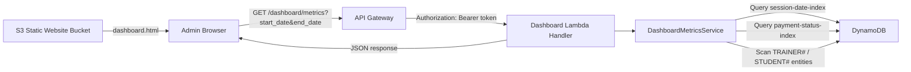

# Design Document: Admin Dashboard

## Overview

The Admin Dashboard is a lightweight, admin-only web interface that provides real-time visibility into the FitAgent platform's health. It consists of three components:

1. A **Dashboard API** — a new Lambda handler (`src/handlers/dashboard_handler.py`) behind API Gateway that aggregates metrics from DynamoDB
2. A **Metrics Aggregation Service** (`src/services/dashboard_metrics.py`) that queries DynamoDB using existing GSIs and computes KPIs
3. A **Static Frontend** — a single-page HTML/JS dashboard served from the existing S3 static website bucket, protected by a simple token-based auth

The design prioritizes simplicity: one API endpoint, one service module, one HTML page. No frameworks, no build steps.

## Architecture



### Request Flow

1. Admin opens `dashboard.html` (served from S3 via CloudFront or locally)
2. Browser prompts for API token (stored in `localStorage`)
3. JavaScript fetches `GET /dashboard/metrics?start_date=YYYY-MM-DD&end_date=YYYY-MM-DD` with `Authorization: Bearer <token>`
4. Dashboard Lambda validates token, calls `DashboardMetricsService`
5. Service queries DynamoDB across all trainers, aggregates metrics
6. Lambda returns JSON with sections: `user_metrics`, `session_metrics`, `payment_metrics`, `growth_metrics`
7. Frontend renders KPI cards and charts

### Authentication Approach

Since this is admin-only (single user), we use a simple pre-shared API token:

- Token is stored in AWS Secrets Manager as `fitagent/dashboard-token/{environment}`
- Lambda reads the token from Secrets Manager and compares against the `Authorization: Bearer <token>` header
- Token has no expiration built-in; the frontend stores it in `localStorage` with a client-side 8-hour session TTL
- The frontend login page accepts the token, validates it via a lightweight `/dashboard/auth` endpoint, and stores it

This avoids the complexity of Cognito/OAuth for a single-admin use case.

## Components and Interfaces

### 1. Dashboard Lambda Handler (`src/handlers/dashboard_handler.py`)

Follows the existing Lambda handler pattern. Handles two routes via API Gateway:

```python
def lambda_handler(event: Dict[str, Any], context: Any) -> Dict[str, Any]:
    """
    Routes:
      GET /dashboard/auth    — validate token, return {"valid": true}
      GET /dashboard/metrics — return aggregated metrics JSON
    """
```

**Auth validation logic:**
```python
def _validate_token(event: Dict[str, Any]) -> bool:
    """Extract Bearer token from Authorization header, compare to stored secret."""
```

**Response format (metrics endpoint):**
```json
{
  "status": "ok",
  "generated_at": "2024-01-15T10:30:00Z",
  "period": {
    "start_date": "2024-01-01",
    "end_date": "2024-01-15"
  },
  "user_metrics": { ... },
  "session_metrics": { ... },
  "payment_metrics": { ... },
  "growth_metrics": { ... },
  "errors": []
}
```

If a section fails, the handler returns partial data with the failed section name in `errors`:
```json
{
  "status": "partial",
  "errors": ["session_metrics"],
  ...
}
```

### 2. Dashboard Metrics Service (`src/services/dashboard_metrics.py`)

Pure business logic, no HTTP concerns. Receives a `DynamoDBClient` instance and date range.

```python
class DashboardMetricsService:
    def __init__(self, dynamodb_client: DynamoDBClient):
        self.db = dynamodb_client

    def get_all_metrics(self, start_date: str, end_date: str) -> Dict[str, Any]:
        """Aggregate all metric sections. Returns dict with all four sections."""

    def get_user_metrics(self, start_date: str, end_date: str) -> Dict[str, Any]:
        """Total trainers, students, active trainers/students, avg students per trainer."""

    def get_session_metrics(self, start_date: str, end_date: str) -> Dict[str, Any]:
        """Session counts by status, completion rate, cancellation rate."""

    def get_payment_metrics(self, start_date: str, end_date: str) -> Dict[str, Any]:
        """Payment counts, amounts, confirmation rate, average amount."""

    def get_growth_metrics(self, start_date: str, end_date: str) -> Dict[str, Any]:
        """New registrations per day, sessions per day, revenue per day."""
```

### 3. Static Frontend (`static/dashboard.html`)

A single HTML file with embedded CSS and vanilla JavaScript. No build tools.

- Login screen: text input for API token, "Login" button
- Dashboard view: KPI cards in a grid, time period selector, refresh button
- Charts: uses a lightweight charting library (Chart.js via CDN) for growth trend lines
- Responsive layout using CSS Grid

### DynamoDB Query Strategy

The service needs cross-trainer data. Here's how each metric section queries DynamoDB:

**User Metrics:**
- Total trainers/students: Table scan with `entity_type` filter (`TRAINER` / `STUDENT`). These are infrequent and the dataset is small (platform-level counts).
- Active trainers/students in period: Derived from session data — scan sessions in date range, collect distinct `trainer_id` and `student_id` values.
- Avg students per trainer: Count of active `TRAINER_STUDENT_LINK` items divided by trainer count.

**Session Metrics:**
- Use `session-date-index` GSI. Since this GSI has `trainer_id` as PK, we need to query per-trainer then aggregate. For a small platform, we first get all trainer IDs, then query each trainer's sessions in the date range.
- Alternative: Table scan with `entity_type = SESSION` and `created_at` filter. For early-stage platform with <10K items, this is acceptable and simpler.

**Payment Metrics:**
- Use `payment-status-index` GSI per trainer, or table scan with `entity_type = PAYMENT` filter.
- Sum amounts, count by status.

**Growth Metrics:**
- New trainers/students: Scan with `entity_type` filter and `created_at` in date range.
- Sessions per day: From session query results, group by date.
- Revenue per day: From payment query results (confirmed), group by date.

**Performance note:** For the initial implementation, table scans are acceptable since:
- This is an admin-only dashboard (low request frequency)
- The platform is early-stage (small dataset)
- Scans are simpler and avoid the N+1 query pattern of per-trainer GSI queries
- If the dataset grows, we can add a `entity_type` GSI or use DynamoDB Streams to maintain pre-aggregated counters


## Data Models

### API Response Models

```python
@dataclass
class PeriodInfo:
    start_date: str  # YYYY-MM-DD
    end_date: str    # YYYY-MM-DD

@dataclass
class UserMetrics:
    total_trainers: int
    total_students: int
    active_trainers: int       # trainers with sessions in period
    active_students: int       # students with sessions in period
    avg_students_per_trainer: float
    total_active_links: int    # trainer-student links with status="active"

@dataclass
class SessionMetrics:
    total_sessions: int
    scheduled_sessions: int
    completed_sessions: int
    cancelled_sessions: int
    missed_sessions: int
    completion_rate: float     # completed / (completed + missed), 0.0 if denominator is 0
    cancellation_rate: float   # cancelled / total, 0.0 if total is 0

@dataclass
class PaymentMetrics:
    total_payments: int
    pending_payments: int
    confirmed_payments: int
    total_confirmed_amount: float
    total_pending_amount: float
    confirmation_rate: float   # confirmed / total, 0.0 if total is 0
    avg_payment_amount: float  # avg of confirmed amounts, 0.0 if no confirmed

@dataclass
class DailyDataPoint:
    date: str   # YYYY-MM-DD
    count: int  # or amount for revenue

@dataclass
class GrowthMetrics:
    new_trainers: int
    new_students: int
    trainers_per_day: List[DailyDataPoint]
    students_per_day: List[DailyDataPoint]
    sessions_per_day: List[DailyDataPoint]
    revenue_per_day: List[DailyDataPoint]  # confirmed payment amounts

@dataclass
class DashboardResponse:
    status: str                    # "ok" or "partial"
    generated_at: str              # ISO 8601 timestamp
    period: PeriodInfo
    user_metrics: Optional[UserMetrics]
    session_metrics: Optional[SessionMetrics]
    payment_metrics: Optional[PaymentMetrics]
    growth_metrics: Optional[GrowthMetrics]
    errors: List[str]              # names of failed sections
```

### Rate Calculation Rules

These rules are critical for correctness:

- **Completion rate** = `completed / (completed + missed)`. If `(completed + missed) == 0`, return `0.0`.
- **Cancellation rate** = `cancelled / total`. If `total == 0`, return `0.0`.
- **Payment confirmation rate** = `confirmed / total`. If `total == 0`, return `0.0`.
- **Average payment amount** = `sum(confirmed amounts) / count(confirmed)`. If `count == 0`, return `0.0`.
- All rates are returned as floats between 0.0 and 1.0 (not percentages). The frontend multiplies by 100 for display.

### Date Range Defaults

- If no `start_date`/`end_date` provided, default to last 30 days: `end_date = today`, `start_date = today - 30 days`.
- Dates are inclusive on both ends.
- Maximum allowed range: 90 days. Requests exceeding this return HTTP 400.


## Correctness Properties

*A property is a characteristic or behavior that should hold true across all valid executions of a system — essentially, a formal statement about what the system should do. Properties serve as the bridge between human-readable specifications and machine-verifiable correctness guarantees.*

### Property 1: Entity counting correctness

*For any* set of DynamoDB items containing trainers, students, and trainer-student links, the metrics service should return `total_trainers` equal to the count of trainer entities, `total_students` equal to the count of student entities, `total_active_links` equal to the count of links with `status="active"`, `new_trainers` equal to trainers with `created_at` in the date range, and `new_students` equal to students with `created_at` in the date range.

**Validates: Requirements 3.1, 3.2, 3.6, 6.1, 6.2**

### Property 2: Active entity counting from sessions

*For any* set of sessions within a date range, `active_trainers` should equal the count of distinct `trainer_id` values and `active_students` should equal the count of distinct `student_id` values from sessions with status in `["scheduled", "completed"]` within that range.

**Validates: Requirements 3.3, 3.4**

### Property 3: Session status count invariant

*For any* set of sessions within a date range, the sum of `scheduled_sessions + completed_sessions + cancelled_sessions + missed_sessions` should equal `total_sessions`, and each status count should equal the number of sessions with that specific status.

**Validates: Requirements 4.1, 4.2, 4.3, 4.4, 4.5**

### Property 4: Rate calculation correctness

*For any* non-negative integers `numerator` and `denominator`, the rate calculation function should return `numerator / denominator` when `denominator > 0` and `0.0` when `denominator == 0`. The result should always be between 0.0 and 1.0 inclusive. This applies to: completion rate (`completed / (completed + missed)`), cancellation rate (`cancelled / total`), payment confirmation rate (`confirmed / total`), and average students per trainer (`active_links / total_trainers`).

**Validates: Requirements 3.5, 4.6, 4.7, 5.6, 5.7**

### Property 5: Payment amount aggregation

*For any* set of payment records within a date range, `total_confirmed_amount` should equal the sum of `amount` for payments with `payment_status="confirmed"`, `total_pending_amount` should equal the sum of `amount` for payments with `payment_status="pending"`, and the individual status counts should sum to `total_payments`.

**Validates: Requirements 5.1, 5.2, 5.3, 5.4, 5.5**

### Property 6: Daily breakdown consistency

*For any* set of daily data points returned in growth metrics, the sum of all `count` values in `trainers_per_day` should equal `new_trainers`, the sum of `students_per_day` should equal `new_students`, the sum of `sessions_per_day` should equal `total_sessions`, and the sum of `revenue_per_day` should equal `total_confirmed_amount`.

**Validates: Requirements 6.3, 6.4, 6.5, 6.6**

### Property 7: Date range scoping

*For any* dataset and date range `[start_date, end_date]`, all items counted in session metrics should have `session_datetime` within the range, all items counted in payment metrics should have `created_at` within the range, and all items counted in growth metrics (new registrations) should have `created_at` within the range. Items outside the range must not be counted.

**Validates: Requirements 2.3, 7.2**

### Property 8: Response structure completeness

*For any* successful API response, the JSON body should contain all required top-level keys: `status`, `generated_at`, `period`, `user_metrics`, `session_metrics`, `payment_metrics`, `growth_metrics`, and `errors`. The `generated_at` field should be a valid ISO 8601 timestamp. The `period` object should contain `start_date` and `end_date`.

**Validates: Requirements 2.1, 2.2, 7.5**

### Property 9: Invalid token rejection

*For any* string that does not match the stored admin token, the Dashboard API should return HTTP 401 and never include metric data in the response body.

**Validates: Requirements 1.3, 8.1, 8.2**

### Property 10: Partial response on section failure

*For any* combination of metric section failures (1 to 4 sections failing), the API should return `status: "partial"`, include the successfully computed sections with their data, and list exactly the failed section names in the `errors` array.

**Validates: Requirements 7.6**


## Error Handling

### Lambda Handler Errors

| Error Condition | HTTP Status | Response |
|---|---|---|
| Missing/invalid Authorization header | 401 | `{"error": "Unauthorized", "message": "Missing or invalid authorization token"}` |
| Invalid date format in query params | 400 | `{"error": "Bad Request", "message": "Invalid date format. Use YYYY-MM-DD"}` |
| Date range exceeds 90 days | 400 | `{"error": "Bad Request", "message": "Date range cannot exceed 90 days"}` |
| start_date > end_date | 400 | `{"error": "Bad Request", "message": "start_date must be before or equal to end_date"}` |
| Partial DynamoDB failure | 200 | Full response with `status: "partial"` and failed sections in `errors` |
| Complete DynamoDB failure | 500 | `{"error": "Internal Server Error", "message": "Failed to retrieve metrics"}` |
| Secrets Manager unavailable | 500 | `{"error": "Internal Server Error", "message": "Authentication service unavailable"}` |

### Metrics Service Error Handling

Each metric section (`get_user_metrics`, `get_session_metrics`, etc.) is called independently and wrapped in try/except. If one section fails:

1. The exception is logged with structured logging (trainer context not applicable here — this is admin-level)
2. The section is set to `None` in the response
3. The section name is appended to the `errors` list
4. Other sections continue to compute normally

This ensures partial availability — the admin sees whatever data is available rather than a blank screen.

### Frontend Error Handling

- Network errors: Display "Unable to reach the server. Please check your connection." with a retry button
- 401 responses: Clear stored token, redirect to login page
- Partial responses (`status: "partial"`): Display available sections, show warning banner listing unavailable sections
- 400 responses: Display the error message from the API

## Testing Strategy

### Unit Tests

Unit tests focus on the `DashboardMetricsService` with mocked DynamoDB data:

- Test each metric calculation function with known inputs and expected outputs
- Test edge cases: empty dataset, single trainer, zero payments, all sessions cancelled
- Test date range boundary conditions (inclusive start/end)
- Test rate calculations with zero denominators
- Test the handler's auth validation logic
- Test date parameter parsing and defaults

### Property-Based Tests

Property tests use **Hypothesis** (already in the project's test stack) to verify the correctness properties defined above.

**Configuration:**
- Minimum 100 examples per property test
- Use `@settings(max_examples=100)` decorator
- Each test tagged with a comment referencing the design property

**Tag format:** `# Feature: admin-dashboard, Property {number}: {property_title}`

**Approach:**
- Generate random sets of entity dicts (trainers, students, sessions, payments) using Hypothesis strategies
- Pass them to the `DashboardMetricsService` methods (with a mock DynamoDB client that returns the generated data)
- Assert the correctness properties hold

**Key strategies to define:**
- `st_trainer()` — generates a trainer dict with random `created_at`
- `st_student()` — generates a student dict with random `created_at`
- `st_session(start_date, end_date)` — generates a session dict with random status and `session_datetime`
- `st_payment(start_date, end_date)` — generates a payment dict with random status, amount, and `created_at`
- `st_date_range()` — generates a valid `(start_date, end_date)` pair within 90 days

**Property test mapping:**
- Property 1 (Entity counting): Generate random lists of trainers/students/links, verify counts
- Property 2 (Active entities): Generate random sessions, verify distinct ID counts
- Property 3 (Session status invariant): Generate random sessions, verify status counts sum to total
- Property 4 (Rate calculations): Generate random numerator/denominator pairs, verify formula
- Property 5 (Payment aggregation): Generate random payments, verify amount sums and counts
- Property 6 (Daily breakdown): Generate random entities with dates, verify daily sums equal totals
- Property 7 (Date scoping): Generate entities both inside and outside date range, verify only in-range items counted
- Property 8 (Response structure): Generate random valid inputs, verify response shape
- Property 9 (Token rejection): Generate random strings, verify 401 for non-matching tokens
- Property 10 (Partial response): Simulate random section failures, verify error reporting

Each correctness property is implemented by a single property-based test function.

### Integration Tests

- Test the full Lambda handler with LocalStack DynamoDB
- Seed DynamoDB with known data, call the handler, verify the complete response
- Test auth flow end-to-end with Secrets Manager (LocalStack)
