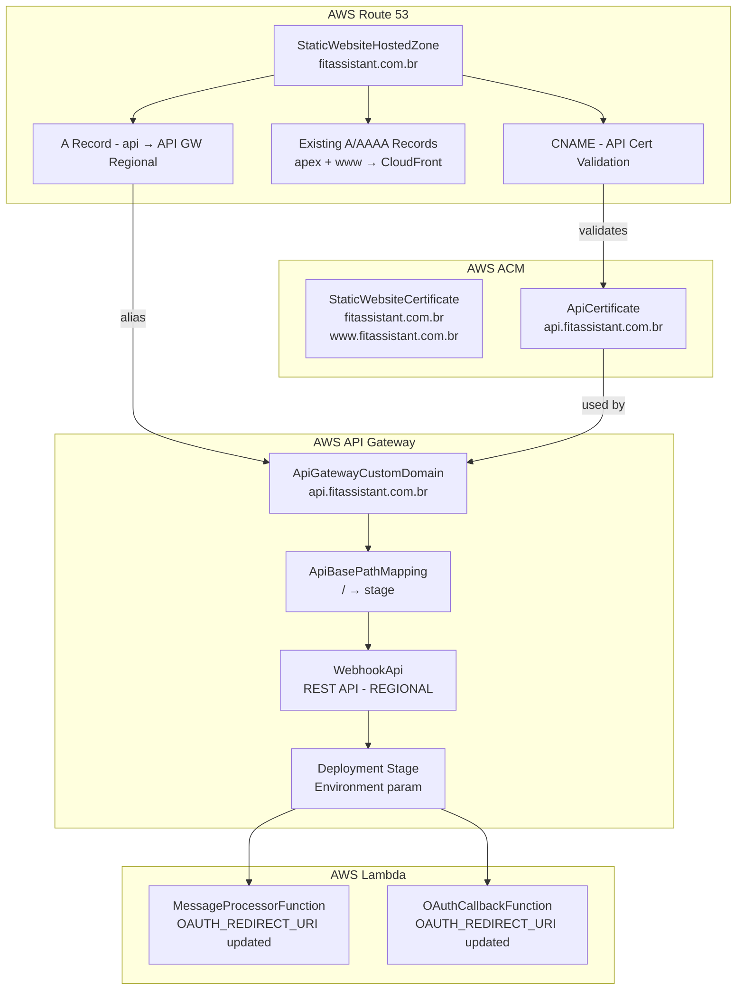
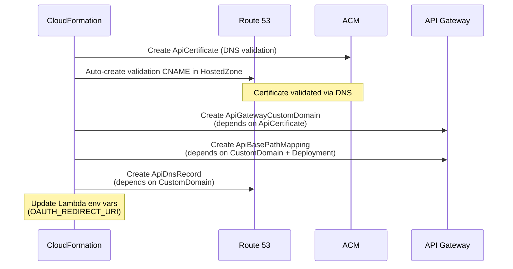

# Design Document: API Gateway Custom Domain

## Overview

This design adds a custom domain `api.fitassistant.com.br` to the existing API Gateway REST API (`WebhookApi`) in the FitAgent CloudFormation template. The implementation creates a dedicated ACM certificate for the API subdomain, configures an API Gateway custom domain name resource with regional endpoint, sets up a base path mapping to the existing deployment stage, and creates a DNS A-alias record in the existing Route 53 hosted zone. It also updates Lambda environment variables (`OAUTH_REDIRECT_URI`) to use the custom domain URL and adds new CloudFormation outputs for the API custom domain URLs.

The existing `StaticWebsiteCertificate` covers `fitassistant.com.br` and `www.fitassistant.com.br`. Rather than modifying it (which would force certificate re-validation and potentially disrupt the static website), a new dedicated certificate is created for `api.fitassistant.com.br`.

### Key Design Decisions

1. **Dedicated ACM certificate for API subdomain**: Creating a separate `ApiCertificate` resource instead of extending `StaticWebsiteCertificate`. This avoids re-validation of the existing certificate and keeps concerns separated — the static website cert covers website domains, the API cert covers the API subdomain.
2. **Regional endpoint type**: The API Gateway is already configured as `REGIONAL`, so the custom domain name uses a regional certificate in the same region as the stack (not us-east-1 like CloudFront requires). DNS validation uses the existing hosted zone.
3. **Domain derived from parameter**: The API subdomain is constructed as `!Sub 'api.${DomainName}'` to maintain the existing parameterization pattern.
4. **Base path mapping to root**: The mapping connects the root path (`/`) of the custom domain to the existing stage, so `https://api.fitassistant.com.br/webhook` maps directly to the existing `/webhook` resource.
5. **Lambda env var update**: `OAUTH_REDIRECT_URI` in `MessageProcessorFunction` and `OAuthCallbackFunction` is updated to use the custom domain, ensuring OAuth callbacks use the professional URL.

## Architecture



### Resource Dependency Flow



## Components and Interfaces

### 1. New CloudFormation Resources (infrastructure/template.yml)

| Resource | Type | Purpose |
|---|---|---|
| `ApiCertificate` | `AWS::CertificateManager::Certificate` | SSL cert for `api.fitassistant.com.br`, DNS-validated in existing hosted zone |
| `ApiGatewayCustomDomain` | `AWS::ApiGateway::DomainName` | Custom domain name resource linking cert to API Gateway |
| `ApiBasePathMapping` | `AWS::ApiGateway::BasePathMapping` | Maps root path of custom domain to API Gateway stage |
| `ApiDnsRecord` | `AWS::Route53::RecordSet` | A-alias record: `api.fitassistant.com.br` → API GW regional endpoint |

### 2. Modifications to Existing Resources

| Resource | Change |
|---|---|
| `MessageProcessorFunction` | `OAUTH_REDIRECT_URI` env var updated from API GW default URL to `https://api.${DomainName}/oauth/callback` |
| `OAuthCallbackFunction` | `OAUTH_REDIRECT_URI` env var updated from API GW default URL to `https://api.${DomainName}/oauth/callback` |

### 3. New CloudFormation Outputs

| Output | Value | Description |
|---|---|---|
| `ApiCustomDomainUrl` | `https://api.${DomainName}` | Base URL for the API custom domain |
| `ApiCustomWebhookUrl` | `https://api.${DomainName}/webhook` | Webhook URL using custom domain |
| `ApiCustomOAuthCallbackUrl` | `https://api.${DomainName}/oauth/callback` | OAuth callback URL using custom domain |
| `ApiCertificateArn` | `!Ref ApiCertificate` | ARN of the API subdomain certificate |

### 4. Documentation Update (docs/configuracao-dominio.md)

New section appended to the existing guide covering:
- Verification that `api.fitassistant.com.br` resolves correctly
- Testing webhook endpoint via custom domain
- Testing OAuth callback via custom domain
- Troubleshooting API custom domain issues

### Resource Configuration Details

**ApiCertificate:**
```yaml
Type: AWS::CertificateManager::Certificate
Properties:
  DomainName: !Sub 'api.${DomainName}'
  ValidationMethod: DNS
  DomainValidationOptions:
    - DomainName: !Sub 'api.${DomainName}'
      HostedZoneId: !Ref StaticWebsiteHostedZone
```

**ApiGatewayCustomDomain:**
```yaml
Type: AWS::ApiGateway::DomainName
Properties:
  DomainName: !Sub 'api.${DomainName}'
  RegionalCertificateArn: !Ref ApiCertificate
  EndpointConfiguration:
    Types:
      - REGIONAL
  SecurityPolicy: TLS_1_2
```

**ApiBasePathMapping:**
```yaml
Type: AWS::ApiGateway::BasePathMapping
Properties:
  DomainName: !Ref ApiGatewayCustomDomain
  RestApiId: !Ref WebhookApi
  Stage: !Ref Environment
```

**ApiDnsRecord:**
```yaml
Type: AWS::Route53::RecordSet
Properties:
  HostedZoneId: !Ref StaticWebsiteHostedZone
  Name: !Sub 'api.${DomainName}'
  Type: A
  AliasTarget:
    DNSName: !GetAtt ApiGatewayCustomDomain.RegionalDomainName
    HostedZoneId: !GetAtt ApiGatewayCustomDomain.RegionalHostedZoneId
```

## Data Models

This feature does not introduce new data models or database changes. All changes are infrastructure-level (CloudFormation resources).

### CloudFormation Parameter Usage

The existing `DomainName` parameter (default: `fitassistant.com.br`) is reused. The API subdomain is derived via `!Sub 'api.${DomainName}'`.

### Lambda Environment Variable Change

| Variable | Current Value | New Value |
|---|---|---|
| `OAUTH_REDIRECT_URI` | `https://${WebhookApi}.execute-api.${AWS::Region}.amazonaws.com/${Environment}/oauth/callback` | `https://api.${DomainName}/oauth/callback` |

This affects `MessageProcessorFunction` and `OAuthCallbackFunction`.


## Correctness Properties

*A property is a characteristic or behavior that should hold true across all valid executions of a system — essentially, a formal statement about what the system should do. Properties serve as the bridge between human-readable specifications and machine-verifiable correctness guarantees.*

### Property 1: API subdomain derived from DomainName parameter

*For any* valid domain name string passed as the `DomainName` parameter, both the `ApiCertificate` DomainName and the `ApiGatewayCustomDomain` DomainName SHALL resolve to `api.{domain}`, ensuring the API subdomain is always derived from the parameterized domain rather than hardcoded.

**Validates: Requirements 1.1, 2.5**

### Property 2: API certificate uses DNS validation via existing hosted zone

*For any* API certificate resource in the template, the `ValidationMethod` SHALL be `DNS` and the `DomainValidationOptions` SHALL reference the `StaticWebsiteHostedZone` resource, ensuring certificate validation is automated through the existing Route 53 zone.

**Validates: Requirements 1.2, 1.3**

### Property 3: Custom domain resource configuration

*For any* `ApiGatewayCustomDomain` resource in the template, it SHALL have `EndpointConfiguration.Types` containing `REGIONAL`, `SecurityPolicy` set to `TLS_1_2`, and `RegionalCertificateArn` referencing the `ApiCertificate` resource, ensuring the custom domain is correctly configured for regional access with TLS 1.2 minimum security.

**Validates: Requirements 2.1, 2.2, 2.3, 2.4**

### Property 4: Base path mapping connects custom domain to API stage

*For any* `ApiBasePathMapping` resource in the template, it SHALL reference the `ApiGatewayCustomDomain` as its `DomainName`, the `WebhookApi` as its `RestApiId`, the `Environment` parameter as its `Stage`, and SHALL NOT specify a `BasePath` (implying root mapping), ensuring requests to the custom domain are routed to the correct API stage.

**Validates: Requirements 3.1, 3.2, 3.3**

### Property 5: DNS A-alias record points to API Gateway regional endpoint

*For any* `ApiDnsRecord` resource in the template, it SHALL be of type `A`, reference the `StaticWebsiteHostedZone`, have Name resolving to `api.{DomainName}`, and have `AliasTarget` using `RegionalDomainName` and `RegionalHostedZoneId` from the `ApiGatewayCustomDomain` resource.

**Validates: Requirements 4.1, 4.2, 4.3**

### Property 6: API custom domain outputs present with correct values

*For any* valid domain name string, the template outputs SHALL include `ApiCustomDomainUrl` resolving to `https://api.{domain}`, `ApiCustomWebhookUrl` resolving to `https://api.{domain}/webhook`, and `ApiCustomOAuthCallbackUrl` resolving to `https://api.{domain}/oauth/callback`.

**Validates: Requirements 5.1, 5.2, 5.3**

### Property 7: Lambda OAUTH_REDIRECT_URI uses custom domain

*For any* valid domain name string, the `OAUTH_REDIRECT_URI` environment variable in both `MessageProcessorFunction` and `OAuthCallbackFunction` SHALL resolve to `https://api.{domain}/oauth/callback`, ensuring OAuth callbacks use the custom domain URL.

**Validates: Requirements 5.4**

### Property 8: Existing CloudFormation resources preserved

*For any* resource logical ID that existed in the original CloudFormation template before this feature, that logical ID SHALL still be present in the updated template with its `Type` unchanged. Specifically, `WebhookApi`, `StaticWebsiteHostedZone`, and `StaticWebsiteCertificate` SHALL remain with their original types and the existing certificate's `SubjectAlternativeNames` SHALL still include the original domains.

**Validates: Requirements 6.1, 6.2, 6.3, 6.4**

## Error Handling

### CloudFormation Deployment Errors

| Scenario | Handling |
|---|---|
| API certificate validation timeout | CloudFormation waits for DNS validation. Since the hosted zone already has nameservers configured at registro.br (from the static website setup), validation should complete automatically. If it doesn't, verify nameserver delegation is still active. |
| Custom domain name already exists | If `api.fitassistant.com.br` is already registered as a custom domain in another API Gateway, CloudFormation will fail. The operator should check for existing custom domain configurations before deploying. |
| Base path mapping conflict | If a base path mapping already exists for the same domain + base path combination, the stack update will fail. Delete the existing mapping first. |
| Certificate in wrong region | For regional API Gateway endpoints, the certificate must be in the same region as the API Gateway. The template creates both in the same stack/region, so this is handled by design. |

### DNS Resolution Errors

| Scenario | Handling |
|---|---|
| API subdomain doesn't resolve | Verify the hosted zone nameservers are still correctly configured at registro.br. Check that the `ApiDnsRecord` was created successfully in the stack. |
| SSL certificate mismatch | If the browser shows a certificate error, verify the `ApiCertificate` status is `ISSUED` and the custom domain is correctly associated. |

### Lambda Environment Variable Errors

| Scenario | Handling |
|---|---|
| OAuth callback fails with new URL | The OAuth redirect URI must be registered in Google Cloud Console and Azure AD app registration. After deploying, update the allowed redirect URIs in both providers to include `https://api.fitassistant.com.br/oauth/callback`. |
| Old OAuth tokens use old redirect URI | Existing OAuth tokens are not affected by the redirect URI change. Only new authorization flows will use the updated URL. |

## Testing Strategy

### Property-Based Tests (Hypothesis)

The project uses **Hypothesis** for property-based testing. All correctness properties will be implemented as Hypothesis property-based tests that parse and validate the CloudFormation template YAML.

Each property test will:
- Run a minimum of 100 iterations
- Be tagged with a comment referencing the design property
- Tag format: `Feature: api-gateway-custom-domain, Property {number}: {property_text}`
- Live in `tests/property/test_api_gateway_custom_domain_properties.py`

| Property | Test Approach | Generator Strategy |
|---|---|---|
| P1: API subdomain parameterization | Parse template YAML, generate random valid domain strings, resolve `!Sub` expressions, verify both cert and custom domain use `api.{domain}` | `st.from_regex(r'[a-z]{3,10}\.(com|net|org)\.[a-z]{2}')` |
| P2: DNS validation config | Parse template YAML, verify cert ValidationMethod is DNS and DomainValidationOptions references StaticWebsiteHostedZone | Deterministic template check with random domain for Sub resolution |
| P3: Custom domain config | Parse template YAML, verify EndpointConfiguration, SecurityPolicy, and RegionalCertificateArn | Deterministic template structure check |
| P4: Base path mapping | Parse template YAML, verify DomainName, RestApiId, Stage references and absence of BasePath | Deterministic template structure check |
| P5: DNS record config | Parse template YAML, verify record type, Name, AliasTarget references | Random domain strings for Sub resolution |
| P6: Outputs correctness | Parse template YAML, generate random domain strings, resolve output values, verify URL patterns | `st.from_regex(r'[a-z]{3,10}\.(com|net|org)\.[a-z]{2}')` |
| P7: Lambda env var | Parse template YAML, generate random domain strings, resolve OAUTH_REDIRECT_URI for both functions, verify it contains `api.{domain}` | Same domain generator |
| P8: Resource preservation | Parse original and updated template YAML, verify all original resource IDs exist with same Type in updated template | `st.sampled_from(original_resource_ids)` |

### Unit Tests

Unit tests complement property tests for specific examples and edge cases:

| Test | What it verifies |
|---|---|
| `test_template_has_api_certificate_resource` | `ApiCertificate` resource exists with type `AWS::CertificateManager::Certificate` |
| `test_template_has_api_gateway_custom_domain` | `ApiGatewayCustomDomain` resource exists with type `AWS::ApiGateway::DomainName` |
| `test_template_has_api_base_path_mapping` | `ApiBasePathMapping` resource exists with type `AWS::ApiGateway::BasePathMapping` |
| `test_template_has_api_dns_record` | `ApiDnsRecord` resource exists with type `AWS::Route53::RecordSet` |
| `test_existing_certificate_unchanged` | `StaticWebsiteCertificate` SANs still contain only apex and www domains |
| `test_api_certificate_does_not_cover_apex` | `ApiCertificate` only covers `api.${DomainName}`, not the apex domain |
| `test_output_api_custom_domain_url_exists` | `ApiCustomDomainUrl` output exists |
| `test_output_api_webhook_url_exists` | `ApiCustomWebhookUrl` output exists |
| `test_output_api_oauth_callback_url_exists` | `ApiCustomOAuthCallbackUrl` output exists |
| `test_oauth_redirect_uri_not_using_execute_api` | Neither Lambda function's `OAUTH_REDIRECT_URI` contains `execute-api` |
| `test_docs_mention_api_subdomain` | `docs/configuracao-dominio.md` contains `api.fitassistant.com.br` |
| `test_docs_contain_api_verification_commands` | Documentation contains `dig` or `curl` commands for the API subdomain |

### Test File Organization

```
tests/
├── property/
│   └── test_api_gateway_custom_domain_properties.py   # All 8 property tests
└── unit/
    └── test_api_gateway_custom_domain.py              # Unit tests for specific examples
```
