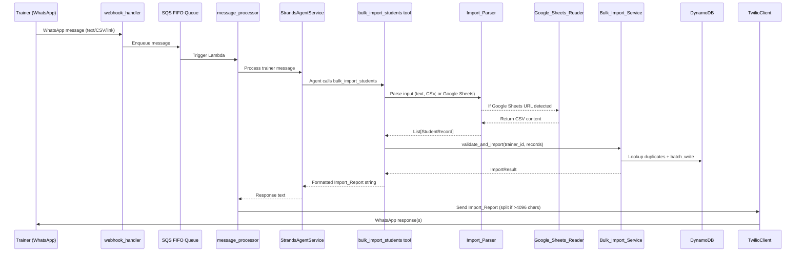
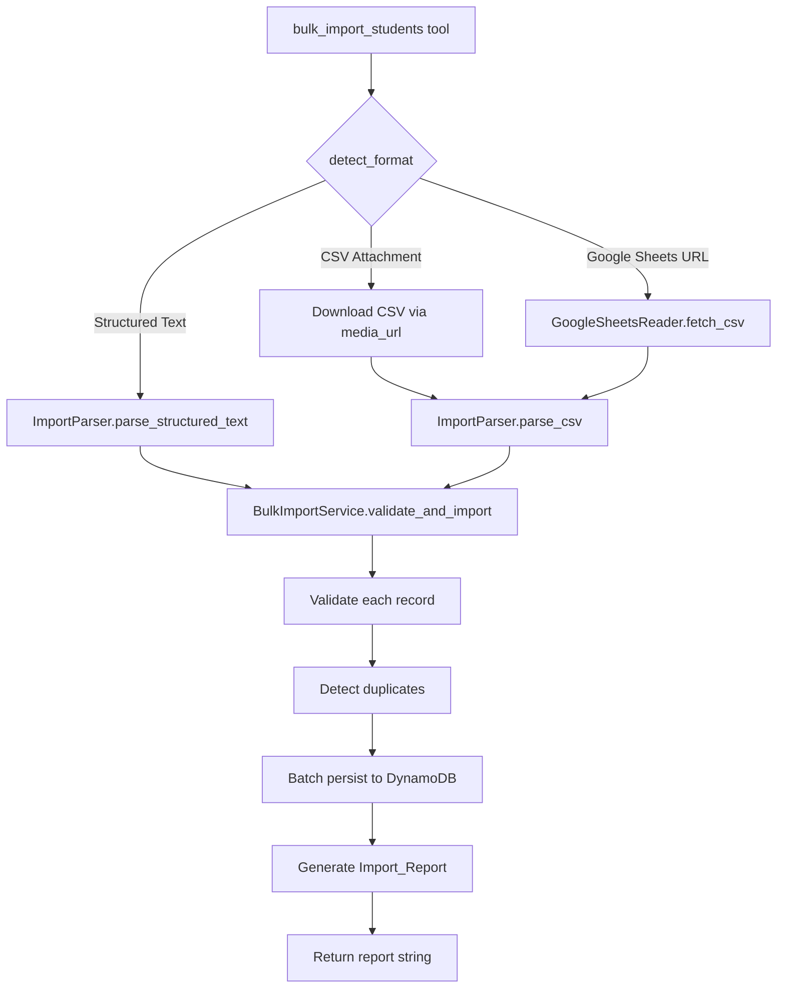
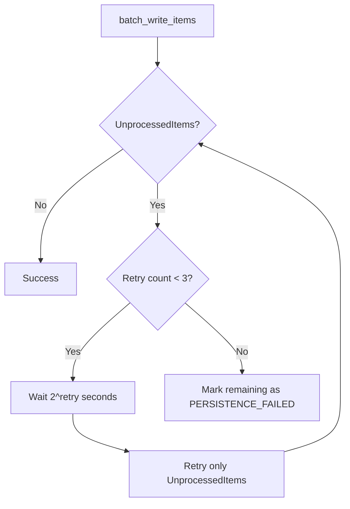

# Design Document: Bulk Student Import

## Overview

Bulk Student Import adds the ability for trainers to register multiple students in a single operation through WhatsApp. Instead of repeating the conversational AI flow for each student, trainers can send a structured text message, attach a CSV file, or share a Google Sheets link containing student data. The system parses the input, validates each record using the same rules as `register_student`, detects duplicates, persists valid records via DynamoDB batch writes, and sends back a formatted Import Report via WhatsApp.

The feature introduces three new modules (`Import_Parser`, `Google_Sheets_Reader`, `Bulk_Import_Service`) and a new Strands agent tool (`bulk_import_students`) that integrates with the existing `message_processor` → `TrainerHandler` → `StrandsAgentService` pipeline. No changes are needed to the webhook handler or SQS infrastructure — the AI agent detects bulk import intent from the trainer's message and invokes the tool.

## Architecture

### High-Level Data Flow



### Integration Point

The bulk import integrates as a new `@tool` function in `src/tools/student_tools.py` (or a new `src/tools/bulk_import_tools.py`). The Strands agent already has access to all tools registered via `@tool` decorator. When a trainer sends a message like "importar alunos" with student data, the agent recognizes the intent and calls `bulk_import_students`. For CSV attachments, the `media_urls` from the webhook payload are passed through the message body to the agent context.

No changes to `webhook_handler.py`, `message_router.py`, or the SQS pipeline are required. The `message_processor` already passes `media_urls` in the message body, and the Strands agent can access them via tool parameters.

## Components and Interfaces

### 1. Import_Parser (`src/services/import_parser.py`)

Responsible for parsing all three input formats into a uniform list of student record dictionaries.

```python
from dataclasses import dataclass
from typing import List, Optional, Tuple
from enum import Enum

class ImportFormat(Enum):
    STRUCTURED_TEXT = "structured_text"
    CSV = "csv"
    GOOGLE_SHEETS = "google_sheets"

@dataclass
class RawStudentRecord:
    """Intermediate representation of a parsed student record."""
    line_number: int
    name: Optional[str]
    phone_number: Optional[str]
    email: Optional[str]
    training_goal: Optional[str]
    payment_due_day: Optional[str] = None
    monthly_fee: Optional[str] = None
    plan_start_date: Optional[str] = None

@dataclass
class ParseError:
    """Error encountered during parsing."""
    line_number: int
    message: str

class ImportParser:
    BULK_IMPORT_PREFIXES = ("importar alunos", "import students")
    MAX_RECORDS = 50

    def detect_format(self, message_body: str, media_urls: list) -> Optional[ImportFormat]:
        """Detect import format from message content."""
        ...

    def parse_structured_text(self, message_body: str) -> Tuple[List[RawStudentRecord], List[ParseError]]:
        """Parse 'importar alunos\\nname;phone;email;goal' format."""
        ...

    def parse_csv(self, csv_content: str) -> Tuple[List[RawStudentRecord], List[ParseError]]:
        """Parse CSV with header row: name,phone_number,email,training_goal[,optional cols]."""
        ...

    def format_structured_text(self, records: List[dict]) -> str:
        """Format student record dicts back to structured text (for round-trip)."""
        ...

    def format_csv(self, records: List[dict]) -> str:
        """Format student record dicts back to CSV string (for round-trip)."""
        ...
```

**Design decisions:**
- The parser is stateless and format-agnostic after parsing — all formats produce the same `RawStudentRecord` list.
- Parse errors are collected per-line rather than failing fast, so the Import Report can list all issues.
- The `detect_format` method checks for Google Sheets URLs first, then CSV media attachments, then structured text prefixes.

### 2. Google_Sheets_Reader (`src/services/google_sheets_reader.py`)

Fetches spreadsheet data from publicly shared Google Sheets using the CSV export endpoint. No API key or OAuth required.

```python
import re
import httpx

class GoogleSheetsReader:
    SHEETS_URL_PATTERN = re.compile(
        r'https://docs\.google\.com/spreadsheets/d/([a-zA-Z0-9_-]+)'
    )
    EXPORT_URL_TEMPLATE = "https://docs.google.com/spreadsheets/d/{spreadsheet_id}/export?format=csv"
    TIMEOUT_SECONDS = 10

    def extract_spreadsheet_id(self, url: str) -> Optional[str]:
        """Extract spreadsheet ID from Google Sheets URL."""
        ...

    def fetch_csv(self, spreadsheet_id: str) -> str:
        """Fetch CSV content from public Google Sheets export endpoint.
        
        Raises:
            GoogleSheetsAccessError: If sheet is not publicly shared.
            GoogleSheetsTimeoutError: If request exceeds 10 seconds.
        """
        ...
```

**Design decisions:**
- Uses the public CSV export endpoint (`/export?format=csv`) instead of the Google Sheets API. This avoids needing API credentials and works for any sheet shared with "Anyone with the link can view."
- Uses `httpx` (already available in the Python ecosystem) with a 10-second timeout per Requirement 9.9.
- Custom exception classes allow the Bulk_Import_Service to return specific error messages to the trainer.

### 3. Bulk_Import_Service (`src/services/bulk_import_service.py`)

Orchestrates validation, duplicate detection, persistence, and report generation.

```python
from dataclasses import dataclass, field
from typing import List
from enum import Enum

class RecordStatus(Enum):
    SUCCESS = "success"
    ALREADY_LINKED = "already_linked"
    LINKED_EXISTING = "linked_existing"
    PHONE_IS_TRAINER = "phone_registered_as_trainer"
    DUPLICATE_IN_BATCH = "duplicate_in_batch"
    VALIDATION_FAILED = "validation_failed"
    PERSISTENCE_FAILED = "persistence_failed"

@dataclass
class RecordResult:
    line_number: int
    name: Optional[str]
    phone_number: Optional[str]
    status: RecordStatus
    error: Optional[str] = None
    student_id: Optional[str] = None

@dataclass
class ImportResult:
    total: int
    succeeded: int
    skipped: int
    failed: int
    results: List[RecordResult] = field(default_factory=list)

class BulkImportService:
    MAX_BATCH_SIZE = 50
    DYNAMO_BATCH_SIZE = 25
    MAX_RETRIES = 3

    def __init__(self, dynamodb_client, phone_validator, input_sanitizer):
        ...

    def validate_and_import(
        self, trainer_id: str, records: List[RawStudentRecord]
    ) -> ImportResult:
        """Full pipeline: validate → deduplicate → persist → return results."""
        ...

    def _validate_record(self, record: RawStudentRecord) -> List[str]:
        """Validate a single record using same rules as register_student.
        Returns list of error messages (empty = valid)."""
        ...

    def _detect_duplicates(
        self, trainer_id: str, records: List[RawStudentRecord]
    ) -> dict:
        """Check each phone number against DynamoDB and within-batch duplicates.
        Returns dict mapping line_number -> RecordStatus for duplicates."""
        ...

    def _batch_persist(
        self, trainer_id: str, valid_records: List[RawStudentRecord]
    ) -> List[RecordResult]:
        """Persist records using DynamoDB batch_write_items in chunks of 25.
        Each student requires 2 items (Student + TrainerStudentLink) = max 12 students per batch call."""
        ...

    def generate_report(self, result: ImportResult) -> List[str]:
        """Generate Import_Report as list of WhatsApp messages (each ≤4096 chars)."""
        ...
```

**Design decisions:**
- Validation reuses the same rules from `register_student` (PhoneNumberValidator, InputSanitizer, Pydantic Student model validators) rather than reimplementing them.
- Each student creates 2 DynamoDB items (Student entity + TrainerStudentLink), so a batch of 25 DynamoDB items handles ~12 students. The service chunks accordingly.
- Retry logic uses exponential backoff (1s, 2s, 4s) for failed batch writes, processing only `UnprocessedItems` on retry.
- The report generator splits output into multiple messages if it exceeds 4096 characters.

### 4. bulk_import_students Tool (`src/tools/student_tools.py` or `src/tools/bulk_import_tools.py`)

```python
@tool
def bulk_import_students(
    trainer_id: str,
    message_body: str,
    media_urls: list = None,
) -> Dict[str, Any]:
    """
    Import multiple students from structured text, CSV file, or Google Sheets link.
    
    Use this tool when the trainer wants to register multiple students at once.
    The trainer can send student data as:
    - Structured text starting with "importar alunos" or "import students"
    - A CSV file attachment with caption containing "importar" or "import"
    - A Google Sheets link with message containing "importar" or "import"
    """
    ...
```

### Component Interaction Diagram



## Data Models

### RawStudentRecord (Internal)

Intermediate representation after parsing, before validation:

| Field | Type | Required | Description |
|-------|------|----------|-------------|
| line_number | int | Yes | Source line number for error reporting |
| name | str | No | Raw name string (may be invalid) |
| phone_number | str | No | Raw phone string (may need normalization) |
| email | str | No | Raw email string |
| training_goal | str | No | Raw training goal string |
| payment_due_day | str | No | Raw day string (optional column) |
| monthly_fee | str | No | Raw fee string (optional column) |
| plan_start_date | str | No | Raw date string (optional column) |

### Existing Entities (Reused As-Is)

- **Student** (`src/models/entities.py`): Created for each new valid student. Fields: `student_id`, `name`, `email`, `phone_number`, `training_goal`, `payment_due_day`, `monthly_fee`, `currency`, `plan_start_date`, `created_at`, `updated_at`.
- **TrainerStudentLink** (`src/models/entities.py`): Created to link each student to the trainer. Fields: `trainer_id`, `student_id`, `linked_at`, `status="active"`.

### DynamoDB Write Pattern

For each new student, 2 items are written:

| Item | PK | SK |
|------|----|----|
| Student | `STUDENT#{student_id}` | `METADATA` |
| TrainerStudentLink | `TRAINER#{trainer_id}` | `STUDENT#{student_id}` |

For existing students needing only a link: 1 item written (TrainerStudentLink only).

Batch writes use `batch_writer()` (which handles chunking into 25-item batches internally via boto3), with manual retry of `UnprocessedItems` up to 3 times with exponential backoff.

### ImportResult (Internal)

| Field | Type | Description |
|-------|------|-------------|
| total | int | Total records in the batch |
| succeeded | int | Records successfully imported |
| skipped | int | Records skipped (duplicates) |
| failed | int | Records that failed validation |
| results | List[RecordResult] | Per-record outcome details |

### Structured Text Format

```
importar alunos
João Silva;+5511999999999;joao@email.com;Perder peso
Maria Santos;+5511888888888;maria@email.com;Ganhar massa muscular
```

### CSV Format

```csv
name,phone_number,email,training_goal,payment_due_day,monthly_fee,plan_start_date
João Silva,+5511999999999,joao@email.com,Perder peso,10,150.00,2024-01
Maria Santos,+5511888888888,maria@email.com,Ganhar massa,,, 
```

### Import Report Format (WhatsApp Message)

```
📋 Relatório de Importação

Total: 5 registros processados
✅ Importados: 3
⏭️ Ignorados: 1
❌ Falhas: 1

Detalhes:
✅ João Silva (+5511999999999) - Importado
✅ Maria Santos (+5511888888888) - Importado
✅ Pedro Lima (+5511777777777) - Importado
⏭️ Ana Costa (+5511666666666) - Já vinculado ao trainer
❌ Linha 5 (+5511555) - Telefone inválido (formato E.164)
```


## Correctness Properties

*A property is a characteristic or behavior that should hold true across all valid executions of a system — essentially, a formal statement about what the system should do. Properties serve as the bridge between human-readable specifications and machine-verifiable correctness guarantees.*

### Property 1: Format Detection

*For any* WhatsApp message (with or without media attachments), the `ImportParser.detect_format` method should return `STRUCTURED_TEXT` if and only if the message body starts with "importar alunos" or "import students" (case-insensitive) and has no CSV attachment or Google Sheets URL; `CSV` if and only if a CSV media attachment is present and the caption contains "importar" or "import"; `GOOGLE_SHEETS` if and only if the message contains a valid Google Sheets URL and "importar" or "import"; and `None` otherwise.

**Validates: Requirements 1.1, 2.1**

### Property 2: Structured Text Parse-Format Round-Trip

*For any* valid list of student record dictionaries (with non-empty name, valid E.164 phone, email with "@" and ".", non-empty training_goal), formatting the list into structured text and then parsing the result should produce a list equivalent to the original input.

**Validates: Requirements 8.1, 8.2, 8.3**

### Property 3: CSV Parse-Format Round-Trip

*For any* valid CSV content string with the required header row, parsing then formatting then parsing should produce a list equivalent to the first parse result.

**Validates: Requirements 8.4**

### Property 4: Batch Size Limit Enforcement

*For any* import batch containing more than 50 student records (regardless of input format), the `BulkImportService` should reject the entire batch and return an error indicating the 50-student limit.

**Validates: Requirements 1.5, 2.4, 9.7**

### Property 5: Validation Correctness

*For any* student record, the validation function should reject the record if and only if at least one of the following holds: name has fewer than 2 characters, phone_number is not valid E.164 (even after normalization), email lacks "@" or ".", training_goal is empty, payment_due_day is outside 1–31, monthly_fee is non-positive or has more than 2 decimal places, or plan_start_date does not match YYYY-MM format.

**Validates: Requirements 3.1, 3.2, 3.4, 3.5, 3.6, 3.7, 3.8**

### Property 6: Phone Number Normalization

*For any* phone number string that is a valid E.164 number except for a missing "+" prefix, the `BulkImportService` should normalize it by prepending "+" and the resulting number should pass E.164 validation.

**Validates: Requirements 3.3**

### Property 7: Duplicate Detection Classification

*For any* trainer and import batch, each record's phone number should be classified as exactly one of: "already_linked" (phone exists as active student linked to this trainer), "linked_existing" (phone exists as student but not linked to this trainer), "phone_registered_as_trainer" (phone belongs to a trainer), "duplicate_in_batch" (same phone appeared earlier in the batch), or "new" (phone not found in system and first occurrence in batch).

**Validates: Requirements 4.1, 4.2, 4.3, 4.4**

### Property 8: Persistence Creates Correct Entities

*For any* valid new student record that passes validation and duplicate detection, the `BulkImportService` should create exactly one Student entity and one TrainerStudentLink entity with status "active" in DynamoDB.

**Validates: Requirements 5.1, 7.2**

### Property 9: Partial Failure Independence

*For any* import batch containing a mix of valid and invalid records, all valid records should be persisted successfully regardless of the invalid records, and the ImportResult should reflect the correct count of successes and failures.

**Validates: Requirements 5.4**

### Property 10: Report Completeness

*For any* ImportResult, the generated Import_Report should contain the total count, success count, skipped count, and failed count that match the ImportResult values, and should list every failed or skipped record with its name (or line number), phone number, and reason.

**Validates: Requirements 6.2, 6.3**

### Property 11: Report Message Splitting

*For any* Import_Report output, every message chunk in the returned list should be at most 4096 characters in length, and concatenating all chunks should contain all the information from the full report.

**Validates: Requirements 6.5**

### Property 12: Schema Consistency with register_student

*For any* student record that is valid for bulk import, creating a Student entity via `BulkImportService` and then retrieving it via `view_students` should produce output with the same fields and format as a student created via the `register_student` tool.

**Validates: Requirements 7.1, 7.3**

### Property 13: Input Sanitization

*For any* student record containing HTML tags or script injection attempts in string fields, the `BulkImportService` should sanitize all string fields using `InputSanitizer` such that the persisted values contain no HTML tags.

**Validates: Requirements 7.4**

### Property 14: Google Sheets URL Extraction

*For any* string, `GoogleSheetsReader.extract_spreadsheet_id` should return a non-None spreadsheet ID if and only if the string contains a URL matching the pattern `https://docs.google.com/spreadsheets/d/{id}`, and the returned ID should match the `{id}` segment of the URL.

**Validates: Requirements 9.1, 9.2**

## Error Handling

### Error Categories and Responses

| Error | Source | Handling | User Message |
|-------|--------|----------|-------------|
| Invalid format (not recognized as bulk import) | Import_Parser | Return None from detect_format; agent handles naturally | Agent responds conversationally |
| Structured text line with <4 fields | Import_Parser | Add ParseError with line number | "Linha X: formato inválido (esperado: nome;telefone;email;objetivo)" |
| CSV missing required columns | Import_Parser | Return descriptive error listing missing columns | "CSV inválido: colunas ausentes: {columns}" |
| CSV encoding error | Import_Parser | Try UTF-8 first, fallback to Latin-1, then error | "Não foi possível ler o arquivo CSV. Verifique a codificação (UTF-8 ou Latin-1)." |
| Batch exceeds 50 records | BulkImportService | Reject entire batch before processing | "Limite excedido: máximo de 50 alunos por importação. Seu arquivo contém {n} registros." |
| Validation failure (per record) | BulkImportService | Mark record as failed, continue processing others | Listed in Import_Report with specific reason |
| Phone already linked to trainer | BulkImportService | Mark as "already_linked", skip | Listed in Import_Report as skipped |
| Phone registered as trainer | BulkImportService | Mark as "phone_registered_as_trainer", skip | Listed in Import_Report as skipped |
| DynamoDB batch write failure | DynamoDBClient | Retry UnprocessedItems up to 3 times with exponential backoff | If still fails: "Erro ao salvar {n} registros. Tente novamente." |
| Google Sheets not publicly shared | GoogleSheetsReader | Return GoogleSheetsAccessError | "Não foi possível acessar a planilha. Verifique se o compartilhamento está configurado como 'Qualquer pessoa com o link pode visualizar'." |
| Google Sheets timeout (>10s) | GoogleSheetsReader | Return GoogleSheetsTimeoutError | "Tempo limite excedido ao acessar a planilha. Tente novamente em alguns instantes." |
| CSV media download failure | TwilioClient/httpx | Return error | "Não foi possível baixar o arquivo CSV. Tente enviar novamente." |

### Retry Strategy



### Error Propagation

- **Parse errors** are collected and included in the Import_Report. They do not prevent valid records from being processed.
- **Validation errors** are per-record and do not affect other records in the batch.
- **DynamoDB errors** after retries are marked as `PERSISTENCE_FAILED` in the Import_Report. Successfully written records are not rolled back (eventual consistency is acceptable for this use case).
- **Google Sheets / CSV download errors** abort the entire import since no data is available to process.

## Testing Strategy

### Property-Based Testing

Property-based tests use the **Hypothesis** library (already in the project's test dependencies) with a minimum of **100 iterations** per property. Each test references its design document property.

Tests go in `tests/property/test_bulk_import_properties.py`.

Key generators needed:
- `valid_student_record()`: Generates random valid student data (name ≥2 chars, E.164 phone, email with "@" and ".", non-empty goal, optional valid payment_due_day/monthly_fee/plan_start_date)
- `invalid_student_record()`: Generates records with at least one invalid field
- `student_record_list(min_size, max_size)`: Generates lists of valid student records
- `import_result()`: Generates ImportResult with random counts and RecordResult lists
- `google_sheets_url()`: Generates valid and invalid Google Sheets URLs

Property tests to implement:

| Test | Property | Tag |
|------|----------|-----|
| `test_format_detection` | Property 1 | Feature: bulk-student-import, Property 1: Format Detection |
| `test_structured_text_round_trip` | Property 2 | Feature: bulk-student-import, Property 2: Structured Text Parse-Format Round-Trip |
| `test_csv_round_trip` | Property 3 | Feature: bulk-student-import, Property 3: CSV Parse-Format Round-Trip |
| `test_batch_size_limit` | Property 4 | Feature: bulk-student-import, Property 4: Batch Size Limit Enforcement |
| `test_validation_correctness` | Property 5 | Feature: bulk-student-import, Property 5: Validation Correctness |
| `test_phone_normalization` | Property 6 | Feature: bulk-student-import, Property 6: Phone Number Normalization |
| `test_duplicate_detection` | Property 7 | Feature: bulk-student-import, Property 7: Duplicate Detection Classification |
| `test_persistence_creates_entities` | Property 8 | Feature: bulk-student-import, Property 8: Persistence Creates Correct Entities |
| `test_partial_failure_independence` | Property 9 | Feature: bulk-student-import, Property 9: Partial Failure Independence |
| `test_report_completeness` | Property 10 | Feature: bulk-student-import, Property 10: Report Completeness |
| `test_report_message_splitting` | Property 11 | Feature: bulk-student-import, Property 11: Report Message Splitting |
| `test_schema_consistency` | Property 12 | Feature: bulk-student-import, Property 12: Schema Consistency with register_student |
| `test_input_sanitization` | Property 13 | Feature: bulk-student-import, Property 13: Input Sanitization |
| `test_google_sheets_url_extraction` | Property 14 | Feature: bulk-student-import, Property 14: Google Sheets URL Extraction |

### Unit Testing

Unit tests go in `tests/unit/test_bulk_import.py` and focus on specific examples and edge cases:

- **Import_Parser**: Parse a known structured text message and verify exact output; parse CSV with missing columns and verify error; parse empty message; parse message with only the prefix and no records.
- **Google_Sheets_Reader**: Extract spreadsheet ID from various URL formats; handle non-Google URLs; mock HTTP responses for access denied (403), timeout, and success.
- **BulkImportService**: Import a batch where all records are valid; import a batch where all records are invalid (verify no DB writes); import with DynamoDB failure and verify retry behavior (mock); verify report format for all-success and mixed-result scenarios.
- **Report generation**: Verify report with exactly 4096 characters is not split; verify report with 4097 characters is split into 2 messages.

### Integration Testing

Integration tests go in `tests/integration/test_bulk_import_integration.py` using LocalStack:

- End-to-end: Send a structured text bulk import message through the tool and verify students appear in DynamoDB and are returned by `view_students`.
- CSV file: Parse a real CSV file and verify all records are persisted correctly.
- Duplicate handling: Pre-populate DynamoDB with existing students and verify correct duplicate classification.

### Test Configuration

```python
# Hypothesis settings for property tests
from hypothesis import settings as hypothesis_settings

hypothesis_settings.register_profile(
    "bulk_import",
    max_examples=100,
    deadline=None,  # DynamoDB mocking can be slow
)
```
