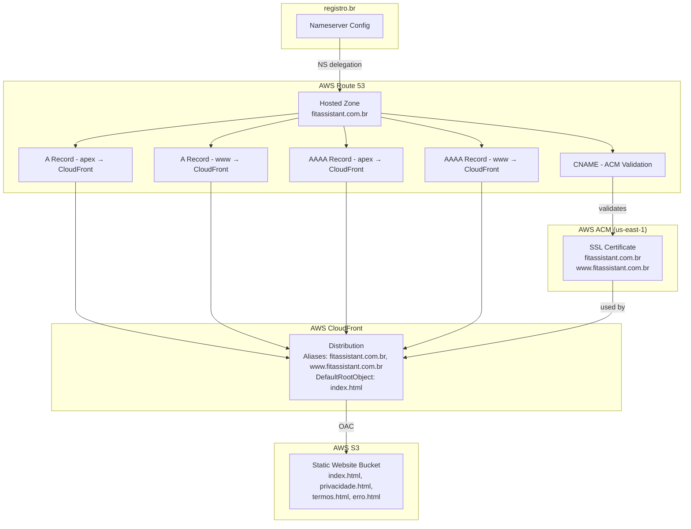
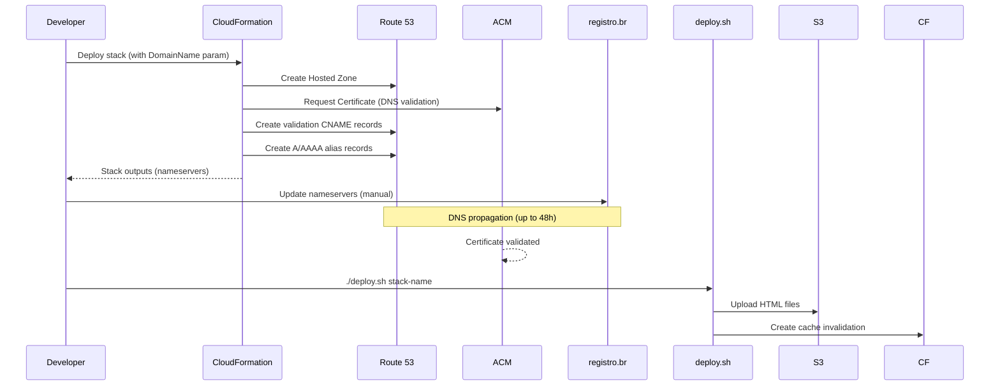

# Design Document: Custom Domain Deployment

## Overview

This design adds custom domain support (`fitassistant.com.br`) to the existing FitAgent static website hosted on S3 + CloudFront. The implementation extends the existing CloudFormation template (`infrastructure/template.yml`) with Route 53 DNS, ACM SSL certificate, and CloudFront alias configuration. It also introduces a new `index.html` landing page, updates navigation across all existing pages, creates a deploy script for S3 upload + CloudFront invalidation, and provides a PT-BR manual steps guide for configuring nameservers at registro.br.

The domain was purchased from registro.br (Brazilian registrar), so DNS delegation to AWS Route 53 requires a manual nameserver update at the registrar — this is the only step that cannot be automated via CloudFormation.

### Key Design Decisions

1. **Single CloudFormation template**: All new resources (Hosted Zone, ACM Certificate, DNS records) are added to the existing `infrastructure/template.yml` rather than a separate stack, keeping infrastructure cohesive and allowing cross-resource references.
2. **ACM DNS validation via CloudFormation**: Using `AWS::CertificateManager::Certificate` with `DomainValidationOptions` pointing to the Route 53 hosted zone. CloudFormation will create the validation CNAME records automatically.
3. **Domain as CloudFormation parameter**: The domain name is parameterized (`DomainName`) so the template can be reused across environments.
4. **Deploy script in Bash**: A simple `deploy.sh` script using AWS CLI to sync HTML files and invalidate CloudFront cache, consistent with the project's existing infrastructure tooling.
5. **Embedded CSS pattern**: The new `index.html` follows the same embedded CSS pattern as existing pages (no external stylesheets), maintaining consistency.

## Architecture



### Deployment Flow



## Components and Interfaces

### 1. CloudFormation Resources (infrastructure/template.yml)

New resources to add to the existing template:

| Resource | Type | Purpose |
|---|---|---|
| `DomainName` | Parameter | Domain name string (default: `fitassistant.com.br`) |
| `StaticWebsiteHostedZone` | `AWS::Route53::HostedZone` | DNS zone for the custom domain |
| `StaticWebsiteCertificate` | `AWS::CertificateManager::Certificate` | SSL cert for apex + www, DNS-validated in the hosted zone |
| `StaticWebsiteApexARecord` | `AWS::Route53::RecordSet` | A alias record: apex → CloudFront |
| `StaticWebsiteWwwARecord` | `AWS::Route53::RecordSet` | A alias record: www → CloudFront |
| `StaticWebsiteApexAAAARecord` | `AWS::Route53::RecordSet` | AAAA alias record: apex → CloudFront |
| `StaticWebsiteWwwAAAARecord` | `AWS::Route53::RecordSet` | AAAA alias record: www → CloudFront |

Modifications to existing resources:

| Resource | Change |
|---|---|
| `StaticWebsiteDistribution` | Add `Aliases` (apex + www), add `ViewerCertificate` with ACM cert ARN, change `DefaultRootObject` to `index.html` |

New outputs:

| Output | Value |
|---|---|
| `HostedZoneNameServers` | Nameservers for registro.br configuration |
| `CertificateArn` | ACM certificate ARN |
| `StaticWebsiteCustomUrl` | `https://fitassistant.com.br` |
| `StaticWebsiteDistributionId` | CloudFront distribution ID (for deploy script) |

### 2. Deploy Script (scripts/deploy.sh)

Bash script that:
- Accepts stack name as argument
- Queries CloudFormation outputs for bucket name and distribution ID
- Uploads all `.html` files from `static-website/` to S3 with `Content-Type: text/html`
- Creates a CloudFront invalidation for `/*`
- Exits with non-zero code on any failure

Interface:
```bash
./scripts/deploy.sh <stack-name>
```

### 3. Static HTML Pages

| File | Action |
|---|---|
| `static-website/index.html` | New landing page with FitAgent description and nav links |
| `static-website/privacidade.html` | Update nav to include `index.html` link |
| `static-website/termos.html` | Update nav to include `index.html` link |
| `static-website/erro.html` | Update error links to include `index.html` link |

### 4. Manual Steps Guide (docs/configuracao-dominio.md)

PT-BR document with step-by-step instructions for:
1. Deploying the CloudFormation stack
2. Retrieving nameservers from stack outputs
3. Updating nameservers at registro.br
4. Verifying DNS propagation
5. Verifying ACM certificate validation
6. Running the deploy script

## Data Models

This feature does not introduce new data models or database changes. All changes are infrastructure-level (CloudFormation resources) and static content (HTML files).

### CloudFormation Parameter Model

```yaml
DomainName:
  Type: String
  Default: 'fitassistant.com.br'
  Description: Custom domain name for the static website
```

### Deploy Script Configuration Model

The deploy script derives its configuration from CloudFormation stack outputs:

| Field | Source | Type |
|---|---|---|
| `BUCKET_NAME` | `StaticWebsiteBucketName` output | String |
| `DISTRIBUTION_ID` | `StaticWebsiteDistributionId` output | String |

### HTML Page Structure Model

All pages follow a consistent structure:

```
<!DOCTYPE html>
<html lang="pt-BR">
  <head>
    <meta charset="UTF-8">
    <meta name="viewport" ...>
    <title>{Page Title} - FitAgent</title>
    <style>/* Embedded CSS - identical base styles across all pages */</style>
  </head>
  <body>
    <header>  <!-- #1a1a2e background, logo + nav links -->
    <main>    <!-- Page content -->
    <footer>  <!-- #1a1a2e background, copyright + nav links -->
  </body>
</html>
```

Navigation links across all pages after update:
- `index.html` (Início)
- `privacidade.html` (Política de Privacidade)
- `termos.html` (Termos de Serviço)

## Correctness Properties

*A property is a characteristic or behavior that should hold true across all valid executions of a system — essentially, a formal statement about what the system should do. Properties serve as the bridge between human-readable specifications and machine-verifiable correctness guarantees.*

### Property 1: Hosted Zone uses domain parameter

*For any* valid domain name string passed as the `DomainName` CloudFormation parameter, the `StaticWebsiteHostedZone` resource in the template SHALL reference that parameter as its `Name`, ensuring the hosted zone is always created for the parameterized domain rather than a hardcoded value.

**Validates: Requirements 1.1, 1.2**

### Property 2: CloudFront Aliases contain both domain variants

*For any* valid domain name string `D`, the CloudFront distribution's `Aliases` list SHALL contain exactly `D` and `www.{D}`, ensuring both the apex domain and the www subdomain are configured as alternate domain names.

**Validates: Requirements 3.1**

### Property 3: Deploy script uploads all HTML files with correct Content-Type

*For any* set of `.html` files present in the `static-website/` directory, the deploy script SHALL issue an S3 upload command for each file with `Content-Type: text/html`, ensuring no HTML file is missed and all are served with the correct MIME type.

**Validates: Requirements 6.1, 6.2**

### Property 4: Deploy script exits non-zero on failure

*For any* AWS CLI command (S3 upload or CloudFront invalidation) that returns a non-zero exit code, the deploy script SHALL terminate with a non-zero exit code and print a descriptive error message to stderr, ensuring failures are never silently ignored.

**Validates: Requirements 6.5**

### Property 5: Cross-page navigation completeness

*For any* non-error page in the website (`index.html`, `privacidade.html`, `termos.html`), the page SHALL contain `<a>` elements linking to all other non-error pages. Specifically: index.html links to privacidade.html and termos.html; privacidade.html links to index.html and termos.html; termos.html links to index.html and privacidade.html. The error page (`erro.html`) SHALL contain links to all three non-error pages.

**Validates: Requirements 7.4, 8.4**

### Property 6: CSS consistency across all pages

*For any* two pages in the static website, the base CSS rules (reset, body, `.container`, `header`, `footer`, `main`, responsive media query) SHALL be identical, ensuring visual consistency across the entire site.

**Validates: Requirements 7.6**

### Property 7: Original CloudFormation resources preserved

*For any* resource logical ID that existed in the original CloudFormation template before this feature, that logical ID SHALL still be present in the updated template with its `Type` unchanged, ensuring no existing infrastructure is accidentally removed or altered.

**Validates: Requirements 8.1**

## Error Handling

### CloudFormation Deployment Errors

| Scenario | Handling |
|---|---|
| ACM certificate validation timeout | CloudFormation will wait for DNS validation. If nameservers aren't configured at registro.br, the stack will eventually timeout. The manual guide documents the correct order: deploy stack → configure nameservers → wait for propagation. |
| Domain already has a hosted zone | CloudFormation will fail if a hosted zone for the same domain already exists. The operator should check for existing zones before deploying. |
| Certificate in wrong region | The template must be deployed in a region where CloudFront can reference the cert. ACM certs for CloudFront must be in us-east-1. This is documented in the manual guide. |

### Deploy Script Errors

| Scenario | Handling |
|---|---|
| Invalid stack name | Script queries CloudFormation outputs; if the stack doesn't exist, `aws cloudformation describe-stacks` fails and the script exits with an error message. |
| No HTML files found | Script checks for `.html` files in `static-website/` and exits with an error if none are found. |
| S3 upload failure | Script uses `set -e` to exit on any command failure. Each upload failure triggers immediate termination with the AWS CLI error message. |
| CloudFront invalidation failure | Same `set -e` behavior. The error message from AWS CLI is displayed. |
| Missing AWS credentials | AWS CLI commands fail with authentication errors; script exits non-zero. |

### Static Website Errors

| Scenario | Handling |
|---|---|
| 404 / missing page | CloudFront custom error response already configured to serve `erro.html` with 404 status for both 403 and 404 origin errors. The updated `erro.html` will include a link to `index.html`. |
| Broken navigation link | Mitigated by Property 5 (cross-page navigation completeness test). |

## Testing Strategy

### Property-Based Tests (Hypothesis)

The project already uses **Hypothesis** for property-based testing (as seen in `.hypothesis/` directory and `tests/property/`). All correctness properties will be implemented as Hypothesis property-based tests.

Each property test will:
- Run a minimum of 100 iterations
- Be tagged with a comment referencing the design property
- Tag format: `Feature: custom-domain-deployment, Property {number}: {property_text}`
- Live in `tests/property/test_custom_domain_deployment_properties.py`

| Property | Test Approach | Generator Strategy |
|---|---|---|
| P1: Hosted Zone parameterization | Parse template YAML, generate random valid domain strings, verify HostedZone Name references the parameter | `st.from_regex(r'[a-z]{3,10}\.(com|net|org)\.[a-z]{2}')` |
| P2: CloudFront Aliases | Parse template YAML, generate random domain strings, verify Aliases list after `!Sub` resolution contains apex + www | Same domain generator |
| P3: Deploy script uploads all HTML | Create temp directories with random sets of `.html` files, parse script logic, verify all files are targeted | `st.lists(st.from_regex(r'[a-z]{3,10}\.html'), min_size=1)` |
| P4: Script error handling | Mock AWS CLI commands to return various non-zero exit codes, verify script exits non-zero | `st.integers(min_value=1, max_value=255)` for exit codes |
| P5: Cross-page navigation | Parse all HTML files, extract `<a href>` values, verify navigation graph completeness | Deterministic — operates on actual HTML files |
| P6: CSS consistency | Parse all HTML files, extract `<style>` blocks, compare base CSS rules across pages | Deterministic — operates on actual HTML files |
| P7: Resource preservation | Parse original and updated template YAML, generate subsets of original resource IDs, verify all are present in updated template | `st.sampled_from(original_resource_ids)` |

### Unit Tests

Unit tests complement property tests for specific examples and edge cases:

| Test | What it verifies |
|---|---|
| `test_index_html_has_pt_br_lang` | `<html lang="pt-BR">` attribute on index.html |
| `test_index_html_contains_fitagent_description` | Landing page has FitAgent service description |
| `test_template_has_domain_parameter` | DomainName parameter exists with correct type |
| `test_template_default_root_object_is_index` | DefaultRootObject changed to `index.html` |
| `test_template_certificate_uses_dns_validation` | ACM cert ValidationMethod is DNS |
| `test_template_certificate_covers_www` | SubjectAlternativeNames includes www |
| `test_template_outputs_nameservers` | HostedZoneNameServers output exists |
| `test_template_outputs_certificate_arn` | CertificateArn output exists |
| `test_template_outputs_custom_url` | StaticWebsiteCustomUrl output exists |
| `test_template_viewer_protocol_redirect` | ViewerProtocolPolicy remains redirect-to-https |
| `test_deploy_script_is_executable` | Script has executable permissions |
| `test_deploy_script_accepts_stack_name_arg` | Script uses `$1` as stack name |
| `test_guide_contains_nameserver_instructions` | Manual guide mentions nameserver configuration |
| `test_guide_contains_propagation_check` | Manual guide mentions DNS propagation verification |
| `test_guide_correct_execution_order` | Deploy stack section appears before nameserver section |
| `test_erro_html_links_to_index` | Error page includes link to index.html |

### Test File Organization

```
tests/
├── property/
│   └── test_custom_domain_deployment_properties.py   # All 7 property tests
└── unit/
    └── test_custom_domain_deployment.py              # Unit tests for specific examples
```
