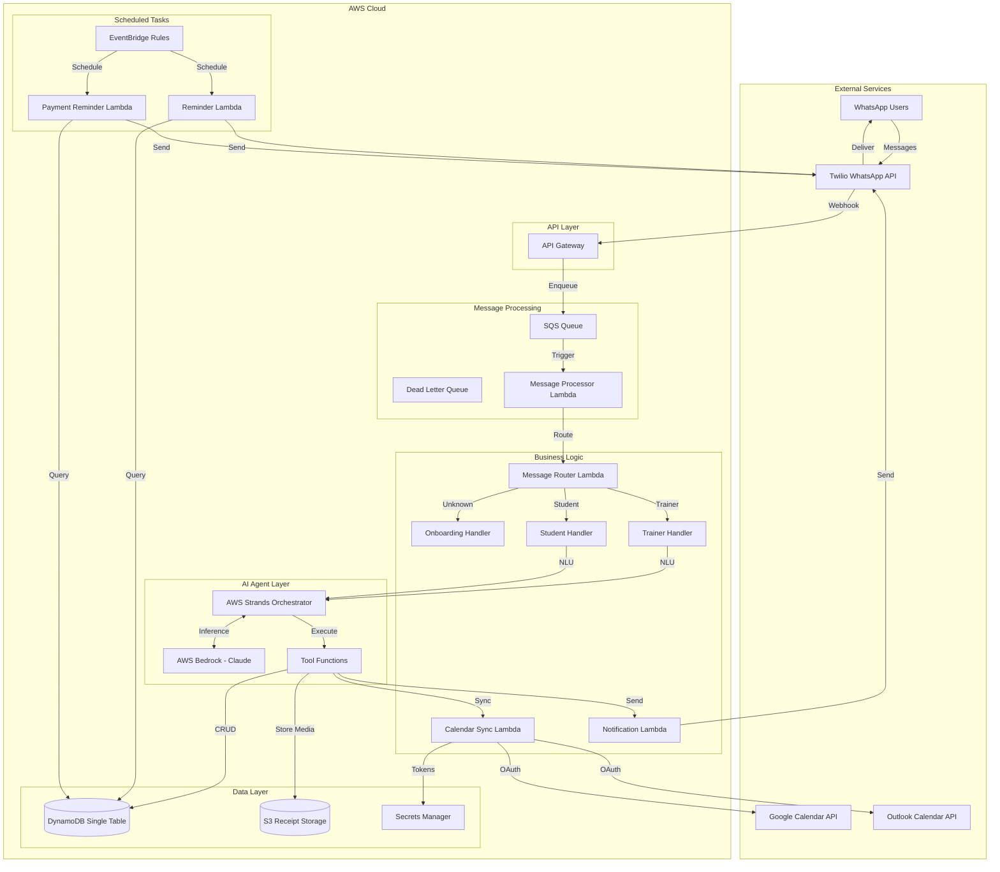
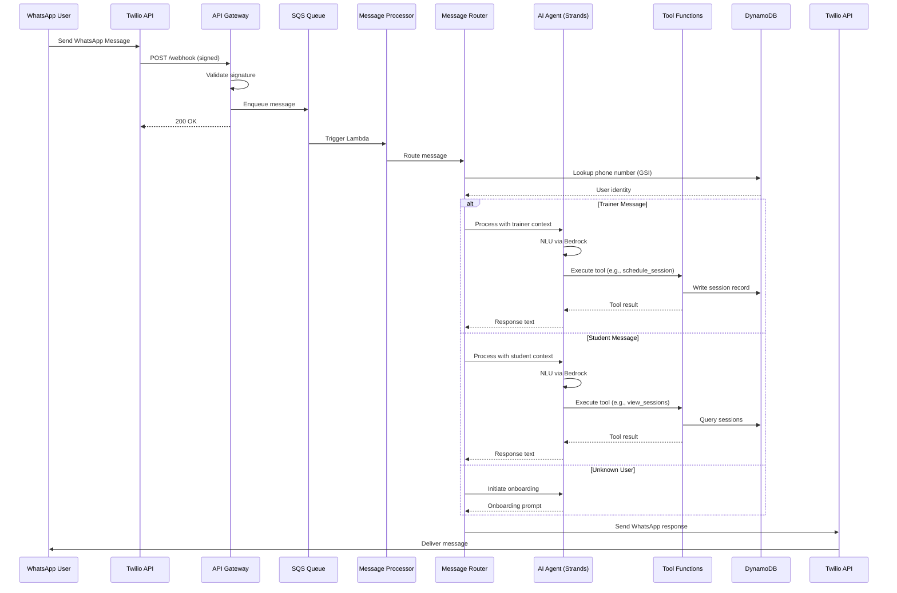
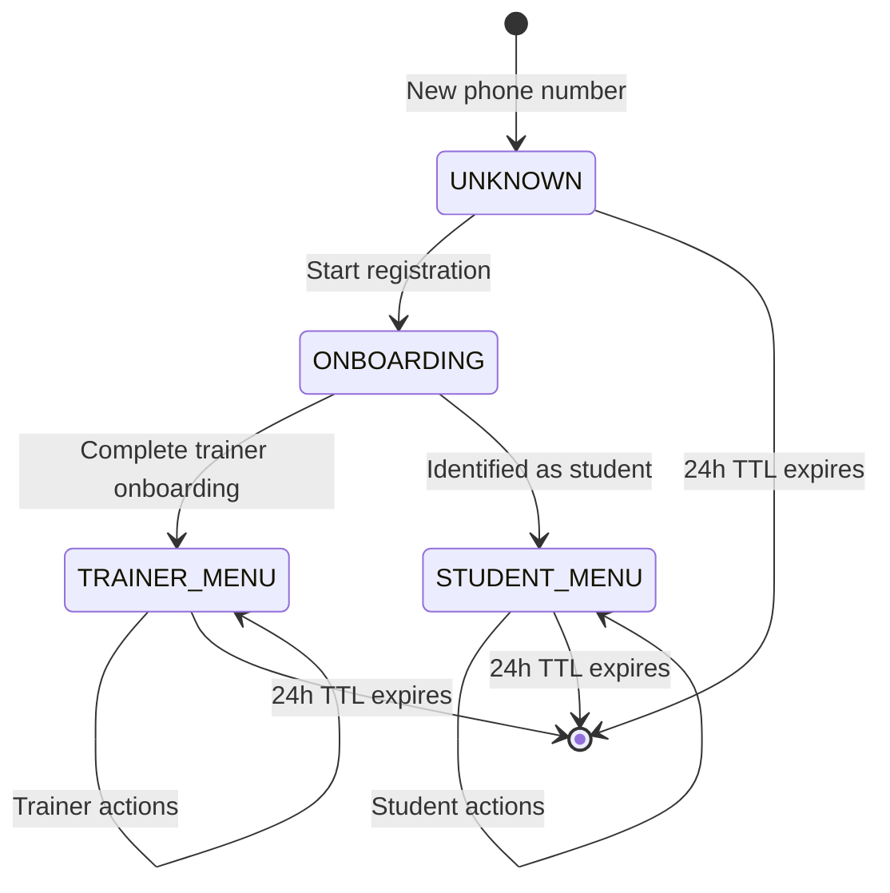
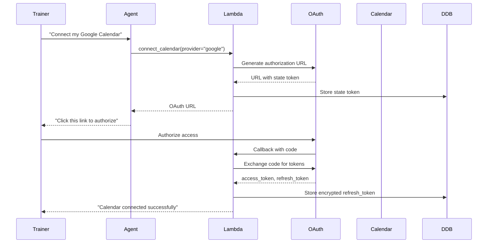

# Design Document: FitAgent WhatsApp Assistant

## Overview

FitAgent is a multi-tenant SaaS platform that enables personal trainers to manage their business through an AI-powered WhatsApp assistant. The system leverages AWS Strands for agentic orchestration and AWS Bedrock for natural language understanding, providing a conversational interface that eliminates the need for traditional web or mobile applications.

### Core Capabilities

- **Conversational AI Interface**: Natural language interaction via WhatsApp using AWS Bedrock (Claude models)
- **Multi-Tenant Architecture**: Isolated data per trainer with support for shared students across trainers
- **Session Management**: Scheduling, rescheduling, cancellation with conflict detection
- **Calendar Integration**: Bidirectional sync with Google Calendar and Microsoft Outlook via OAuth2
- **Payment Tracking**: Receipt media storage in S3 with confirmation workflow
- **Automated Reminders**: EventBridge-scheduled notifications for sessions and payments
- **Message Routing**: Phone number-based user identification and context-aware routing
- **Tool-Calling Architecture**: AI agent executes structured actions through defined tool functions

### Design Principles

1. **Event-Driven Architecture**: Asynchronous message processing via SQS for reliability and scalability
2. **Single-Table Design**: DynamoDB optimization for access patterns with strategic GSIs
3. **Serverless-First**: Lambda functions for compute, minimizing operational overhead
4. **Channel Abstraction**: WhatsApp implementation with extensibility for future channels (SMS, Telegram)
5. **Conversation State Management**: Stateful interactions with automatic TTL-based cleanup
6. **Graceful Degradation**: Calendar sync failures don't block core session management
7. **Local Development Parity**: LocalStack and moto enable full local testing without AWS costs

## Architecture

### High-Level System Architecture



### Message Flow Architecture



### Conversation State Machine



## Components and Interfaces

### 1. WhatsApp Gateway (Twilio Integration)

**Responsibility**: Receive and send WhatsApp messages via Twilio API

**Interfaces**:
- **Inbound**: Twilio webhook POST to API Gateway `/webhook`
- **Outbound**: Twilio Messages API for sending responses

**Webhook Payload Structure**:
```json
{
  "MessageSid": "string",
  "From": "whatsapp:+1234567890",
  "To": "whatsapp:+0987654321",
  "Body": "string",
  "NumMedia": "0",
  "MediaUrl0": "string (if media present)",
  "MediaContentType0": "string"
}
```

**Security**:
- Twilio signature validation using `X-Twilio-Signature` header
- HTTPS-only communication
- API Gateway request validation

### 2. Message Router

**Responsibility**: Identify users by phone number and route to appropriate handler

**Implementation**: Lambda function triggered by SQS

**Routing Logic**:
```python
def route_message(phone_number: str, message: dict) -> Handler:
    """
    Query DynamoDB GSI (phone_number) to identify user type.
    Returns: OnboardingHandler | TrainerHandler | StudentHandler
    """
    user = dynamodb.query(
        IndexName='phone-number-index',
        KeyConditionExpression='phone_number = :phone',
        ExpressionAttributeValues={':phone': phone_number}
    )
    
    if not user:
        return OnboardingHandler()
    elif user['entity_type'] == 'TRAINER':
        return TrainerHandler(trainer_id=user['trainer_id'])
    elif user['entity_type'] == 'STUDENT':
        return StudentHandler(student_id=user['student_id'])
```

**Performance Target**: < 200ms for phone lookup and routing

### 3. AI Agent (AWS Strands + Bedrock)

**Responsibility**: Natural language understanding and tool orchestration

**Architecture**:
- **Orchestrator**: AWS Strands manages conversation flow and tool execution
- **LLM**: AWS Bedrock with Claude 3 (Sonnet or Haiku for cost optimization)
- **Tool Registry**: Defined functions with JSON schemas for parameter validation

**Tool Functions**:

1. **register_student**
   - Parameters: `name`, `phone_number`, `email`, `training_goal`
   - Returns: `student_id`, `success`

2. **schedule_session**
   - Parameters: `student_name`, `date`, `time`, `duration_minutes`, `location` (optional)
   - Returns: `session_id`, `conflicts` (if any)

3. **reschedule_session**
   - Parameters: `session_id`, `new_date`, `new_time`
   - Returns: `success`, `updated_session`

4. **cancel_session**
   - Parameters: `session_id`, `reason` (optional)
   - Returns: `success`

5. **register_payment**
   - Parameters: `student_name`, `amount`, `payment_date`, `receipt_url` (optional)
   - Returns: `payment_id`, `success`

6. **view_calendar**
   - Parameters: `start_date`, `end_date`, `filter` (optional: "day", "week", "month")
   - Returns: `sessions[]`

7. **view_payments**
   - Parameters: `student_name` (optional), `status` (optional: "pending", "confirmed")
   - Returns: `payments[]`

8. **send_notification**
   - Parameters: `message`, `recipients` (optional: "all", "specific", "upcoming_sessions")
   - Returns: `queued_count`, `success`

9. **connect_calendar**
   - Parameters: `provider` ("google" or "outlook")
   - Returns: `oauth_url`

10. **view_students**
    - Parameters: `filter` (optional)
    - Returns: `students[]`

**Tool Execution Flow**:
```python
# Strands configuration
agent_config = {
    "model_id": "anthropic.claude-3-sonnet-20240229-v1:0",
    "tools": [
        {
            "name": "schedule_session",
            "description": "Schedule a training session with a student",
            "input_schema": {
                "type": "object",
                "properties": {
                    "student_name": {"type": "string"},
                    "date": {"type": "string", "format": "date"},
                    "time": {"type": "string", "format": "time"},
                    "duration_minutes": {"type": "integer", "minimum": 15}
                },
                "required": ["student_name", "date", "time", "duration_minutes"]
            }
        }
        # ... other tools
    ]
}
```

**Context Management**:
- Conversation state stored in DynamoDB with 24h TTL
- Previous messages included in context window (last 10 messages)
- User identity (trainer_id or student_id) passed as system context

### 4. Calendar Sync Service

**Responsibility**: Bidirectional synchronization with external calendar providers

**Supported Providers**:
- Google Calendar API v3
- Microsoft Graph API (Outlook Calendar)

**OAuth2 Flow**:


**Token Storage**:
```python
# Encrypt refresh token before storage
encrypted_token = kms_client.encrypt(
    KeyId='alias/fitagent-oauth-key',
    Plaintext=refresh_token.encode()
)

dynamodb.put_item(
    Item={
        'PK': f'TRAINER#{trainer_id}',
        'SK': 'CALENDAR_CONFIG',
        'provider': 'google',
        'encrypted_refresh_token': encrypted_token['CiphertextBlob'],
        'scope': 'https://www.googleapis.com/auth/calendar',
        'created_at': datetime.utcnow().isoformat()
    }
)
```

**Sync Operations**:
- **Create Event**: On session schedule
- **Update Event**: On session reschedule
- **Delete Event**: On session cancellation

**Error Handling**:
- Retry logic: 3 attempts with exponential backoff (1s, 2s, 4s)
- Token refresh on 401 Unauthorized
- Graceful degradation: Log error, continue session operation
- CloudWatch metric for sync failures

### 5. Reminder Service

**Responsibility**: Automated notifications for sessions and payments

**Implementation**: EventBridge scheduled rules triggering Lambda functions

**Session Reminder Flow**:
```python
def session_reminder_handler(event, context):
    """
    Triggered by EventBridge every hour.
    Queries sessions scheduled within configured reminder window.
    """
    current_time = datetime.utcnow()
    
    # Query sessions with reminder_hours configuration
    sessions = dynamodb.query(
        IndexName='session-date-index',
        FilterExpression='session_datetime BETWEEN :start AND :end AND status = :status',
        ExpressionAttributeValues={
            ':start': current_time.isoformat(),
            ':end': (current_time + timedelta(hours=48)).isoformat(),
            ':status': 'scheduled'
        }
    )
    
    for session in sessions:
        trainer_config = get_trainer_config(session['trainer_id'])
        reminder_hours = trainer_config.get('reminder_hours', 24)
        
        time_until_session = session['session_datetime'] - current_time
        if time_until_session.total_seconds() / 3600 <= reminder_hours:
            send_reminder(session)
```

**Payment Reminder Flow**:
```python
def payment_reminder_handler(event, context):
    """
    Triggered by EventBridge on configured day of month.
    Sends reminders to students with unpaid sessions.
    """
    current_date = datetime.utcnow().date()
    previous_month_start = (current_date.replace(day=1) - timedelta(days=1)).replace(day=1)
    previous_month_end = current_date.replace(day=1) - timedelta(days=1)
    
    # Query unpaid sessions from previous month
    unpaid_sessions = dynamodb.query(
        FilterExpression='session_date BETWEEN :start AND :end AND payment_status = :status',
        ExpressionAttributeValues={
            ':start': previous_month_start.isoformat(),
            ':end': previous_month_end.isoformat(),
            ':status': 'unpaid'
        }
    )
    
    # Group by student and send consolidated reminder
    student_debts = group_by_student(unpaid_sessions)
    for student_id, sessions in student_debts.items():
        send_payment_reminder(student_id, sessions)
```

**EventBridge Rules**:
- Session reminders: `rate(1 hour)`
- Payment reminders: `cron(0 10 {day} * ? *)` where day is configurable per trainer

### 6. Notification Service

**Responsibility**: Send broadcast messages to students with rate limiting

**Implementation**: Lambda function with SQS queue for rate limiting

**Rate Limiting Strategy**:
```python
def send_notification(trainer_id: str, message: str, recipients: list):
    """
    Queue individual messages to SQS with delay for rate limiting.
    Target: 10 messages/second to comply with WhatsApp limits.
    """
    for i, recipient in enumerate(recipients):
        delay_seconds = i // 10  # 10 messages per second
        
        sqs.send_message(
            QueueUrl=notification_queue_url,
            MessageBody=json.dumps({
                'recipient': recipient,
                'message': message,
                'trainer_id': trainer_id
            }),
            DelaySeconds=delay_seconds
        )
    
    # Record notification in DynamoDB
    dynamodb.put_item(
        Item={
            'PK': f'TRAINER#{trainer_id}',
            'SK': f'NOTIFICATION#{uuid.uuid4()}',
            'message': message,
            'recipient_count': len(recipients),
            'status': 'queued',
            'created_at': datetime.utcnow().isoformat()
        }
    )
```

**Delivery Tracking**:
- Status per recipient: `queued`, `sent`, `delivered`, `failed`
- Retry logic: 2 retries with 5-minute delays
- Dead letter queue for permanent failures

### 7. Receipt Storage Service

**Responsibility**: Store and retrieve payment receipt media from S3

**S3 Key Structure**:
```
receipts/{trainer_id}/{student_id}/{timestamp}_{media_sid}.{extension}
```

**Upload Flow**:
```python
def store_receipt(trainer_id: str, student_id: str, media_url: str, media_type: str):
    """
    Download media from Twilio and upload to S3.
    """
    # Download from Twilio
    response = requests.get(media_url, auth=(twilio_sid, twilio_token))
    
    # Determine extension
    extension = mimetypes.guess_extension(media_type) or '.bin'
    
    # Generate S3 key
    timestamp = datetime.utcnow().strftime('%Y%m%d_%H%M%S')
    s3_key = f'receipts/{trainer_id}/{student_id}/{timestamp}_{uuid.uuid4()}{extension}'
    
    # Upload to S3
    s3.put_object(
        Bucket=receipt_bucket,
        Key=s3_key,
        Body=response.content,
        ContentType=media_type,
        ServerSideEncryption='AES256'
    )
    
    return s3_key
```

**Presigned URL Generation**:
```python
def get_receipt_url(s3_key: str) -> str:
    """
    Generate presigned URL with 1 hour expiration.
    """
    return s3.generate_presigned_url(
        'get_object',
        Params={'Bucket': receipt_bucket, 'Key': s3_key},
        ExpiresIn=3600
    )
```

## Data Models

### DynamoDB Single-Table Design

**Table Name**: `fitagent-main`

**Primary Key**:
- Partition Key (PK): String
- Sort Key (SK): String

**Global Secondary Indexes**:

1. **phone-number-index**
   - Partition Key: `phone_number`
   - Sort Key: `entity_type`
   - Purpose: User identification and routing

2. **session-date-index**
   - Partition Key: `trainer_id`
   - Sort Key: `session_datetime`
   - Purpose: Calendar queries and reminder scheduling

3. **payment-status-index**
   - Partition Key: `trainer_id`
   - Sort Key: `payment_status#created_at`
   - Purpose: Payment tracking and reminder queries

**TTL Attribute**: `ttl` (Unix timestamp for conversation state expiration)

### Entity Patterns

#### 1. Trainer Entity
```json
{
  "PK": "TRAINER#<trainer_id>",
  "SK": "METADATA",
  "entity_type": "TRAINER",
  "trainer_id": "uuid",
  "name": "string",
  "email": "string",
  "business_name": "string",
  "phone_number": "+1234567890",
  "created_at": "2024-01-15T10:30:00Z",
  "updated_at": "2024-01-15T10:30:00Z"
}
```

#### 2. Student Entity
```json
{
  "PK": "STUDENT#<student_id>",
  "SK": "METADATA",
  "entity_type": "STUDENT",
  "student_id": "uuid",
  "name": "string",
  "email": "string",
  "phone_number": "+1234567890",
  "training_goal": "string",
  "created_at": "2024-01-15T10:30:00Z",
  "updated_at": "2024-01-15T10:30:00Z"
}
```

#### 3. Trainer-Student Link
```json
{
  "PK": "TRAINER#<trainer_id>",
  "SK": "STUDENT#<student_id>",
  "entity_type": "TRAINER_STUDENT_LINK",
  "trainer_id": "uuid",
  "student_id": "uuid",
  "linked_at": "2024-01-15T10:30:00Z",
  "status": "active"
}
```

#### 4. Session Entity
```json
{
  "PK": "TRAINER#<trainer_id>",
  "SK": "SESSION#<session_id>",
  "entity_type": "SESSION",
  "session_id": "uuid",
  "trainer_id": "uuid",
  "student_id": "uuid",
  "student_name": "string",
  "session_datetime": "2024-01-20T14:00:00Z",
  "duration_minutes": 60,
  "location": "string (optional)",
  "status": "scheduled | confirmed | cancelled | completed",
  "calendar_event_id": "string (optional)",
  "calendar_provider": "google | outlook (optional)",
  "student_confirmed": false,
  "student_confirmed_at": "2024-01-19T10:00:00Z (optional)",
  "created_at": "2024-01-15T10:30:00Z",
  "updated_at": "2024-01-15T10:30:00Z"
}
```

#### 5. Payment Record
```json
{
  "PK": "TRAINER#<trainer_id>",
  "SK": "PAYMENT#<payment_id>",
  "entity_type": "PAYMENT",
  "payment_id": "uuid",
  "trainer_id": "uuid",
  "student_id": "uuid",
  "student_name": "string",
  "amount": 100.00,
  "currency": "USD",
  "payment_date": "2024-01-15",
  "payment_status": "pending | confirmed",
  "receipt_s3_key": "string (optional)",
  "receipt_media_type": "image/jpeg | application/pdf (optional)",
  "confirmed_at": "2024-01-16T09:00:00Z (optional)",
  "session_id": "uuid (optional)",
  "created_at": "2024-01-15T10:30:00Z",
  "updated_at": "2024-01-15T10:30:00Z"
}
```

#### 6. Conversation State
```json
{
  "PK": "CONVERSATION#<phone_number>",
  "SK": "STATE",
  "entity_type": "CONVERSATION_STATE",
  "phone_number": "+1234567890",
  "state": "UNKNOWN | ONBOARDING | TRAINER_MENU | STUDENT_MENU",
  "user_id": "uuid (optional)",
  "user_type": "TRAINER | STUDENT (optional)",
  "context": {
    "last_action": "string",
    "pending_data": {}
  },
  "message_history": [
    {"role": "user", "content": "string", "timestamp": "2024-01-15T10:30:00Z"},
    {"role": "assistant", "content": "string", "timestamp": "2024-01-15T10:30:15Z"}
  ],
  "created_at": "2024-01-15T10:30:00Z",
  "updated_at": "2024-01-15T10:35:00Z",
  "ttl": 1705411800
}
```

#### 7. Trainer Configuration
```json
{
  "PK": "TRAINER#<trainer_id>",
  "SK": "CONFIG",
  "entity_type": "TRAINER_CONFIG",
  "trainer_id": "uuid",
  "reminder_hours": 24,
  "payment_reminder_day": 1,
  "payment_reminders_enabled": true,
  "session_reminders_enabled": true,
  "timezone": "America/New_York",
  "created_at": "2024-01-15T10:30:00Z",
  "updated_at": "2024-01-15T10:30:00Z"
}
```

#### 8. Calendar Configuration
```json
{
  "PK": "TRAINER#<trainer_id>",
  "SK": "CALENDAR_CONFIG",
  "entity_type": "CALENDAR_CONFIG",
  "trainer_id": "uuid",
  "provider": "google | outlook",
  "encrypted_refresh_token": "binary",
  "scope": "string",
  "calendar_id": "string (optional)",
  "connected_at": "2024-01-15T10:30:00Z",
  "last_sync_at": "2024-01-15T10:30:00Z",
  "created_at": "2024-01-15T10:30:00Z",
  "updated_at": "2024-01-15T10:30:00Z"
}
```

#### 9. Notification Record
```json
{
  "PK": "TRAINER#<trainer_id>",
  "SK": "NOTIFICATION#<notification_id>",
  "entity_type": "NOTIFICATION",
  "notification_id": "uuid",
  "trainer_id": "uuid",
  "message": "string",
  "recipient_count": 10,
  "status": "queued | processing | completed | failed",
  "recipients": [
    {
      "student_id": "uuid",
      "phone_number": "+1234567890",
      "status": "queued | sent | delivered | failed",
      "sent_at": "2024-01-15T10:30:00Z (optional)",
      "delivered_at": "2024-01-15T10:30:05Z (optional)"
    }
  ],
  "created_at": "2024-01-15T10:30:00Z",
  "updated_at": "2024-01-15T10:30:00Z"
}
```

#### 10. Reminder Delivery Record
```json
{
  "PK": "SESSION#<session_id>",
  "SK": "REMINDER#<reminder_id>",
  "entity_type": "REMINDER",
  "reminder_id": "uuid",
  "session_id": "uuid",
  "reminder_type": "session | payment",
  "recipient_phone": "+1234567890",
  "status": "sent | delivered | failed",
  "sent_at": "2024-01-15T10:30:00Z",
  "delivered_at": "2024-01-15T10:30:05Z (optional)",
  "created_at": "2024-01-15T10:30:00Z"
}
```

### Access Patterns and Queries

| Access Pattern | Index | Key Condition | Filter |
|----------------|-------|---------------|--------|
| Get trainer by ID | Main | PK=TRAINER#{id}, SK=METADATA | - |
| Get student by ID | Main | PK=STUDENT#{id}, SK=METADATA | - |
| Identify user by phone | phone-number-index | phone_number={phone} | - |
| Get trainer's students | Main | PK=TRAINER#{id}, SK begins_with STUDENT# | - |
| Get student's trainers | Main | PK=STUDENT#{id}, SK begins_with TRAINER# | - |
| Get trainer's sessions | Main | PK=TRAINER#{id}, SK begins_with SESSION# | - |
| Get sessions by date range | session-date-index | trainer_id={id}, session_datetime BETWEEN {start} AND {end} | - |
| Get trainer's payments | Main | PK=TRAINER#{id}, SK begins_with PAYMENT# | - |
| Get unpaid payments | payment-status-index | trainer_id={id}, payment_status#created_at begins_with pending# | - |
| Get conversation state | Main | PK=CONVERSATION#{phone}, SK=STATE | - |
| Get trainer config | Main | PK=TRAINER#{id}, SK=CONFIG | - |
| Get calendar config | Main | PK=TRAINER#{id}, SK=CALENDAR_CONFIG | - |


### API Specifications

#### 1. Twilio Webhook Endpoint

**Endpoint**: `POST /webhook`

**Request Headers**:
```
Content-Type: application/x-www-form-urlencoded
X-Twilio-Signature: <signature>
```

**Request Body** (form-encoded):
```
MessageSid=SM1234567890
From=whatsapp:+1234567890
To=whatsapp:+0987654321
Body=Hello, I want to schedule a session
NumMedia=0
```

**Response**:
```xml
<?xml version="1.0" encoding="UTF-8"?>
<Response></Response>
```

**Validation**:
```python
from twilio.request_validator import RequestValidator

def validate_twilio_signature(request):
    validator = RequestValidator(twilio_auth_token)
    signature = request.headers.get('X-Twilio-Signature')
    url = request.url
    params = request.form.to_dict()
    
    return validator.validate(url, params, signature)
```

#### 2. OAuth Callback Endpoint

**Endpoint**: `GET /oauth/callback`

**Query Parameters**:
```
code=<authorization_code>
state=<state_token>
```

**Flow**:
1. Validate state token against DynamoDB
2. Exchange code for tokens
3. Encrypt and store refresh token
4. Send confirmation message via WhatsApp

#### 3. Twilio Outbound API

**Send Message**:
```python
from twilio.rest import Client

client = Client(twilio_account_sid, twilio_auth_token)

message = client.messages.create(
    from_='whatsapp:+14155238886',
    to=f'whatsapp:{recipient_phone}',
    body='Your session is scheduled for tomorrow at 2 PM'
)
```

#### 4. Google Calendar API

**Create Event**:
```python
from googleapiclient.discovery import build
from google.oauth2.credentials import Credentials

credentials = Credentials(
    token=access_token,
    refresh_token=refresh_token,
    token_uri='https://oauth2.googleapis.com/token',
    client_id=google_client_id,
    client_secret=google_client_secret
)

service = build('calendar', 'v3', credentials=credentials)

event = {
    'summary': f'Training Session with {student_name}',
    'description': f'Session ID: {session_id}',
    'start': {
        'dateTime': '2024-01-20T14:00:00',
        'timeZone': 'America/New_York'
    },
    'end': {
        'dateTime': '2024-01-20T15:00:00',
        'timeZone': 'America/New_York'
    },
    'reminders': {
        'useDefault': False,
        'overrides': [
            {'method': 'popup', 'minutes': 30}
        ]
    }
}

result = service.events().insert(calendarId='primary', body=event).execute()
calendar_event_id = result['id']
```

**Update Event**:
```python
event = service.events().get(calendarId='primary', eventId=calendar_event_id).execute()
event['start']['dateTime'] = '2024-01-21T14:00:00'
event['end']['dateTime'] = '2024-01-21T15:00:00'

updated_event = service.events().update(
    calendarId='primary',
    eventId=calendar_event_id,
    body=event
).execute()
```

**Delete Event**:
```python
service.events().delete(calendarId='primary', eventId=calendar_event_id).execute()
```

#### 5. Microsoft Outlook API

**Create Event**:
```python
import requests

headers = {
    'Authorization': f'Bearer {access_token}',
    'Content-Type': 'application/json'
}

event = {
    'subject': f'Training Session with {student_name}',
    'body': {
        'contentType': 'Text',
        'content': f'Session ID: {session_id}'
    },
    'start': {
        'dateTime': '2024-01-20T14:00:00',
        'timeZone': 'America/New_York'
    },
    'end': {
        'dateTime': '2024-01-20T15:00:00',
        'timeZone': 'America/New_York'
    }
}

response = requests.post(
    'https://graph.microsoft.com/v1.0/me/events',
    headers=headers,
    json=event
)

calendar_event_id = response.json()['id']
```

### Implementation Details

#### Lambda Function Structure

```
src/
├── handlers/
│   ├── webhook_handler.py          # API Gateway webhook entry point
│   ├── message_processor.py        # SQS message processing
│   ├── session_reminder.py         # EventBridge session reminders
│   ├── payment_reminder.py         # EventBridge payment reminders
│   ├── notification_sender.py      # SQS notification processing
│   └── oauth_callback.py           # OAuth callback handler
├── services/
│   ├── message_router.py           # Phone number routing logic
│   ├── ai_agent.py                 # AWS Strands integration
│   ├── calendar_sync.py            # Calendar API integration
│   ├── receipt_storage.py          # S3 media handling
│   └── twilio_client.py            # Twilio API wrapper
├── tools/
│   ├── student_tools.py            # register_student, view_students
│   ├── session_tools.py            # schedule_session, reschedule_session, cancel_session
│   ├── payment_tools.py            # register_payment, view_payments
│   ├── calendar_tools.py           # connect_calendar, view_calendar
│   └── notification_tools.py       # send_notification
├── models/
│   ├── entities.py                 # Pydantic models for entities
│   └── dynamodb_client.py          # DynamoDB abstraction layer
├── utils/
│   ├── validation.py               # Input validation utilities
│   ├── encryption.py               # KMS encryption helpers
│   └── logging.py                  # Structured logging setup
└── config.py                       # Environment configuration
```

#### Conversation State Management

```python
from datetime import datetime, timedelta
from typing import Optional, Dict, List
import json

class ConversationStateManager:
    def __init__(self, dynamodb_client):
        self.dynamodb = dynamodb_client
        self.ttl_hours = 24
    
    def get_state(self, phone_number: str) -> Optional[Dict]:
        """Retrieve conversation state for phone number."""
        response = self.dynamodb.get_item(
            Key={
                'PK': f'CONVERSATION#{phone_number}',
                'SK': 'STATE'
            }
        )
        return response.get('Item')
    
    def update_state(
        self,
        phone_number: str,
        state: str,
        user_id: Optional[str] = None,
        user_type: Optional[str] = None,
        context: Optional[Dict] = None,
        message: Optional[Dict] = None
    ):
        """Update conversation state with new information."""
        now = datetime.utcnow()
        ttl = int((now + timedelta(hours=self.ttl_hours)).timestamp())
        
        current_state = self.get_state(phone_number) or {}
        message_history = current_state.get('message_history', [])
        
        if message:
            message_history.append({
                **message,
                'timestamp': now.isoformat()
            })
            # Keep only last 10 messages
            message_history = message_history[-10:]
        
        item = {
            'PK': f'CONVERSATION#{phone_number}',
            'SK': 'STATE',
            'entity_type': 'CONVERSATION_STATE',
            'phone_number': phone_number,
            'state': state,
            'message_history': message_history,
            'updated_at': now.isoformat(),
            'ttl': ttl
        }
        
        if user_id:
            item['user_id'] = user_id
        if user_type:
            item['user_type'] = user_type
        if context:
            item['context'] = context
        if not current_state:
            item['created_at'] = now.isoformat()
        
        self.dynamodb.put_item(Item=item)
        return item
    
    def clear_state(self, phone_number: str):
        """Clear conversation state (manual cleanup)."""
        self.dynamodb.delete_item(
            Key={
                'PK': f'CONVERSATION#{phone_number}',
                'SK': 'STATE'
            }
        )
```

#### Session Conflict Detection

```python
from datetime import datetime, timedelta
from typing import List, Optional

class SessionConflictDetector:
    def __init__(self, dynamodb_client):
        self.dynamodb = dynamodb_client
    
    def check_conflicts(
        self,
        trainer_id: str,
        session_datetime: datetime,
        duration_minutes: int,
        exclude_session_id: Optional[str] = None
    ) -> List[Dict]:
        """
        Check for scheduling conflicts.
        Returns list of conflicting sessions.
        """
        session_start = session_datetime
        session_end = session_datetime + timedelta(minutes=duration_minutes)
        
        # Query sessions in the time window
        # Add buffer of 30 minutes before and after
        query_start = session_start - timedelta(minutes=30)
        query_end = session_end + timedelta(minutes=30)
        
        response = self.dynamodb.query(
            IndexName='session-date-index',
            KeyConditionExpression='trainer_id = :tid AND session_datetime BETWEEN :start AND :end',
            FilterExpression='#status IN (:scheduled, :confirmed)',
            ExpressionAttributeNames={'#status': 'status'},
            ExpressionAttributeValues={
                ':tid': trainer_id,
                ':start': query_start.isoformat(),
                ':end': query_end.isoformat(),
                ':scheduled': 'scheduled',
                ':confirmed': 'confirmed'
            }
        )
        
        conflicts = []
        for session in response.get('Items', []):
            if exclude_session_id and session['session_id'] == exclude_session_id:
                continue
            
            existing_start = datetime.fromisoformat(session['session_datetime'])
            existing_end = existing_start + timedelta(minutes=session['duration_minutes'])
            
            # Check for overlap
            if (session_start < existing_end and session_end > existing_start):
                conflicts.append(session)
        
        return conflicts
```

#### Phone Number Validation

```python
import re
from typing import Optional

class PhoneNumberValidator:
    E164_PATTERN = re.compile(r'^\+[1-9]\d{1,14}$')
    
    @classmethod
    def validate(cls, phone_number: str) -> bool:
        """Validate phone number against E.164 format."""
        return bool(cls.E164_PATTERN.match(phone_number))
    
    @classmethod
    def normalize(cls, phone_number: str) -> Optional[str]:
        """
        Normalize phone number to E.164 format.
        Handles common formats like (555) 123-4567.
        """
        # Remove all non-digit characters except leading +
        cleaned = re.sub(r'[^\d+]', '', phone_number)
        
        # Add + if missing and starts with country code
        if not cleaned.startswith('+'):
            if cleaned.startswith('1') and len(cleaned) == 11:
                cleaned = '+' + cleaned
            elif len(cleaned) == 10:
                cleaned = '+1' + cleaned
            else:
                return None
        
        if cls.validate(cleaned):
            return cleaned
        return None
```

#### Retry Logic with Exponential Backoff

```python
import time
from typing import Callable, Any, Optional
from functools import wraps

def retry_with_backoff(
    max_attempts: int = 3,
    initial_delay: float = 1.0,
    backoff_factor: float = 2.0,
    exceptions: tuple = (Exception,)
):
    """
    Decorator for retry logic with exponential backoff.
    """
    def decorator(func: Callable) -> Callable:
        @wraps(func)
        def wrapper(*args, **kwargs) -> Any:
            delay = initial_delay
            last_exception = None
            
            for attempt in range(max_attempts):
                try:
                    return func(*args, **kwargs)
                except exceptions as e:
                    last_exception = e
                    if attempt < max_attempts - 1:
                        time.sleep(delay)
                        delay *= backoff_factor
                    else:
                        raise last_exception
            
            raise last_exception
        
        return wrapper
    return decorator

# Usage example
@retry_with_backoff(max_attempts=3, initial_delay=1.0, backoff_factor=2.0)
def sync_calendar_event(event_data: dict):
    """Sync event to calendar with retry logic."""
    return calendar_api.create_event(event_data)
```

#### Structured Logging

```python
import json
import logging
from datetime import datetime
from typing import Any, Dict, Optional

class StructuredLogger:
    def __init__(self, name: str):
        self.logger = logging.getLogger(name)
        self.logger.setLevel(logging.INFO)
    
    def _format_log(
        self,
        level: str,
        message: str,
        request_id: Optional[str] = None,
        phone_number: Optional[str] = None,
        **kwargs
    ) -> str:
        """Format log entry as JSON."""
        log_entry = {
            'timestamp': datetime.utcnow().isoformat(),
            'level': level,
            'message': message,
            'service': 'fitagent'
        }
        
        if request_id:
            log_entry['request_id'] = request_id
        if phone_number:
            # Mask phone number for privacy (show last 4 digits)
            log_entry['phone_number'] = f'***{phone_number[-4:]}'
        
        log_entry.update(kwargs)
        return json.dumps(log_entry)
    
    def info(self, message: str, **kwargs):
        self.logger.info(self._format_log('INFO', message, **kwargs))
    
    def error(self, message: str, **kwargs):
        self.logger.error(self._format_log('ERROR', message, **kwargs))
    
    def warning(self, message: str, **kwargs):
        self.logger.warning(self._format_log('WARNING', message, **kwargs))

# Usage
logger = StructuredLogger(__name__)
logger.info(
    'Tool executed',
    request_id='abc-123',
    phone_number='+1234567890',
    tool_name='schedule_session',
    parameters={'student_name': 'John', 'date': '2024-01-20'}
)
```

#### Input Sanitization

```python
import bleach
from typing import Any, Dict

class InputSanitizer:
    @staticmethod
    def sanitize_string(value: str, max_length: int = 1000) -> str:
        """Sanitize string input to prevent injection attacks."""
        # Remove HTML tags
        cleaned = bleach.clean(value, tags=[], strip=True)
        # Truncate to max length
        return cleaned[:max_length].strip()
    
    @staticmethod
    def sanitize_tool_parameters(params: Dict[str, Any]) -> Dict[str, Any]:
        """Sanitize all string parameters in tool input."""
        sanitized = {}
        for key, value in params.items():
            if isinstance(value, str):
                sanitized[key] = InputSanitizer.sanitize_string(value)
            elif isinstance(value, dict):
                sanitized[key] = InputSanitizer.sanitize_tool_parameters(value)
            elif isinstance(value, list):
                sanitized[key] = [
                    InputSanitizer.sanitize_string(item) if isinstance(item, str) else item
                    for item in value
                ]
            else:
                sanitized[key] = value
        return sanitized
```

### Local Development Setup

#### Docker Compose Configuration

```yaml
version: '3.8'

services:
  localstack:
    image: localstack/localstack:latest
    ports:
      - "4566:4566"
      - "4571:4571"
    environment:
      - SERVICES=dynamodb,s3,sqs,lambda,apigateway,events,secretsmanager,kms
      - DEBUG=1
      - DATA_DIR=/tmp/localstack/data
      - LAMBDA_EXECUTOR=docker
      - DOCKER_HOST=unix:///var/run/docker.sock
    volumes:
      - "./localstack-init:/docker-entrypoint-initaws.d"
      - "/var/run/docker.sock:/var/run/docker.sock"
      - "./tmp/localstack:/tmp/localstack"
  
  api:
    build: .
    ports:
      - "8000:8000"
    environment:
      - AWS_ENDPOINT_URL=http://localstack:4566
      - AWS_ACCESS_KEY_ID=test
      - AWS_SECRET_ACCESS_KEY=test
      - AWS_DEFAULT_REGION=us-east-1
      - DYNAMODB_TABLE=fitagent-main
      - S3_BUCKET=fitagent-receipts-local
      - SQS_QUEUE_URL=http://localstack:4566/000000000000/fitagent-messages
      - TWILIO_ACCOUNT_SID=${TWILIO_ACCOUNT_SID}
      - TWILIO_AUTH_TOKEN=${TWILIO_AUTH_TOKEN}
      - ENVIRONMENT=local
    depends_on:
      - localstack
    volumes:
      - "./src:/app/src"
    command: uvicorn src.main:app --host 0.0.0.0 --port 8000 --reload
```

#### LocalStack Initialization Script

```bash
#!/bin/bash
# localstack-init/01-setup.sh

echo "Initializing LocalStack resources..."

# Create DynamoDB table
awslocal dynamodb create-table \
    --table-name fitagent-main \
    --attribute-definitions \
        AttributeName=PK,AttributeType=S \
        AttributeName=SK,AttributeType=S \
        AttributeName=phone_number,AttributeType=S \
        AttributeName=entity_type,AttributeType=S \
        AttributeName=trainer_id,AttributeType=S \
        AttributeName=session_datetime,AttributeType=S \
        AttributeName=payment_status,AttributeType=S \
    --key-schema \
        AttributeName=PK,KeyType=HASH \
        AttributeName=SK,KeyType=RANGE \
    --global-secondary-indexes \
        "[
            {
                \"IndexName\": \"phone-number-index\",
                \"KeySchema\": [
                    {\"AttributeName\": \"phone_number\", \"KeyType\": \"HASH\"},
                    {\"AttributeName\": \"entity_type\", \"KeyType\": \"RANGE\"}
                ],
                \"Projection\": {\"ProjectionType\": \"ALL\"},
                \"ProvisionedThroughput\": {\"ReadCapacityUnits\": 5, \"WriteCapacityUnits\": 5}
            },
            {
                \"IndexName\": \"session-date-index\",
                \"KeySchema\": [
                    {\"AttributeName\": \"trainer_id\", \"KeyType\": \"HASH\"},
                    {\"AttributeName\": \"session_datetime\", \"KeyType\": \"RANGE\"}
                ],
                \"Projection\": {\"ProjectionType\": \"ALL\"},
                \"ProvisionedThroughput\": {\"ReadCapacityUnits\": 5, \"WriteCapacityUnits\": 5}
            },
            {
                \"IndexName\": \"payment-status-index\",
                \"KeySchema\": [
                    {\"AttributeName\": \"trainer_id\", \"KeyType\": \"HASH\"},
                    {\"AttributeName\": \"payment_status\", \"KeyType\": \"RANGE\"}
                ],
                \"Projection\": {\"ProjectionType\": \"ALL\"},
                \"ProvisionedThroughput\": {\"ReadCapacityUnits\": 5, \"WriteCapacityUnits\": 5}
            }
        ]" \
    --billing-mode PAY_PER_REQUEST

# Create S3 bucket
awslocal s3 mb s3://fitagent-receipts-local

# Create SQS queues
awslocal sqs create-queue --queue-name fitagent-messages
awslocal sqs create-queue --queue-name fitagent-messages-dlq
awslocal sqs create-queue --queue-name fitagent-notifications

# Create KMS key for encryption
awslocal kms create-key --description "FitAgent OAuth token encryption"
awslocal kms create-alias --alias-name alias/fitagent-oauth-key --target-key-id <key-id>

echo "LocalStack initialization complete!"
```

#### Environment Configuration

```python
# src/config.py
from pydantic_settings import BaseSettings
from typing import Optional

class Settings(BaseSettings):
    # Environment
    environment: str = "local"
    
    # AWS Configuration
    aws_region: str = "us-east-1"
    aws_endpoint_url: Optional[str] = None  # For LocalStack
    dynamodb_table: str = "fitagent-main"
    s3_bucket: str = "fitagent-receipts"
    sqs_queue_url: str
    notification_queue_url: str
    dlq_url: str
    kms_key_alias: str = "alias/fitagent-oauth-key"
    
    # Twilio Configuration
    twilio_account_sid: str
    twilio_auth_token: str
    twilio_whatsapp_number: str
    
    # OAuth Configuration
    google_client_id: Optional[str] = None
    google_client_secret: Optional[str] = None
    outlook_client_id: Optional[str] = None
    outlook_client_secret: Optional[str] = None
    oauth_redirect_uri: str
    
    # AWS Bedrock Configuration
    bedrock_model_id: str = "anthropic.claude-3-sonnet-20240229-v1:0"
    bedrock_region: str = "us-east-1"
    
    # Application Configuration
    conversation_ttl_hours: int = 24
    max_message_history: int = 10
    session_reminder_default_hours: int = 24
    payment_reminder_default_day: int = 1
    notification_rate_limit: int = 10  # messages per second
    
    class Config:
        env_file = ".env"
        case_sensitive = False

settings = Settings()
```


## Correctness Properties

A property is a characteristic or behavior that should hold true across all valid executions of a system—essentially, a formal statement about what the system should do. Properties serve as the bridge between human-readable specifications and machine-verifiable correctness guarantees.

### Property 1: Unregistered Phone Number Onboarding

For any phone number not in the system, when a message is received from that number, the system should initiate the onboarding conversation flow.

**Validates: Requirements 1.1**

### Property 2: Trainer Onboarding Completeness

For any completed trainer onboarding flow, the resulting trainer record should contain all required fields: name, email, business_name, phone_number, and a unique trainer_id.

**Validates: Requirements 1.2, 1.3, 1.4**

### Property 3: Trainer ID Uniqueness

For any set of registered trainers, all trainer_id values should be unique.

**Validates: Requirements 1.4**

### Property 4: Student Registration Completeness

For any completed student registration, the resulting student record should contain all required fields: name, phone_number, email, and training_goal.

**Validates: Requirements 2.1**

### Property 5: Phone Number E.164 Validation

For any phone number input during student or trainer registration, the system should accept valid E.164 format numbers and reject invalid formats.

**Validates: Requirements 2.2**

### Property 6: Many-to-Many Trainer-Student Links

For any student, when linked to multiple trainers, all trainer-student link records should exist in DynamoDB and be queryable from both directions.

**Validates: Requirements 2.3, 2.4**

### Property 7: Student Information Retrieval Completeness

For any student query, the returned information should include all stored fields: name, phone_number, email, training_goal, and payment_status.

**Validates: Requirements 2.5**

### Property 8: Student Information Update Persistence

For any student information update, the changes should be persisted in DynamoDB and reflected in subsequent queries.

**Validates: Requirements 2.6**

### Property 9: Session Scheduling Completeness

For any scheduled session, the session record should contain all required fields: student_name, session_datetime, duration_minutes, trainer_id, student_id, and status="scheduled".

**Validates: Requirements 3.1, 3.3**

### Property 10: Session Conflict Detection

For any trainer, when attempting to schedule a session that overlaps with an existing non-cancelled session, the system should detect and report the conflict.

**Validates: Requirements 3.2**

### Property 11: Session DateTime ISO 8601 Format

For any session record, the session_datetime field should be in valid ISO 8601 format with timezone information.

**Validates: Requirements 3.4**

### Property 12: Session Reschedule Updates

For any session reschedule operation, the session_datetime should be updated to the new value and the change should be persisted.

**Validates: Requirements 3.5**

### Property 13: Session Cancellation Status Update

For any session cancellation, the session status should be updated to "cancelled" and persisted.

**Validates: Requirements 3.6**

### Property 14: Session Query Filtering

For any session query with date range filters (day, week, month), only sessions within the specified range should be returned.

**Validates: Requirements 3.7**

### Property 15: OAuth URL Generation

For any calendar connection request, the system should generate a valid OAuth2 authorization URL containing required parameters (client_id, redirect_uri, scope, state).

**Validates: Requirements 4.1**

### Property 16: OAuth Token Encryption

For any OAuth refresh token stored in DynamoDB, the token should be encrypted (not stored in plaintext).

**Validates: Requirements 4.2, 20.3**

### Property 17: Calendar Sync Retry Logic

For any calendar API call that fails, the system should retry up to 3 times with exponential backoff before giving up.

**Validates: Requirements 4.6**

### Property 18: Calendar Sync Graceful Degradation

For any session creation where calendar sync fails after all retries, the session should still be created successfully in DynamoDB.

**Validates: Requirements 4.7**

### Property 19: Receipt S3 Key Format

For any receipt media stored in S3, the key should follow the format: receipts/{trainer_id}/{student_id}/{timestamp}_{unique_id}.{extension}

**Validates: Requirements 5.2**

### Property 20: Receipt Payment Record Creation

For any receipt media stored, a corresponding payment record should be created in DynamoDB with status="pending".

**Validates: Requirements 5.3**

### Property 21: Payment Confirmation Updates

For any payment confirmation, the payment record status should be updated to "confirmed" and a confirmation timestamp should be recorded.

**Validates: Requirements 5.4**

### Property 22: Presigned URL Expiration

For any presigned URL generated for receipt viewing, the URL should have an expiration time of 1 hour (3600 seconds).

**Validates: Requirements 5.6**

### Property 23: Manual Payment Registration

For any payment registration without receipt media, a payment record should be created with the provided details and no receipt_s3_key.

**Validates: Requirements 5.7**

### Property 24: Phone Number Extraction

For any WhatsApp webhook payload, the system should correctly extract the sender phone number from the "From" field.

**Validates: Requirements 6.1**

### Property 25: User Identification and Routing

For any phone number, the message router should correctly identify the user type (trainer, student, or unknown) by querying the phone-number-index GSI and route to the appropriate handler.

**Validates: Requirements 6.2, 6.3, 6.4, 6.5**

### Property 26: Student Upcoming Sessions Query

For any student query for upcoming sessions, only sessions with session_datetime within the next 30 days should be returned.

**Validates: Requirements 7.1**

### Property 27: Session Information Display Completeness

For any session displayed to a student, the information should include trainer_name, date, time, and location (if provided).

**Validates: Requirements 7.2**

### Property 28: Student Attendance Confirmation

For any student attendance confirmation, the session record should be updated with student_confirmed=true and a confirmation timestamp.

**Validates: Requirements 7.3**

### Property 29: Session Chronological Ordering

For any list of sessions returned to a user, the sessions should be ordered chronologically with the nearest session first.

**Validates: Requirements 7.5**

### Property 30: Session Reminder Scheduling

For any trainer with session reminders enabled, reminders should be sent at the configured hours before each non-cancelled session.

**Validates: Requirements 8.1**

### Property 31: Reminder Configuration Validation

For any reminder timing configuration, the system should accept values between 1 and 48 hours and reject values outside this range.

**Validates: Requirements 8.2**

### Property 32: Session Reminder Content

For any session reminder sent, the message should include session details: student_name, date, time, and location (if provided).

**Validates: Requirements 8.4**

### Property 33: Cancelled Session Reminder Exclusion

For any session with status="cancelled", no reminders should be sent for that session.

**Validates: Requirements 8.5**

### Property 34: Reminder Delivery Audit

For any reminder sent, a delivery record should be created in DynamoDB with status and timestamp.

**Validates: Requirements 8.6**

### Property 35: Payment Reminder Day Validation

For any payment reminder day configuration, the system should accept values between 1 and 28 and reject values outside this range.

**Validates: Requirements 9.2**

### Property 36: Payment Reminder Recipient Filtering

For any payment reminder trigger, only students with unpaid sessions in the previous month should receive reminders.

**Validates: Requirements 9.3, 9.5**

### Property 37: Payment Reminder Content Calculation

For any payment reminder sent, the message should include the correct total amount due and count of unpaid sessions for that student.

**Validates: Requirements 9.4**

### Property 38: Notification Recipient Selection

For any notification request, the system should correctly identify recipients based on the selection criteria (all students, specific students, or students with upcoming sessions).

**Validates: Requirements 10.2**

### Property 39: Notification SQS Queueing

For any notification with N recipients, exactly N messages should be queued in SQS.

**Validates: Requirements 10.3**

### Property 40: Notification Delivery Tracking

For any notification sent, delivery status records should be created in DynamoDB for each recipient.

**Validates: Requirements 10.5**

### Property 41: Notification Retry Logic

For any notification delivery failure, the system should retry up to 2 times with 5-minute delays between attempts.

**Validates: Requirements 10.6**

### Property 42: Conversation State TTL

For any conversation state created, the TTL field should be set to 24 hours from creation time.

**Validates: Requirements 11.1**

### Property 43: Conversation State Initialization

For any new conversation, the initial state should be set to "UNKNOWN".

**Validates: Requirements 11.2**

### Property 44: Conversation State Transitions

For any user identification, the conversation state should transition to "TRAINER_MENU" for trainers and "STUDENT_MENU" for students.

**Validates: Requirements 11.3, 11.4**

### Property 45: Conversation State Expiration

For any conversation state with expired TTL, the state should not be returned by queries and a new state should be created on the next message.

**Validates: Requirements 11.6**

### Property 46: Tool Registry Completeness

The AI agent tool registry should contain all required tools: register_student, schedule_session, reschedule_session, cancel_session, register_payment, view_calendar, view_payments, send_notification, connect_calendar, and view_students.

**Validates: Requirements 12.2**

### Property 47: Tool Parameter Validation

For any tool call with invalid or missing required parameters, the system should reject the call and request clarification.

**Validates: Requirements 12.4**

### Property 48: Tool Execution Context Preservation

For any sequence of tool executions within a single user request, the conversation context should be maintained across all executions.

**Validates: Requirements 12.6**

### Property 49: Twilio Signature Validation

For any webhook request, the system should validate the Twilio signature and reject requests with invalid signatures.

**Validates: Requirements 13.2, 20.7**

### Property 50: Message Processing Retry

For any message processing failure, the system should retry up to 3 times with exponential backoff.

**Validates: Requirements 13.5**

### Property 51: Dead Letter Queue Routing

For any message that fails processing after all retries, the message should be moved to the dead-letter queue.

**Validates: Requirements 13.6**

### Property 52: Error Logging Completeness

For any error in a Lambda function, an error log should be created with ERROR level containing request_id, phone_number (masked), and stack_trace.

**Validates: Requirements 19.1, 19.2**

### Property 53: Tool Execution Logging

For any tool execution, an INFO level log should be created containing tool_name and parameters.

**Validates: Requirements 19.3**

### Property 54: External API Call Logging

For any external API call (WhatsApp, Calendar), an INFO level log should be created containing the API endpoint and response status.

**Validates: Requirements 19.4**

### Property 55: Structured JSON Logging

For any log entry created, the log should be valid JSON format.

**Validates: Requirements 19.5**

### Property 56: Sensitive Data Exclusion from Logs

For any log entry, sensitive information (OAuth tokens, full phone numbers) should not appear in plaintext.

**Validates: Requirements 19.6**

### Property 57: Critical Error Metrics

For any critical error, a CloudWatch metric should be published for alerting purposes.

**Validates: Requirements 19.7**

### Property 58: Input Sanitization

For any user input string, the system should sanitize the input to remove HTML tags and prevent injection attacks before processing.

**Validates: Requirements 20.4**

### Property 59: API Gateway Request Validation

For any webhook request with a malformed payload, API Gateway should reject the request before it reaches Lambda functions.

**Validates: Requirements 20.6**


## Error Handling

### Error Categories

#### 1. User Input Errors

**Examples**:
- Invalid phone number format
- Missing required fields
- Invalid date/time values
- Scheduling conflicts

**Handling Strategy**:
- Validate inputs before processing
- Return user-friendly error messages via AI agent
- Suggest corrective actions
- Do not retry automatically

**Implementation**:
```python
class ValidationError(Exception):
    """User input validation error."""
    def __init__(self, message: str, field: str, suggestion: str = None):
        self.message = message
        self.field = field
        self.suggestion = suggestion
        super().__init__(self.message)

def handle_validation_error(error: ValidationError) -> str:
    """Convert validation error to user-friendly message."""
    response = f"I couldn't process that. {error.message}"
    if error.suggestion:
        response += f" {error.suggestion}"
    return response
```

#### 2. External Service Errors

**Examples**:
- Twilio API failures
- Calendar API timeouts
- OAuth token expiration
- S3 upload failures

**Handling Strategy**:
- Retry with exponential backoff (3 attempts)
- Log all attempts with request/response details
- Graceful degradation where possible (e.g., calendar sync)
- Alert on persistent failures

**Implementation**:
```python
class ExternalServiceError(Exception):
    """External service call failed."""
    def __init__(self, service: str, operation: str, status_code: int = None):
        self.service = service
        self.operation = operation
        self.status_code = status_code
        super().__init__(f"{service} {operation} failed")

@retry_with_backoff(max_attempts=3, exceptions=(ExternalServiceError,))
def call_calendar_api(operation: str, **kwargs):
    """Call calendar API with retry logic."""
    try:
        if kwargs['provider'] == 'google':
            return google_calendar_client.execute(operation, **kwargs)
        else:
            return outlook_calendar_client.execute(operation, **kwargs)
    except Exception as e:
        logger.error(
            f"Calendar API call failed",
            service=kwargs['provider'],
            operation=operation,
            error=str(e)
        )
        raise ExternalServiceError(kwargs['provider'], operation)
```

#### 3. Data Consistency Errors

**Examples**:
- Student not found for session
- Trainer-student link missing
- Session already cancelled
- Duplicate payment records

**Handling Strategy**:
- Validate data relationships before operations
- Use DynamoDB transactions for multi-item updates
- Log inconsistencies for investigation
- Return clear error messages to users

**Implementation**:
```python
class DataConsistencyError(Exception):
    """Data relationship or state inconsistency."""
    pass

def schedule_session_with_validation(trainer_id: str, student_name: str, **kwargs):
    """Schedule session with data validation."""
    # Verify trainer-student link exists
    link = dynamodb.get_item(
        Key={'PK': f'TRAINER#{trainer_id}', 'SK': f'STUDENT#{student_id}'}
    )
    if not link:
        raise DataConsistencyError(
            f"Student {student_name} is not linked to your account. "
            f"Please register the student first."
        )
    
    # Check for conflicts
    conflicts = conflict_detector.check_conflicts(trainer_id, session_datetime, duration)
    if conflicts:
        raise ValidationError(
            f"This time conflicts with an existing session.",
            field="session_datetime",
            suggestion=f"Try scheduling at {suggest_alternative_time(conflicts)}"
        )
    
    # Create session
    return create_session(trainer_id, student_id, **kwargs)
```

#### 4. System Errors

**Examples**:
- DynamoDB throttling
- Lambda timeout
- SQS queue full
- Memory exhaustion

**Handling Strategy**:
- Automatic retry via SQS/Lambda configuration
- CloudWatch alarms for threshold breaches
- Dead letter queue for failed messages
- Graceful error messages to users

**Implementation**:
```python
class SystemError(Exception):
    """System-level error (infrastructure)."""
    pass

def lambda_handler(event, context):
    """Lambda handler with comprehensive error handling."""
    request_id = context.request_id
    
    try:
        # Process message
        result = process_message(event)
        return {'statusCode': 200, 'body': json.dumps(result)}
    
    except ValidationError as e:
        logger.warning(
            "Validation error",
            request_id=request_id,
            error=str(e),
            field=e.field
        )
        return {
            'statusCode': 400,
            'body': json.dumps({'error': handle_validation_error(e)})
        }
    
    except ExternalServiceError as e:
        logger.error(
            "External service error",
            request_id=request_id,
            service=e.service,
            operation=e.operation,
            status_code=e.status_code
        )
        # Let SQS retry
        raise
    
    except DataConsistencyError as e:
        logger.error(
            "Data consistency error",
            request_id=request_id,
            error=str(e)
        )
        return {
            'statusCode': 409,
            'body': json.dumps({'error': str(e)})
        }
    
    except Exception as e:
        logger.error(
            "Unexpected error",
            request_id=request_id,
            error=str(e),
            stack_trace=traceback.format_exc()
        )
        cloudwatch.put_metric_data(
            Namespace='FitAgent',
            MetricData=[{
                'MetricName': 'CriticalError',
                'Value': 1,
                'Unit': 'Count'
            }]
        )
        # Let SQS retry
        raise
```

### Error Response Patterns

#### User-Facing Errors (via WhatsApp)

```python
ERROR_MESSAGES = {
    'invalid_phone': "That phone number doesn't look right. Please use format: +1234567890",
    'student_not_found': "I couldn't find a student with that name. Would you like to register them?",
    'session_conflict': "You already have a session scheduled at that time. Would you like to see your calendar?",
    'payment_not_found': "I couldn't find a payment record for that student. Would you like to register a payment?",
    'calendar_not_connected': "Your calendar isn't connected yet. Would you like to connect it now?",
    'generic_error': "Something went wrong. I've logged the issue and will try again. Please try your request again in a moment."
}
```

#### System Errors (Logged)

```json
{
  "timestamp": "2024-01-15T10:30:00Z",
  "level": "ERROR",
  "service": "fitagent",
  "request_id": "abc-123-def",
  "phone_number": "***7890",
  "error_type": "ExternalServiceError",
  "error_message": "Calendar API timeout",
  "service": "google_calendar",
  "operation": "create_event",
  "retry_attempt": 2,
  "stack_trace": "..."
}
```

### Circuit Breaker Pattern

For external services with high failure rates, implement circuit breaker:

```python
from datetime import datetime, timedelta

class CircuitBreaker:
    def __init__(self, failure_threshold: int = 5, timeout: int = 60):
        self.failure_threshold = failure_threshold
        self.timeout = timeout
        self.failures = 0
        self.last_failure_time = None
        self.state = 'CLOSED'  # CLOSED, OPEN, HALF_OPEN
    
    def call(self, func, *args, **kwargs):
        if self.state == 'OPEN':
            if datetime.utcnow() - self.last_failure_time > timedelta(seconds=self.timeout):
                self.state = 'HALF_OPEN'
            else:
                raise ExternalServiceError('circuit_breaker', 'open')
        
        try:
            result = func(*args, **kwargs)
            if self.state == 'HALF_OPEN':
                self.state = 'CLOSED'
                self.failures = 0
            return result
        except Exception as e:
            self.failures += 1
            self.last_failure_time = datetime.utcnow()
            if self.failures >= self.failure_threshold:
                self.state = 'OPEN'
            raise

# Usage
calendar_circuit_breaker = CircuitBreaker(failure_threshold=5, timeout=60)

def sync_calendar_with_breaker(event_data):
    return calendar_circuit_breaker.call(sync_calendar_event, event_data)
```

## Testing Strategy

### Overview

The FitAgent platform requires comprehensive testing across multiple layers to ensure correctness, reliability, and maintainability. We employ a dual testing approach combining traditional unit/integration tests with property-based testing for comprehensive coverage.

### Testing Layers

#### 1. Unit Tests

**Purpose**: Verify individual functions and classes in isolation

**Scope**:
- Tool functions (register_student, schedule_session, etc.)
- Validation logic (phone numbers, dates, inputs)
- Data model serialization/deserialization
- Utility functions (encryption, logging, sanitization)

**Framework**: pytest with moto for AWS mocking

**Example**:
```python
import pytest
from moto import mock_dynamodb
from src.tools.student_tools import register_student
from src.utils.validation import PhoneNumberValidator

@mock_dynamodb
def test_register_student_creates_record():
    """Test that registering a student creates DynamoDB records."""
    # Setup
    setup_dynamodb_table()
    
    # Execute
    result = register_student(
        trainer_id='trainer-123',
        name='John Doe',
        phone_number='+1234567890',
        email='john@example.com',
        training_goal='Weight loss'
    )
    
    # Assert
    assert result['success'] is True
    assert 'student_id' in result
    
    # Verify student record exists
    student = get_student(result['student_id'])
    assert student['name'] == 'John Doe'
    assert student['phone_number'] == '+1234567890'
    
    # Verify trainer-student link exists
    link = get_trainer_student_link('trainer-123', result['student_id'])
    assert link is not None

def test_phone_number_validation():
    """Test phone number E.164 validation."""
    assert PhoneNumberValidator.validate('+1234567890') is True
    assert PhoneNumberValidator.validate('1234567890') is False
    assert PhoneNumberValidator.validate('+1 (234) 567-890') is False
    
    # Test normalization
    assert PhoneNumberValidator.normalize('(234) 567-8900') == '+12345678900'
    assert PhoneNumberValidator.normalize('+1234567890') == '+1234567890'
```

#### 2. Integration Tests

**Purpose**: Verify component interactions and end-to-end flows

**Scope**:
- WhatsApp webhook to message processing
- AI agent tool execution flow
- Calendar sync with mocked OAuth
- S3 receipt storage and retrieval
- SQS message queueing and processing

**Framework**: pytest with LocalStack

**Example**:
```python
import pytest
import boto3
from src.handlers.webhook_handler import handle_webhook
from src.handlers.message_processor import process_message

@pytest.fixture
def localstack_setup():
    """Setup LocalStack services for integration tests."""
    # Configure AWS clients to use LocalStack
    os.environ['AWS_ENDPOINT_URL'] = 'http://localhost:4566'
    
    # Create resources
    dynamodb = boto3.client('dynamodb', endpoint_url='http://localhost:4566')
    create_table(dynamodb)
    
    sqs = boto3.client('sqs', endpoint_url='http://localhost:4566')
    queue_url = sqs.create_queue(QueueName='fitagent-messages')['QueueUrl']
    
    yield {'dynamodb': dynamodb, 'sqs': sqs, 'queue_url': queue_url}

def test_webhook_to_message_processing_flow(localstack_setup):
    """Test complete flow from webhook to message processing."""
    # Simulate Twilio webhook
    webhook_payload = {
        'MessageSid': 'SM123',
        'From': 'whatsapp:+1234567890',
        'To': 'whatsapp:+0987654321',
        'Body': 'I want to schedule a session'
    }
    
    # Handle webhook (should enqueue to SQS)
    response = handle_webhook(webhook_payload)
    assert response['statusCode'] == 200
    
    # Verify message in SQS
    messages = localstack_setup['sqs'].receive_message(
        QueueUrl=localstack_setup['queue_url']
    )
    assert len(messages['Messages']) == 1
    
    # Process message
    result = process_message(messages['Messages'][0])
    assert result['success'] is True
```

#### 3. Property-Based Tests

**Purpose**: Verify universal properties across all valid inputs

**Scope**: All 59 correctness properties defined in this document

**Framework**: Hypothesis (Python property-based testing library)

**Configuration**:
- Minimum 100 iterations per property test
- Each test tagged with property reference
- Custom generators for domain objects

**Example**:
```python
from hypothesis import given, strategies as st
from hypothesis import settings
from src.tools.session_tools import schedule_session
from src.services.conflict_detector import SessionConflictDetector

# Custom strategies for domain objects
@st.composite
def trainer_strategy(draw):
    return {
        'trainer_id': draw(st.uuids()).hex,
        'name': draw(st.text(min_size=1, max_size=100)),
        'phone_number': draw(st.from_regex(r'\+[1-9]\d{10,14}'))
    }

@st.composite
def session_strategy(draw):
    base_date = datetime(2024, 1, 1)
    days_offset = draw(st.integers(min_value=0, max_value=365))
    hour = draw(st.integers(min_value=6, max_value=22))
    
    return {
        'student_name': draw(st.text(min_size=1, max_size=100)),
        'session_datetime': base_date + timedelta(days=days_offset, hours=hour),
        'duration_minutes': draw(st.integers(min_value=30, max_value=180))
    }

@given(
    trainer=trainer_strategy(),
    session1=session_strategy(),
    session2=session_strategy()
)
@settings(max_examples=100)
def test_property_10_session_conflict_detection(trainer, session1, session2):
    """
    Property 10: Session Conflict Detection
    
    For any trainer, when attempting to schedule a session that overlaps 
    with an existing non-cancelled session, the system should detect and 
    report the conflict.
    
    Feature: fitagent-whatsapp-assistant, Property 10
    """
    # Setup: Create first session
    result1 = schedule_session(
        trainer_id=trainer['trainer_id'],
        **session1
    )
    assert result1['success'] is True
    
    # Calculate overlap
    session1_end = session1['session_datetime'] + timedelta(
        minutes=session1['duration_minutes']
    )
    session2_end = session2['session_datetime'] + timedelta(
        minutes=session2['duration_minutes']
    )
    
    has_overlap = (
        session1['session_datetime'] < session2_end and
        session2['session_datetime'] < session1_end
    )
    
    # Attempt to schedule second session
    result2 = schedule_session(
        trainer_id=trainer['trainer_id'],
        **session2
    )
    
    # Verify conflict detection matches actual overlap
    if has_overlap:
        assert result2['success'] is False
        assert 'conflicts' in result2
        assert len(result2['conflicts']) > 0
    else:
        assert result2['success'] is True

@given(phone_number=st.from_regex(r'\+[1-9]\d{10,14}'))
@settings(max_examples=100)
def test_property_5_phone_number_e164_validation(phone_number):
    """
    Property 5: Phone Number E.164 Validation
    
    For any phone number input during student or trainer registration, 
    the system should accept valid E.164 format numbers and reject invalid formats.
    
    Feature: fitagent-whatsapp-assistant, Property 5
    """
    # Valid E.164 format should be accepted
    result = PhoneNumberValidator.validate(phone_number)
    assert result is True
    
    # Invalid formats should be rejected
    invalid_formats = [
        phone_number[1:],  # Remove leading +
        phone_number.replace('+', ''),  # Remove +
        f'({phone_number[1:4]}) {phone_number[4:7]}-{phone_number[7:]}'  # US format
    ]
    
    for invalid in invalid_formats:
        assert PhoneNumberValidator.validate(invalid) is False

@given(
    trainer_id=st.uuids(),
    student_id=st.uuids(),
    amount=st.floats(min_value=0.01, max_value=10000.0)
)
@settings(max_examples=100)
def test_property_21_payment_confirmation_updates(trainer_id, student_id, amount):
    """
    Property 21: Payment Confirmation Updates
    
    For any payment confirmation, the payment record status should be updated 
    to "confirmed" and a confirmation timestamp should be recorded.
    
    Feature: fitagent-whatsapp-assistant, Property 21
    """
    # Create payment record
    payment_id = create_payment_record(
        trainer_id=str(trainer_id),
        student_id=str(student_id),
        amount=amount,
        status='pending'
    )
    
    # Confirm payment
    before_confirmation = datetime.utcnow()
    result = confirm_payment(payment_id)
    after_confirmation = datetime.utcnow()
    
    assert result['success'] is True
    
    # Verify updates
    payment = get_payment_record(payment_id)
    assert payment['payment_status'] == 'confirmed'
    assert 'confirmed_at' in payment
    
    confirmed_at = datetime.fromisoformat(payment['confirmed_at'])
    assert before_confirmation <= confirmed_at <= after_confirmation
```

#### 4. End-to-End Tests

**Purpose**: Verify complete user workflows

**Scope**:
- Trainer onboarding flow
- Student registration and session scheduling
- Payment receipt upload and confirmation
- Calendar connection and sync
- Reminder delivery

**Framework**: pytest with LocalStack and mocked Twilio

**Example**:
```python
def test_complete_trainer_onboarding_workflow():
    """Test complete trainer onboarding from first message to menu."""
    phone = '+1234567890'
    
    # Step 1: Unknown user sends message
    response1 = send_message(phone, "Hello")
    assert "welcome" in response1.lower()
    assert "register" in response1.lower()
    
    # Step 2: Provide name
    response2 = send_message(phone, "My name is John Doe")
    assert "email" in response2.lower()
    
    # Step 3: Provide email
    response3 = send_message(phone, "john@example.com")
    assert "business" in response3.lower()
    
    # Step 4: Provide business name
    response4 = send_message(phone, "John's Fitness")
    assert "registered" in response4.lower()
    assert "menu" in response4.lower()
    
    # Verify trainer record created
    trainer = get_trainer_by_phone(phone)
    assert trainer is not None
    assert trainer['name'] == 'John Doe'
    assert trainer['email'] == 'john@example.com'
    assert trainer['business_name'] == "John's Fitness"
```

### Test Coverage Requirements

- **Minimum Coverage**: 70% across all Python modules
- **Critical Paths**: 90%+ coverage for:
  - Tool functions
  - Message routing
  - Data validation
  - Error handling

### Test Execution

**Local Development**:
```bash
# Run all tests
pytest

# Run with coverage
pytest --cov=src --cov-report=html --cov-report=term

# Run only unit tests
pytest tests/unit/

# Run only property tests
pytest tests/property/ -v

# Run specific property test with verbose output
pytest tests/property/test_session_properties.py::test_property_10_session_conflict_detection -v
```

**CI/CD Pipeline**:
```yaml
# .github/workflows/test.yml
name: Test

on: [push, pull_request]

jobs:
  test:
    runs-on: ubuntu-latest
    
    services:
      localstack:
        image: localstack/localstack:latest
        ports:
          - 4566:4566
        env:
          SERVICES: dynamodb,s3,sqs,lambda
    
    steps:
      - uses: actions/checkout@v2
      
      - name: Set up Python
        uses: actions/setup-python@v2
        with:
          python-version: '3.12'
      
      - name: Install dependencies
        run: |
          pip install -r requirements.txt
          pip install -r requirements-dev.txt
      
      - name: Run linting
        run: |
          flake8 src/
          black --check src/
          mypy src/
      
      - name: Run tests with coverage
        run: |
          pytest --cov=src --cov-report=xml --cov-report=term --cov-fail-under=70
      
      - name: Upload coverage to Codecov
        uses: codecov/codecov-action@v2
        with:
          file: ./coverage.xml
```

### Test Data Management

**Fixtures**:
```python
# tests/conftest.py
import pytest
from moto import mock_dynamodb, mock_s3, mock_sqs

@pytest.fixture(scope='function')
def aws_credentials():
    """Mock AWS credentials for moto."""
    os.environ['AWS_ACCESS_KEY_ID'] = 'testing'
    os.environ['AWS_SECRET_ACCESS_KEY'] = 'testing'
    os.environ['AWS_SECURITY_TOKEN'] = 'testing'
    os.environ['AWS_SESSION_TOKEN'] = 'testing'

@pytest.fixture(scope='function')
def dynamodb_table(aws_credentials):
    """Create mock DynamoDB table."""
    with mock_dynamodb():
        dynamodb = boto3.resource('dynamodb', region_name='us-east-1')
        table = dynamodb.create_table(
            TableName='fitagent-main',
            KeySchema=[
                {'AttributeName': 'PK', 'KeyType': 'HASH'},
                {'AttributeName': 'SK', 'KeyType': 'RANGE'}
            ],
            AttributeDefinitions=[
                {'AttributeName': 'PK', 'AttributeType': 'S'},
                {'AttributeName': 'SK', 'AttributeType': 'S'},
                {'AttributeName': 'phone_number', 'AttributeType': 'S'},
                {'AttributeName': 'entity_type', 'AttributeType': 'S'}
            ],
            GlobalSecondaryIndexes=[
                {
                    'IndexName': 'phone-number-index',
                    'KeySchema': [
                        {'AttributeName': 'phone_number', 'KeyType': 'HASH'},
                        {'AttributeName': 'entity_type', 'KeyType': 'RANGE'}
                    ],
                    'Projection': {'ProjectionType': 'ALL'}
                }
            ],
            BillingMode='PAY_PER_REQUEST'
        )
        yield table

@pytest.fixture
def sample_trainer():
    """Sample trainer data for tests."""
    return {
        'trainer_id': 'trainer-123',
        'name': 'John Doe',
        'email': 'john@example.com',
        'business_name': "John's Fitness",
        'phone_number': '+1234567890'
    }

@pytest.fixture
def sample_student():
    """Sample student data for tests."""
    return {
        'student_id': 'student-456',
        'name': 'Jane Smith',
        'email': 'jane@example.com',
        'phone_number': '+0987654321',
        'training_goal': 'Weight loss'
    }
```

### Performance Testing

While not part of the core correctness properties, performance tests should be run periodically:

```python
import time
import statistics

def test_phone_lookup_performance():
    """Verify phone lookup meets 200ms p99 requirement."""
    phone = '+1234567890'
    latencies = []
    
    for _ in range(1000):
        start = time.time()
        result = lookup_user_by_phone(phone)
        latencies.append((time.time() - start) * 1000)  # Convert to ms
    
    p99 = statistics.quantiles(latencies, n=100)[98]
    assert p99 < 200, f"P99 latency {p99}ms exceeds 200ms requirement"
```

---

## Summary

This design document provides a comprehensive technical specification for the FitAgent WhatsApp Assistant platform. The architecture leverages AWS serverless services for scalability and reliability, implements a tool-calling AI agent for natural language interaction, and uses single-table DynamoDB design for efficient data access.

Key design decisions include:
- Event-driven architecture with SQS for reliable message processing
- Phone number-based routing for seamless user identification
- Graceful degradation for calendar sync failures
- Comprehensive error handling with retry logic
- Dual testing approach combining unit tests and property-based tests
- Local development parity with LocalStack

The 59 correctness properties defined in this document provide a formal specification of system behavior that will be validated through property-based testing, ensuring the platform meets all functional requirements.
