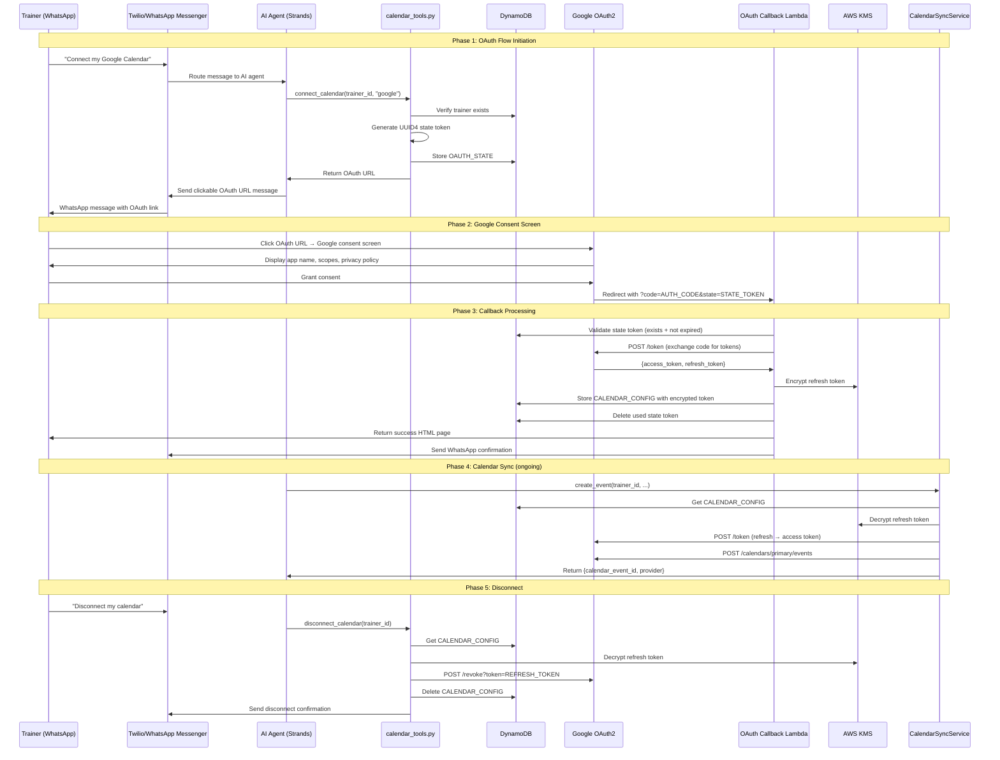

# Design Document: Google OAuth Consent Screen Workflow

## Overview

This design covers the complete Google OAuth2 consent screen workflow for FitAgent, enabling trainers to connect their Google Calendar via WhatsApp. The workflow spans: initiation (WhatsApp message → OAuth URL generation), Google consent screen interaction, callback processing (code exchange, token encryption, storage), token lifecycle management (refresh, revocation), connection status queries, and graceful degradation when calendar sync fails.

The existing codebase already implements much of this flow. The key gaps identified from the requirements and Google's verification rejection are:

1. **Flow initiation messaging**: The `connect_calendar` tool generates the URL but the WhatsApp message formatting needs to be demo-ready and clearly visible.
2. **Token revocation/disconnect**: No `disconnect_calendar` tool or revocation endpoint exists yet.
3. **Connection status query**: No `calendar_status` tool exists yet.
4. **Graceful degradation completeness**: `CalendarSyncService` already returns `None` on failure, but error logging and token refresh failure paths need verification.
5. **State token TTL**: Code uses 30-minute TTL but the state token validation needs explicit timestamp checking (already implemented in `_validate_state_token`).

## Architecture



### Component Responsibilities

| Component | File | Responsibility |
|-----------|------|----------------|
| OAuth Flow Initiator | `src/tools/calendar_tools.py` | Generate OAuth URL, create state token, validate credentials |
| OAuth Callback Handler | `src/handlers/oauth_callback.py` | Validate state, exchange code, store tokens, send confirmation |
| Token Manager | `src/utils/encryption.py` + `src/services/calendar_sync.py` | Encrypt/decrypt tokens via KMS, refresh access tokens, revoke tokens |
| Calendar Sync Service | `src/services/calendar_sync.py` | CRUD calendar events with retry, graceful degradation |
| WhatsApp Messenger | `src/services/twilio_client.py` | Send/receive WhatsApp messages |
| DynamoDB Client | `src/models/dynamodb_client.py` | All data access operations |

## Components and Interfaces

### 1. `connect_calendar(trainer_id, provider)` — Already exists in `calendar_tools.py`

Generates the Google OAuth2 authorization URL with required parameters.

```python
def connect_calendar(trainer_id: str, provider: str) -> Dict[str, Any]:
    """
    Returns: {
        'success': bool,
        'data': {'oauth_url': str, 'provider': str, 'expires_in': int},
        'message': str,  # Instructional message for AI agent
        'error': str      # Only if success=False
    }
    """
```

**Key behaviors:**
- Validates trainer exists in DynamoDB
- Checks Google OAuth credentials are configured (client_id, client_secret)
- Generates UUID4 state token, stores in DynamoDB with 30-min TTL
- Builds URL with `scope=calendar`, `access_type=offline`, `prompt=consent`
- Returns error if credentials not configured

### 2. `disconnect_calendar(trainer_id)` — New function in `calendar_tools.py`

Revokes the Google OAuth token and removes the calendar configuration.

```python
def disconnect_calendar(trainer_id: str) -> Dict[str, Any]:
    """
    Returns: {
        'success': bool,
        'data': {'provider': str, 'disconnected': bool},
        'error': str  # Only if success=False
    }
    """
```

**Key behaviors:**
- Retrieves calendar config from DynamoDB
- Decrypts refresh token via KMS
- Calls Google revocation endpoint (`https://oauth2.googleapis.com/revoke`)
- Deletes CALENDAR_CONFIG from DynamoDB regardless of revocation success/failure
- Logs revocation failures but does not block disconnect

### 3. `get_calendar_status(trainer_id)` — New function in `calendar_tools.py`

Returns the current calendar connection status for a trainer.

```python
def get_calendar_status(trainer_id: str) -> Dict[str, Any]:
    """
    Returns: {
        'success': bool,
        'data': {
            'connected': bool,
            'provider': str | None,
            'connected_at': str | None
        }
    }
    """
```

### 4. OAuth Callback Handler — Already exists in `oauth_callback.py`

The existing `lambda_handler` already implements the full callback flow:
- Validates state token against DynamoDB (existence + TTL)
- Exchanges authorization code for tokens via Google token endpoint
- Encrypts refresh token with KMS, stores in CALENDAR_CONFIG
- Deletes used state token
- Returns HTML success/error pages
- Sends WhatsApp confirmation via Twilio

No structural changes needed. Minor enhancements for demo-readiness.

### 5. Token Refresh — Already exists in `calendar_sync.py`

`CalendarSyncService._refresh_google_token()` handles token refresh:
- Decrypts stored refresh token
- Calls Google token endpoint with `grant_type=refresh_token`
- Raises `TokenRefreshError` on failure or missing access token

### 6. Retry Logic — Already exists in `utils/retry.py`

`@retry_with_backoff(max_attempts=3, initial_delay=1.0, backoff_factor=2.0)` is already applied to all Google Calendar API methods in `CalendarSyncService`.

## Data Models

### DynamoDB Entities (Single-Table Design)

#### OAUTH_STATE (Existing)

| Attribute | Type | Description |
|-----------|------|-------------|
| PK | String | `OAUTH_STATE#{state_token}` |
| SK | String | `METADATA` |
| entity_type | String | `OAUTH_STATE` |
| state_token | String | UUID4 hex string |
| trainer_id | String | Associated trainer ID |
| provider | String | `google` |
| created_at | String | ISO 8601 timestamp |
| ttl | Number | Unix timestamp (created_at + 30 minutes) |

#### CALENDAR_CONFIG (Existing)

| Attribute | Type | Description |
|-----------|------|-------------|
| PK | String | `TRAINER#{trainer_id}` |
| SK | String | `CALENDAR_CONFIG` |
| entity_type | String | `CALENDAR_CONFIG` |
| trainer_id | String | Trainer ID |
| provider | String | `google` or `outlook` |
| encrypted_refresh_token | String | Base64-encoded KMS-encrypted refresh token |
| scope | String | Granted OAuth scope |
| connected_at | String | ISO 8601 timestamp |
| last_sync_at | String | ISO 8601 timestamp |
| created_at | String | ISO 8601 timestamp |
| updated_at | String | ISO 8601 timestamp |

#### Access Patterns

| Access Pattern | Key Condition | Used By |
|----------------|---------------|---------|
| Get calendar config | PK=`TRAINER#{id}`, SK=`CALENDAR_CONFIG` | CalendarSyncService, calendar_tools |
| Get state token | PK=`OAUTH_STATE#{token}`, SK=`METADATA` | OAuth callback handler |
| Delete state token | PK=`OAUTH_STATE#{token}`, SK=`METADATA` | OAuth callback handler |
| Get trainer | PK=`TRAINER#{id}`, SK=`METADATA` | calendar_tools, callback handler |


## Correctness Properties

*A property is a characteristic or behavior that should hold true across all valid executions of a system — essentially, a formal statement about what the system should do. Properties serve as the bridge between human-readable specifications and machine-verifiable correctness guarantees.*

### Property 1: OAuth URL contains all required parameters

*For any* valid trainer ID and provider "google", the OAuth URL returned by `connect_calendar` shall contain the query parameters `scope=https://www.googleapis.com/auth/calendar`, `access_type=offline`, `prompt=consent`, `redirect_uri=<configured_uri>`, `client_id=<configured_id>`, `response_type=code`, and a non-empty `state` parameter.

**Validates: Requirements 1.1, 1.4**

### Property 2: State token stored with correct association and TTL

*For any* successful `connect_calendar` call, the state token stored in DynamoDB shall have `trainer_id` matching the requesting trainer, `provider` set to `"google"`, and a `ttl` value that is within 30 minutes (±5 seconds) of the current time.

**Validates: Requirements 1.2**

### Property 3: State token validation rejects expired tokens

*For any* state token stored in DynamoDB with a TTL in the past, `_validate_state_token` shall return `None`. *For any* state token with a TTL in the future, it shall return the associated trainer data.

**Validates: Requirements 3.1, 9.5**

### Property 4: Token encryption round-trip

*For any* non-empty string representing a refresh token, `decrypt_oauth_token_base64(encrypt_oauth_token_base64(token))` shall return the original token string.

**Validates: Requirements 3.3, 5.1, 9.2**

### Property 5: State token deleted after successful callback

*For any* valid OAuth callback (valid state token + successful token exchange), after the callback handler completes, querying DynamoDB for the state token shall return no item.

**Validates: Requirements 3.4, 9.4**

### Property 6: Success HTML response format

*For any* provider string in `{"google", "outlook"}`, `_success_html_response(provider)` shall return a dict with `statusCode=200`, `Content-Type=text/html` header, and a body containing the provider display name ("Google Calendar" or "Outlook Calendar").

**Validates: Requirements 3.5, 10.3**

### Property 7: Error callback returns HTTP 400 with error description

*For any* non-empty error description string, when the OAuth callback receives an `error` query parameter, the response shall have `statusCode=400` and the HTML body shall contain the error description text.

**Validates: Requirements 4.1**

### Property 8: Invalid state token returns HTTP 400

*For any* state token string that does not exist in DynamoDB, the OAuth callback handler shall return a response with `statusCode=400` and a body instructing the user to request a new link.

**Validates: Requirements 4.3**

### Property 9: Retry decorator applies correct backoff configuration

*For any* function decorated with `@retry_with_backoff(max_attempts=3, initial_delay=1.0, backoff_factor=2.0)`, when the function raises a retryable exception on every call, it shall be invoked exactly 3 times before the exception propagates.

**Validates: Requirements 5.4**

### Property 10: Disconnect deletes config regardless of revocation outcome

*For any* trainer with a stored calendar configuration, after calling `disconnect_calendar`, the calendar configuration shall not exist in DynamoDB, regardless of whether the Google revocation API call succeeded or failed.

**Validates: Requirements 6.2, 6.4**

### Property 11: Calendar status reflects DynamoDB state

*For any* trainer, `get_calendar_status` shall return `connected=True` with the correct `provider` and `connected_at` values when a CALENDAR_CONFIG item exists in DynamoDB, and `connected=False` with `provider=None` and `connected_at=None` when no CALENDAR_CONFIG exists.

**Validates: Requirements 7.1, 7.2, 7.3**

### Property 12: Graceful degradation on calendar sync failures

*For any* trainer ID, when `CalendarSyncService.create_event` is called and the calendar API call fails (no config, token refresh failure, or API error after retries), the method shall return `None` without raising an exception.

**Validates: Requirements 8.1, 8.2, 8.3**

### Property 13: State tokens are unique per request

*For any* two successive calls to `connect_calendar` for the same trainer, the state tokens embedded in the returned OAuth URLs shall be different.

**Validates: Requirements 9.1**

## Error Handling

### OAuth Flow Initiation Errors

| Error Condition | Handling | User-Facing Message |
|----------------|----------|---------------------|
| Trainer not found | Return `success=False` | "Trainer not found: {id}" |
| Google credentials not configured | Return `success=False` | "Google Calendar integration is not configured" |
| Invalid provider | Return `success=False` | "Invalid provider. Must be 'google' or 'outlook'" |
| DynamoDB write failure | Propagate exception | Caught by AI agent error handling |

### OAuth Callback Errors

| Error Condition | HTTP Status | HTML Page Message |
|----------------|-------------|-------------------|
| `error` query parameter present | 400 | Error description from Google |
| Missing `code` or `state` | 400 | "Missing required OAuth parameters" |
| State token not found/expired | 400 | "Authorization link has expired or is invalid" |
| Token exchange HTTP failure | 400 | "Failed to complete calendar authorization" |
| No refresh token in response | 400 | "Calendar authorization did not provide offline access" |
| Unexpected exception | 400 | "An unexpected error occurred" |

### Token Refresh Errors

| Error Condition | Handling |
|----------------|----------|
| Google token endpoint HTTP error | Raise `TokenRefreshError` with error details |
| No access token in response | Raise `TokenRefreshError` |
| KMS decryption failure | Raise `EncryptionError` (caught by CalendarSyncService) |

### Calendar Sync Graceful Degradation

All `CalendarSyncService` public methods (`create_event`, `update_event`, `delete_event`) wrap their logic in try/except and return `None` or `False` on any failure, logging the error. This ensures session operations are never blocked by calendar sync failures.

### Disconnect Errors

| Error Condition | Handling |
|----------------|----------|
| No calendar config exists | Return `success=False` with message |
| Google revocation endpoint failure | Log warning, proceed with config deletion |
| DynamoDB delete failure | Propagate exception |

## Testing Strategy

### Property-Based Testing

Use **Hypothesis** (already in the project) for property-based tests. Each property test runs a maximum of 10 examples (consistent with existing project convention for fast feedback).

Property tests target the core logic functions that can be tested with generated inputs:

| Property | Test Target | Generator Strategy |
|----------|-------------|-------------------|
| P1: URL parameters | `connect_calendar()` | Random trainer IDs with mocked DynamoDB |
| P2: State token storage | `connect_calendar()` | Random trainer IDs, verify DynamoDB writes |
| P3: Token expiry validation | `_validate_state_token()` | Random tokens with past/future TTLs |
| P4: Encryption round-trip | `encrypt/decrypt_oauth_token_base64()` | Random non-empty strings (ASCII + Unicode) |
| P6: Success HTML | `_success_html_response()` | Provider from `{"google", "outlook"}` |
| P7: Error HTML | `_error_html_response()` | Random error title and message strings |
| P9: Retry count | `@retry_with_backoff` decorated function | Mock function that always raises |
| P11: Calendar status | `get_calendar_status()` | Random trainers with/without configs |
| P12: Graceful degradation | `CalendarSyncService.create_event()` | Random trainers with mocked failures |
| P13: Token uniqueness | `connect_calendar()` | Multiple calls for same trainer |

Each test must be tagged with:
```python
# Feature: google-oauth-consent-workflow, Property {N}: {property_text}
```

### Unit Tests

Unit tests cover specific examples, edge cases, and integration points:

- **Edge cases** (from prework):
  - Missing Google credentials (1.5)
  - Missing `code` or `state` parameters (4.2)
  - Token exchange returns no refresh token (4.5)
  - Token refresh response missing access token (5.3)

- **Integration examples**:
  - Token exchange with mocked Google endpoint (3.2)
  - WhatsApp confirmation message sent after success (3.6)
  - Token refresh failure raises TokenRefreshError (5.2)
  - Revocation endpoint called during disconnect (6.1)
  - Disconnect sends WhatsApp confirmation (6.3)
  - End-to-end session creation triggers calendar event (10.5)

### Test Configuration

```python
# pytest.ini / conftest.py
# Property tests: max 10 examples for fast feedback
from hypothesis import settings as hypothesis_settings
hypothesis_settings.register_profile("ci", max_examples=10)
hypothesis_settings.load_profile("ci")
```

### Mocking Strategy

- **DynamoDB**: Use `moto` mock or the existing LocalStack-backed test fixtures
- **Google OAuth endpoints**: Use `responses` or `requests_mock` to mock HTTP calls
- **AWS KMS**: Use `moto` mock for encrypt/decrypt operations
- **Twilio**: Mock `TwilioClient.send_message` to verify message content
