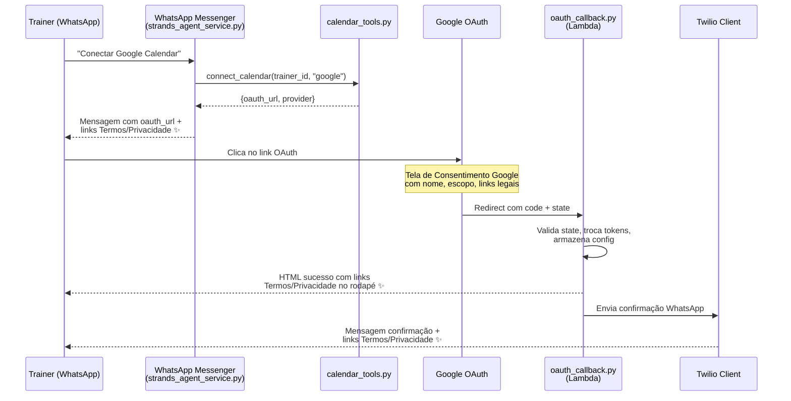

# Documento de Design: Google OAuth Verification

## Visão Geral

Este design detalha as alterações necessárias para que o FitAgent passe no processo de verificação do Google para uso do escopo `https://www.googleapis.com/auth/calendar`. As mudanças são focadas em três áreas:

1. **Mensagens e páginas do fluxo OAuth**: Incluir links de Termos de Serviço e Política de Privacidade em todas as mensagens WhatsApp (conexão e confirmação) e nas páginas HTML de callback (sucesso e erro).
2. **Configuração**: Adicionar variável de ambiente `WEBSITE_BASE_URL` ao `Settings` para construir URLs dinâmicas das páginas legais.
3. **Documentação**: Roteiros de vídeo de demonstração para o fluxo OAuth e funcionalidade do app, e checklist de configuração da tela de consentimento no Google Cloud Console.

Todas as mensagens e páginas serão em Português-BR. As páginas estáticas de Termos (`termos.html`) e Privacidade (`privacidade.html`) já existem no S3/CloudFront.

## Arquitetura

O fluxo OAuth existente já está implementado. As alterações são cirúrgicas nos componentes que geram mensagens e HTML:



Os componentes marcados com ✨ são os que serão modificados.

### Decisões de Design

1. **Helper centralizado para URLs legais**: Criar funções helper em `config.py` (ou no próprio `Settings`) para construir as URLs de Termos e Privacidade a partir de `WEBSITE_BASE_URL`. Isso evita duplicação e garante consistência.

2. **Graceful degradation quando `WEBSITE_BASE_URL` não está configurada**: Se a variável estiver vazia, os links de Termos/Privacidade são simplesmente omitidos das mensagens e páginas. O fluxo OAuth continua funcionando normalmente.

3. **Mensagens formatadas no `strands_agent_service.py`**: A mensagem de conexão é montada no `calendar_agent()` dentro do strands agent service, não no `calendar_tools.py`. Os links legais serão adicionados nesse ponto.

4. **HTML inline no `oauth_callback.py`**: As páginas de sucesso e erro são geradas como strings HTML inline nas funções `_success_html_response()` e `_error_html_response()`. Os links legais serão adicionados ao rodapé dessas páginas.

5. **Roteiros como documentação Markdown**: Os roteiros de vídeo serão documentados diretamente na seção de documentação deste design, sem criar arquivos separados.

## Componentes e Interfaces

### 1. `src/config.py` — Settings

**Alteração**: Adicionar campo `website_base_url` ao `Settings`.

```python
class Settings(BaseSettings):
    # ... campos existentes ...
    
    # Website estático (para links de Termos e Privacidade)
    website_base_url: str = ""
```

**Novas propriedades helper**:

```python
@property
def terms_url(self) -> str:
    """URL da página de Termos de Serviço, ou string vazia se WEBSITE_BASE_URL não configurada."""
    if not self.website_base_url:
        return ""
    base = self.website_base_url.rstrip("/")
    return f"{base}/termos.html"

@property
def privacy_url(self) -> str:
    """URL da página de Política de Privacidade, ou string vazia se WEBSITE_BASE_URL não configurada."""
    if not self.website_base_url:
        return ""
    base = self.website_base_url.rstrip("/")
    return f"{base}/privacidade.html"
```

### 2. `src/services/strands_agent_service.py` — calendar_agent()

**Alteração**: Modificar a mensagem de conexão retornada pelo `calendar_agent()` para incluir links de Termos e Privacidade quando `WEBSITE_BASE_URL` estiver configurada.

**Mensagem atual**:
```
Para conectar seu Google Calendar, clique no link abaixo para autorizar o acesso:

{oauth_url}

O link expira em 30 minutos. Após autorizar, suas sessões serão sincronizadas automaticamente.
```

**Mensagem nova** (quando `WEBSITE_BASE_URL` configurada):
```
Para conectar seu Google Calendar, clique no link abaixo para autorizar o acesso:

{oauth_url}

Ao conectar o calendário, você concorda com os Termos de Serviço ({terms_url}) e a Política de Privacidade ({privacy_url}) do FitAgent.

O link expira em 30 minutos. Após autorizar, suas sessões serão sincronizadas automaticamente.
```

### 3. `src/handlers/oauth_callback.py` — Páginas HTML

**Alteração em `_success_html_response()`**: Adicionar rodapé com links de Termos e Privacidade na página de sucesso. A função receberá as URLs como parâmetros (obtidas de `settings`).

**Alteração em `_error_html_response()`**: Adicionar rodapé com links de Termos e Privacidade na página de erro.

**Alteração em `_send_confirmation_message()`**: Incluir links de Termos e Privacidade na mensagem de confirmação WhatsApp.

**Mensagem de confirmação atual**:
```
✅ Google Calendar conectado com sucesso!

Your training sessions will now automatically sync to your calendar. When you schedule, reschedule, or cancel sessions, the changes will be reflected in your calendar within 30 seconds.
```

**Mensagem de confirmação nova** (em PT-BR, com links):
```
✅ Google Calendar conectado com sucesso!

Suas sessões de treino serão sincronizadas automaticamente com seu calendário. Ao agendar, reagendar ou cancelar sessões, as alterações serão refletidas no seu calendário.

Termos de Serviço: {terms_url}
Política de Privacidade: {privacy_url}
```

### 4. Rodapé HTML das Callback Landing Pages

Ambas as páginas (sucesso e erro) receberão um rodapé com estilo consistente:

```html
<div class="footer-links">
    <a href="{terms_url}" target="_blank">Termos de Serviço</a>
    <span>|</span>
    <a href="{privacy_url}" target="_blank">Política de Privacidade</a>
</div>
```

O rodapé só será renderizado se `WEBSITE_BASE_URL` estiver configurada.

### 5. Conteúdo em Português-BR

Todas as strings das páginas HTML de sucesso e erro serão traduzidas para PT-BR:
- Título sucesso: "Calendário Conectado com Sucesso!"  
- Título erro: mantém dinâmico mas com textos em PT-BR
- Mensagem de fechar: "Você pode fechar esta janela e voltar ao WhatsApp."

## Modelos de Dados

Não há alterações nos modelos de dados do DynamoDB. As mudanças são limitadas a:

1. **Nova variável de ambiente**: `WEBSITE_BASE_URL` (string, padrão vazio)
2. **Campo no Settings**: `website_base_url: str = ""`

### Configuração da Tela de Consentimento Google (Google Cloud Console)

Campos a configurar no Google Cloud Console → APIs & Services → OAuth consent screen:

| Campo | Valor |
|-------|-------|
| App name | FitAgent |
| User support email | (email de suporte do projeto) |
| App logo | Logo do FitAgent (120x120px, PNG) |
| Application home page | `{WEBSITE_BASE_URL}` |
| Application privacy policy link | `{WEBSITE_BASE_URL}/privacidade.html` |
| Application terms of service link | `{WEBSITE_BASE_URL}/termos.html` |
| Authorized domains | `fitassistant.com.br` |
| Scopes | `https://www.googleapis.com/auth/calendar` |

### Roteiro do Vídeo de Demonstração OAuth (Vídeo_Demo_OAuth)

1. Abrir WhatsApp com a conversa do FitAgent
2. Enviar mensagem: "Quero conectar meu Google Calendar"
3. Mostrar a resposta com o link OAuth e os links de Termos/Privacidade
4. Clicar no link OAuth
5. Mostrar a tela de consentimento do Google com: nome "FitAgent", escopo de calendário, links de privacidade e termos
6. Clicar em "Permitir" / "Allow"
7. Mostrar a página de sucesso (Callback Landing Page) com links de Termos/Privacidade no rodapé
8. Voltar ao WhatsApp e mostrar a mensagem de confirmação com links de Termos/Privacidade

### Roteiro do Vídeo de Demonstração de Funcionalidade (Vídeo_Demo_Funcionalidade)

1. Abrir WhatsApp com a conversa do FitAgent (calendário já conectado)
2. Enviar mensagem: "Agendar sessão com [nome] para amanhã às 14h"
3. Mostrar confirmação no WhatsApp
4. Abrir Google Calendar e mostrar o evento criado
5. Voltar ao WhatsApp: "Reagendar sessão de [nome] para depois de amanhã às 15h"
6. Mostrar confirmação no WhatsApp
7. Abrir Google Calendar e mostrar o evento atualizado
8. Voltar ao WhatsApp: "Cancelar sessão de [nome]"
9. Mostrar confirmação no WhatsApp
10. Abrir Google Calendar e mostrar que o evento foi removido


## Propriedades de Corretude

*Uma propriedade é uma característica ou comportamento que deve ser verdadeiro em todas as execuções válidas de um sistema — essencialmente, uma declaração formal sobre o que o sistema deve fazer. Propriedades servem como ponte entre especificações legíveis por humanos e garantias de corretude verificáveis por máquina.*

### Propriedade 1: Construção de URLs legais a partir da URL base

*Para qualquer* string não-vazia `base_url`, as propriedades `terms_url` e `privacy_url` do Settings devem retornar `{base_url.rstrip("/")}/termos.html` e `{base_url.rstrip("/")}/privacidade.html` respectivamente. Para `base_url` vazia, ambas devem retornar string vazia.

**Validates: Requirements 1.3, 4.1, 4.3**

### Propriedade 2: Mensagem de conexão contém links legais

*Para qualquer* `WEBSITE_BASE_URL` não-vazia e qualquer provider válido ("google" ou "outlook"), a mensagem de conexão do calendário gerada pelo `calendar_agent()` deve conter a URL de Termos de Serviço e a URL de Política de Privacidade construídas a partir da URL base.

**Validates: Requirements 1.1, 1.2, 7.1**

### Propriedade 3: Callback landing pages contêm links legais com rótulos em PT-BR

*Para qualquer* `WEBSITE_BASE_URL` não-vazia, qualquer provider e qualquer título/mensagem de erro, o HTML gerado por `_success_html_response()` e `_error_html_response()` deve conter elementos `<a>` com `href` apontando para as URLs de Termos e Privacidade, e com os rótulos "Termos de Serviço" e "Política de Privacidade".

**Validates: Requirements 2.1, 2.2, 2.3, 7.3, 7.4**

### Propriedade 4: Mensagem de confirmação contém links legais

*Para qualquer* `WEBSITE_BASE_URL` não-vazia e qualquer provider válido, a mensagem de confirmação WhatsApp gerada por `_send_confirmation_message()` deve conter a URL de Termos de Serviço e a URL de Política de Privacidade.

**Validates: Requirements 3.1, 3.2, 7.2**

### Propriedade 5: Graceful degradation — links omitidos quando URL base vazia

*Para qualquer* mensagem ou página HTML gerada quando `WEBSITE_BASE_URL` está vazia, o conteúdo não deve conter referências a `termos.html` nem a `privacidade.html`.

**Validates: Requirements 4.2**

## Tratamento de Erros

As alterações não introduzem novos modos de falha. O tratamento de erros segue o padrão existente:

1. **`WEBSITE_BASE_URL` não configurada**: Graceful degradation — links de Termos/Privacidade são omitidos. O fluxo OAuth continua funcionando normalmente. Nenhum erro é lançado.

2. **`WEBSITE_BASE_URL` com formato inválido** (ex: sem protocolo): O sistema usa o valor como está. A validação da URL é responsabilidade do operador na configuração. Trailing slashes são removidos automaticamente pelo helper.

3. **Páginas de Termos/Privacidade indisponíveis**: Os links são incluídos nas mensagens independentemente da disponibilidade das páginas. Se o CloudFront estiver fora do ar, o trainer verá um erro do navegador ao clicar — isso é externo ao FitAgent.

## Estratégia de Testes

### Testes Unitários

Testes unitários focados em exemplos específicos e edge cases:

- **`test_settings_website_base_url`**: Verificar que `Settings` carrega `WEBSITE_BASE_URL` do ambiente
- **`test_settings_terms_url_empty`**: Verificar que `terms_url` retorna vazio quando `WEBSITE_BASE_URL` não está configurada
- **`test_settings_privacy_url_empty`**: Verificar que `privacy_url` retorna vazio quando `WEBSITE_BASE_URL` não está configurada
- **`test_success_html_portuguese`**: Verificar que a página de sucesso contém texto em PT-BR (não inglês)
- **`test_error_html_portuguese`**: Verificar que a página de erro contém texto em PT-BR
- **`test_confirmation_message_portuguese`**: Verificar que a mensagem de confirmação está em PT-BR
- **`test_connection_message_portuguese`**: Verificar que a mensagem de conexão está em PT-BR

### Testes Property-Based

Biblioteca: **Hypothesis** (já utilizada no projeto)

Cada teste property-based deve rodar no mínimo 100 iterações e referenciar a propriedade do design.

- **Property 1**: Gerar `base_url` aleatórias (com e sem trailing slash, com diferentes protocolos) e verificar a construção correta das URLs.
  - Tag: `Feature: google-oauth-verification, Property 1: URL construction from base URL`

- **Property 2**: Gerar `base_url` aleatórias não-vazias e providers aleatórios, verificar que a mensagem de conexão contém ambas as URLs legais.
  - Tag: `Feature: google-oauth-verification, Property 2: Connection message contains legal links`

- **Property 3**: Gerar `base_url` aleatórias não-vazias, providers e mensagens de erro aleatórias, verificar que o HTML de sucesso e erro contém os links com rótulos corretos.
  - Tag: `Feature: google-oauth-verification, Property 3: Callback pages contain legal links with PT-BR labels`

- **Property 4**: Gerar `base_url` aleatórias não-vazias e providers aleatórios, verificar que a mensagem de confirmação contém ambas as URLs legais.
  - Tag: `Feature: google-oauth-verification, Property 4: Confirmation message contains legal links`

- **Property 5**: Gerar mensagens e páginas com `WEBSITE_BASE_URL` vazia, verificar ausência de referências a `termos.html` e `privacidade.html`.
  - Tag: `Feature: google-oauth-verification, Property 5: Graceful degradation with empty base URL`

Cada propriedade de corretude será implementada por um único teste property-based. Os testes unitários complementam com exemplos específicos, edge cases e verificações de idioma.
