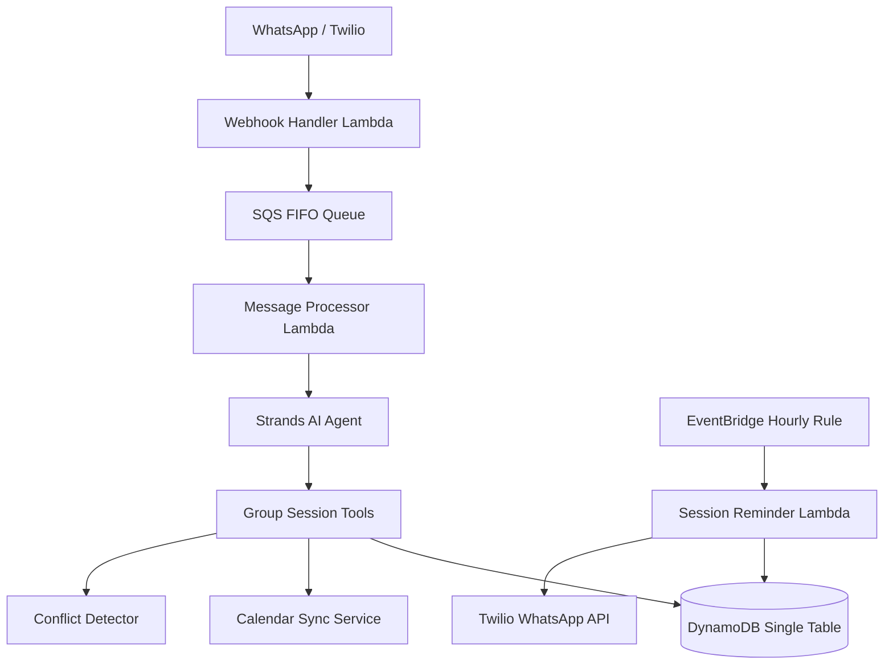

# Design Document: Group Sessions

## Overview

Group Sessions extends FitAgent's existing 1:1 session scheduling to support multi-student training sessions. Trainers configure a per-trainer group size limit, schedule group sessions via WhatsApp, enroll/remove students, and manage the lifecycle (cancel, reschedule). The existing EventBridge reminder pipeline is extended to send individual WhatsApp reminders to every enrolled student on the day of a group session.

The design reuses the existing single-table DynamoDB pattern, session-date-index GSI, conflict detection service, calendar sync service, and reminder Lambda. Group sessions are stored as `SESSION` entities with `session_type="group"`, an `enrolled_students` list, and a `max_participants` cap. No new DynamoDB tables or GSIs are required.

## Architecture

The feature integrates into the existing serverless architecture with minimal new components:



Changes are confined to:
1. New tool functions in `src/tools/session_tools.py` (or a new `group_session_tools.py`)
2. New `GroupSession` Pydantic model in `src/models/entities.py`
3. Extended `TrainerConfig` model with `group_size_limit` field
4. Updated `session_reminder.py` handler to iterate enrolled students
5. Updated `view_calendar` tool to include group session metadata

No new Lambda functions, SQS queues, or DynamoDB tables are needed.

## Components and Interfaces

### 1. Group Session Tool Functions

New `@tool` decorated functions following the existing pattern in `session_tools.py`:

- `schedule_group_session(trainer_id, date, time, duration_minutes, location?, max_participants?) -> dict`
  Creates a group session. Defaults `max_participants` to trainer's `group_size_limit`. Checks conflicts via `SessionConflictDetector`. Syncs calendar via `CalendarSyncService`.

- `enroll_student(trainer_id, session_id, student_names: list[str]) -> dict`
  Adds one or more students to a group session. Validates: student linked to trainer, not already enrolled, session not full. Returns per-student results.

- `remove_student(trainer_id, session_id, student_name) -> dict`
  Removes a student from the enrolled list. Updates `updated_at`.

- `cancel_group_session(trainer_id, session_id, reason?) -> dict`
  Sets status to "cancelled". Returns enrolled student names. Deletes calendar event if linked.

- `reschedule_group_session(trainer_id, session_id, new_date, new_time) -> dict`
  Updates `session_datetime`, preserves enrolled students. Checks conflicts. Updates calendar event if linked.

- `configure_group_size_limit(trainer_id, limit: int) -> dict`
  Updates `group_size_limit` in `TrainerConfig`. Validates range 2–50.

### 2. Updated `view_calendar` Tool

The existing `view_calendar` tool is extended to:
- Include `session_type`, `enrolled_student_count`, and `max_participants` in response for group sessions
- Support filtering by student name across both individual and group sessions

### 3. Updated Session Reminder Lambda

`session_reminder.py` is updated so that when processing a session with `session_type="group"`:
- It iterates over `enrolled_students` list
- Sends an individual WhatsApp reminder to each enrolled student
- Records a separate `Reminder` entity per student

### 4. GroupSession Entity Model

New Pydantic model extending the session concept with group-specific fields.

### 5. TrainerConfig Extension

Add `group_size_limit: int = 10` (range 2–50) to the existing `TrainerConfig` model.

## Data Models

### GroupSession Entity (DynamoDB)

Follows the existing single-table design. Uses the same key pattern as individual sessions so it's queryable via the `session-date-index` GSI.

| Attribute | Type | Description |
|---|---|---|
| PK | String | `TRAINER#{trainer_id}` |
| SK | String | `SESSION#{session_id}` |
| entity_type | String | `"SESSION"` |
| session_id | String | UUID |
| trainer_id | String | Trainer UUID |
| session_type | String | `"group"` (distinguishes from `"individual"`) |
| session_datetime | String | ISO 8601 datetime |
| duration_minutes | Number | 15–480 |
| location | String | Optional |
| status | String | `scheduled`, `confirmed`, `cancelled`, `completed` |
| max_participants | Number | 2–50, defaults to trainer's `group_size_limit` |
| enrolled_students | List | `[{student_id, student_name}, ...]` |
| calendar_event_id | String | Optional, from calendar sync |
| calendar_provider | String | Optional, `"google"` or `"outlook"` |
| created_at | String | ISO 8601 |
| updated_at | String | ISO 8601 |

GSI projections:
- `session-date-index`: PK=`trainer_id`, SK=`session_datetime` — works as-is since group sessions use the same `trainer_id` and `session_datetime` attributes.

### TrainerConfig Extension

Add to existing `TrainerConfig`:

| Attribute | Type | Description |
|---|---|---|
| group_size_limit | Number | Default 10, range 2–50 |

### Enrolled Student Object

Each entry in `enrolled_students`:

```json
{
  "student_id": "abc123",
  "student_name": "João Silva"
}
```

### GroupSession Pydantic Model

```python
class GroupSession(BaseModel):
    session_id: str = Field(default_factory=lambda: uuid4().hex)
    entity_type: Literal["SESSION"] = "SESSION"
    trainer_id: str
    session_type: Literal["group"] = "group"
    session_datetime: datetime
    duration_minutes: int = Field(ge=15, le=480)
    location: Optional[str] = None
    status: Literal["scheduled", "confirmed", "cancelled", "completed"] = "scheduled"
    max_participants: int = Field(ge=2, le=50)
    enrolled_students: List[Dict[str, str]] = Field(default_factory=list)
    calendar_event_id: Optional[str] = None
    calendar_provider: Optional[Literal["google", "outlook"]] = None
    created_at: datetime = Field(default_factory=datetime.utcnow)
    updated_at: datetime = Field(default_factory=datetime.utcnow)
```


## Correctness Properties

*A property is a characteristic or behavior that should hold true across all valid executions of a system — essentially, a formal statement about what the system should do. Properties serve as the bridge between human-readable specifications and machine-verifiable correctness guarantees.*

### Property 1: Group size limit validation round trip

*For any* integer value, calling `configure_group_size_limit` should succeed and persist the value if and only if the value is in the range [2, 50]. For valid values, reading the config back should return the same value. For invalid values, the tool should return a validation error.

**Validates: Requirements 1.2, 1.3, 1.4**

### Property 2: Group session creation uses correct max_participants

*For any* group session creation request, the resulting session's `max_participants` should equal the explicitly provided value if one is given, or the trainer's configured `group_size_limit` if none is provided. If the provided value exceeds the trainer's `group_size_limit`, the tool should reject the request.

**Validates: Requirements 2.1, 2.2, 2.5**

### Property 3: GroupSession serialization round trip

*For any* valid `GroupSession` object, serializing it to DynamoDB format via `to_dynamodb()` and deserializing back via `from_dynamodb()` should produce an equivalent object. The serialized form must have `PK=TRAINER#{trainer_id}`, `SK=SESSION#{session_id}`, `session_type="group"`, and `enrolled_students` as a list of objects each containing `student_id` and `student_name`.

**Validates: Requirements 2.3, 9.1, 9.2, 9.3**

### Property 4: Conflict detection for group sessions

*For any* group session schedule or reschedule request whose time window overlaps with an existing session for the same trainer, the tool should report the conflicting sessions in its response.

**Validates: Requirements 2.4, 6.2**

### Property 5: Enrollment respects capacity and trainer linkage

*For any* group session and student, enrollment should succeed only if: (a) the student is linked to the trainer, (b) the student is not already enrolled, and (c) the current enrolled count is less than `max_participants`. When enrollment succeeds, the student should appear in the `enrolled_students` list.

**Validates: Requirements 3.1, 3.2, 3.3**

### Property 6: Batch enrollment returns per-student results

*For any* list of student names submitted for enrollment in a group session, the tool should return a result list with exactly one entry per requested student, each indicating success or the specific reason for failure.

**Validates: Requirements 3.5**

### Property 7: Student removal updates list and timestamp

*For any* enrolled student in a group session, removing them should result in the student no longer appearing in `enrolled_students`, and the session's `updated_at` timestamp should be more recent than before the removal.

**Validates: Requirements 4.1, 4.3**

### Property 8: Cancellation sets status and returns enrolled names

*For any* non-cancelled group session with enrolled students, cancelling it should set the status to `"cancelled"` and the response should contain the names of all previously enrolled students.

**Validates: Requirements 5.1, 5.2**

### Property 9: Reschedule preserves enrolled students

*For any* non-cancelled group session with enrolled students, rescheduling to a new datetime should update `session_datetime` to the new value while preserving the exact same `enrolled_students` list.

**Validates: Requirements 6.1**

### Property 10: Calendar view includes group session metadata

*For any* calendar view query that spans a date range containing group sessions, each group session in the response should include `session_type`, enrolled student count, and `max_participants` fields.

**Validates: Requirements 7.1, 7.2**

### Property 11: Calendar student filter includes group sessions

*For any* student enrolled in one or more group sessions, filtering the calendar by that student's name should return those group sessions in the results.

**Validates: Requirements 7.3**

### Property 12: Group session reminders send per-student messages

*For any* scheduled (non-cancelled) group session with N enrolled students where the trainer has reminders enabled, the reminder service should produce exactly N individual reminder messages, each containing the session date, time, duration, location, and trainer name, and record N corresponding Reminder entities.

**Validates: Requirements 8.1, 8.2, 8.3, 8.6**

### Property 13: Disabled reminders skip group sessions

*For any* trainer with `session_reminders_enabled` set to false, the reminder service should send zero reminders for that trainer's group sessions regardless of enrollment count.

**Validates: Requirements 8.5**

## Error Handling

### Tool-Level Errors

All group session tool functions follow the existing `{'success': bool, 'data': ..., 'error': ...}` pattern:

| Error Condition | Response |
|---|---|
| Group size limit out of range (< 2 or > 50) | `{'success': False, 'error': 'Group size limit must be between 2 and 50'}` |
| max_participants exceeds trainer's group_size_limit | `{'success': False, 'error': 'Max participants (X) exceeds your group size limit (Y)'}` |
| Session not found | `{'success': False, 'error': 'Session not found: {session_id}'}` |
| Student not linked to trainer | `{'success': False, 'error': 'Student X not found or not linked to this trainer'}` |
| Session at capacity | `{'success': False, 'error': 'Session is full (X/X enrolled)'}` |
| Student already enrolled | `{'success': False, 'error': 'Student X is already enrolled in this session'}` |
| Student not enrolled (for removal) | `{'success': False, 'error': 'Student X is not enrolled in this session'}` |
| Cancel already-cancelled session | `{'success': False, 'error': 'Session is already cancelled'}` |
| Reschedule cancelled session | `{'success': False, 'error': 'Cannot reschedule a cancelled session'}` |
| Scheduling conflict detected | Success with `conflicts` array in response data (warning, not blocking) |
| Invalid date/time format | `{'success': False, 'error': 'Invalid date or time format...'}` |
| Session in the past | `{'success': False, 'error': 'Cannot schedule sessions in the past'}` |

### Calendar Sync Errors

Calendar sync follows the existing graceful degradation pattern:
- Calendar sync failures are logged but do not block session operations
- The response includes `calendar_synced: false` when sync fails
- Retry logic (3 attempts with exponential backoff) is handled by the existing `CalendarSyncService`

### Reminder Errors

- Individual reminder failures are logged and counted but do not stop processing of remaining students
- Failed reminders are recorded with `status: "failed"` in the Reminder entity
- The Lambda returns a summary with `reminders_sent` and `reminders_failed` counts

## Testing Strategy

### Unit Tests

Unit tests cover specific examples and edge cases using `pytest` with `moto` for DynamoDB mocking:

- Default group_size_limit is 10 when TrainerConfig is created
- GroupSession entity can be queried via session-date-index GSI
- Cancelling an already-cancelled session returns appropriate error
- Rescheduling a cancelled session returns appropriate error
- Removing a non-enrolled student returns appropriate error
- Enrolling a duplicate student returns appropriate error
- Cancelled group sessions are skipped by the reminder service
- Calendar event is deleted on cancellation, updated on reschedule

### Property-Based Tests

Property-based tests use `Hypothesis` (already in the project) with minimum 100 iterations per test. Each test references its design property.

| Test | Property | Tag |
|---|---|---|
| `test_group_size_limit_validation` | Property 1 | Feature: group-sessions, Property 1: Group size limit validation round trip |
| `test_group_session_max_participants` | Property 2 | Feature: group-sessions, Property 2: Group session creation uses correct max_participants |
| `test_group_session_serialization_round_trip` | Property 3 | Feature: group-sessions, Property 3: GroupSession serialization round trip |
| `test_conflict_detection_group_sessions` | Property 4 | Feature: group-sessions, Property 4: Conflict detection for group sessions |
| `test_enrollment_respects_constraints` | Property 5 | Feature: group-sessions, Property 5: Enrollment respects capacity and trainer linkage |
| `test_batch_enrollment_results` | Property 6 | Feature: group-sessions, Property 6: Batch enrollment returns per-student results |
| `test_student_removal` | Property 7 | Feature: group-sessions, Property 7: Student removal updates list and timestamp |
| `test_cancellation_status_and_names` | Property 8 | Feature: group-sessions, Property 8: Cancellation sets status and returns enrolled names |
| `test_reschedule_preserves_enrollment` | Property 9 | Feature: group-sessions, Property 9: Reschedule preserves enrolled students |
| `test_calendar_view_group_metadata` | Property 10 | Feature: group-sessions, Property 10: Calendar view includes group session metadata |
| `test_calendar_student_filter` | Property 11 | Feature: group-sessions, Property 11: Calendar student filter includes group sessions |
| `test_group_reminder_per_student` | Property 12 | Feature: group-sessions, Property 12: Group session reminders send per-student messages |
| `test_disabled_reminders_skip_groups` | Property 13 | Feature: group-sessions, Property 13: Disabled reminders skip group sessions |

Each property-based test must:
- Run a minimum of 100 iterations (`@settings(max_examples=100)`)
- Be tagged with a comment: `# Feature: group-sessions, Property N: <title>`
- Use Hypothesis strategies to generate random group sessions, student lists, and config values
- Be placed in `tests/property/test_group_session_properties.py`
