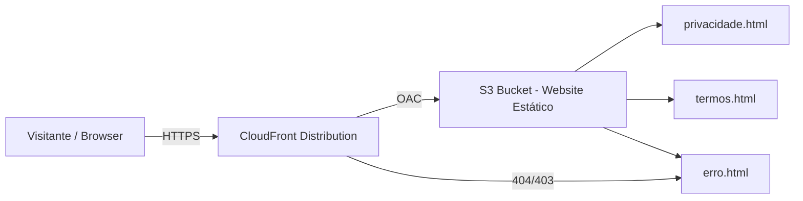

# Design: Páginas Estáticas do Website

## Overview

Este design descreve a implementação de páginas web estáticas para o FitAgent, hospedadas via S3 + CloudFront. As páginas incluem Política de Privacidade (`privacidade.html`), Termos de Serviço (`termos.html`) e uma página de erro personalizada (`erro.html`), todas em Português-BR.

A infraestrutura será adicionada ao template CloudFormation existente (`infrastructure/template.yml`), seguindo os padrões de nomenclatura já estabelecidos no projeto (uso de `Environment` e `AWS::AccountId`).

### Decisões de Design

1. **S3 + CloudFront com OAC**: O bucket S3 terá acesso público bloqueado. O CloudFront usará Origin Access Control (OAC) para acessar o bucket, garantindo que todo tráfego passe pela CDN com HTTPS.
2. **HTML estático sem framework**: As páginas são simples documentos legais. HTML puro com CSS inline/embedded é suficiente — sem necessidade de build tools ou frameworks.
3. **Responsividade via viewport meta tag e CSS**: Layout responsivo usando CSS flexbox/media queries simples, sem dependências externas.
4. **Infraestrutura no template existente**: Os recursos S3 e CloudFront serão adicionados diretamente ao `infrastructure/template.yml` existente, mantendo tudo em um único stack.

## Architecture



### Fluxo de Requisição

1. Visitante acessa a URL do CloudFront (ex: `https://d1234.cloudfront.net/privacidade.html`)
2. CloudFront recebe a requisição via HTTPS (HTTP é redirecionado para HTTPS)
3. CloudFront busca o arquivo no S3 usando OAC
4. S3 retorna o HTML ao CloudFront
5. CloudFront entrega o conteúdo ao visitante com cache
6. Para rotas inexistentes, CloudFront retorna `erro.html` com status 404

## Components and Interfaces

### Recursos CloudFormation (novos)

| Recurso | Tipo | Descrição |
|---------|------|-----------|
| `StaticWebsiteBucket` | `AWS::S3::Bucket` | Bucket S3 para arquivos HTML estáticos |
| `StaticWebsiteBucketPolicy` | `AWS::S3::BucketPolicy` | Política permitindo acesso via CloudFront OAC |
| `StaticWebsiteCloudFrontOAC` | `AWS::CloudFront::OriginAccessControl` | OAC para acesso seguro ao S3 |
| `StaticWebsiteDistribution` | `AWS::CloudFront::Distribution` | Distribuição CDN com HTTPS e página de erro |

### Arquivos HTML

| Arquivo | Rota | Descrição |
|---------|------|-----------|
| `privacidade.html` | `/privacidade.html` | Política de Privacidade em PT-BR |
| `termos.html` | `/termos.html` | Termos de Serviço em PT-BR |
| `erro.html` | Página de erro customizada | Página 404 em PT-BR |

### Estrutura dos Arquivos HTML

Cada página HTML seguirá esta estrutura:

```html
<!DOCTYPE html>
<html lang="pt-BR">
<head>
    <meta charset="UTF-8">
    <meta name="viewport" content="width=device-width, initial-scale=1.0">
    <title>[Título da Página] - FitAgent</title>
    <style>/* CSS embedded para responsividade */</style>
</head>
<body>
    <header><!-- Logo/nome FitAgent + navegação --></header>
    <main><!-- Conteúdo da página --></main>
    <footer><!-- Links entre páginas + copyright --></footer>
</body>
</html>
```

### CSS Compartilhado (embedded)

Para manter a simplicidade sem dependências externas, o CSS será embedded em cada página. O estilo será consistente entre as páginas com:
- Tipografia limpa e legível (system fonts)
- Layout responsivo com max-width para conteúdo
- Cores neutras e profissionais
- Navegação simples no header e footer

## Data Models

Este feature não introduz novos modelos de dados no DynamoDB. Os únicos "dados" são os arquivos HTML estáticos armazenados no S3.

### Configuração CloudFormation

Parâmetros existentes reutilizados:
- `Environment` — para nomenclatura do bucket (`fitagent-static-website-${Environment}-${AWS::AccountId}`)

Novos recursos no template:

```yaml
# S3 Bucket
StaticWebsiteBucket:
  BucketName: !Sub 'fitagent-static-website-${Environment}-${AWS::AccountId}'
  PublicAccessBlockConfiguration: # Tudo bloqueado
  BucketEncryption: AES256

# CloudFront OAC
StaticWebsiteCloudFrontOAC:
  OriginAccessControlOriginType: s3
  SigningBehavior: always
  SigningProtocol: sigv4

# CloudFront Distribution
StaticWebsiteDistribution:
  DefaultRootObject: privacidade.html
  ViewerProtocolPolicy: redirect-to-https
  CustomErrorResponses:
    - ErrorCode: 403 → /erro.html (404)
    - ErrorCode: 404 → /erro.html (404)
```

### Outputs Adicionais

| Output | Valor | Descrição |
|--------|-------|-----------|
| `StaticWebsiteBucketName` | Nome do bucket | Para deploy dos arquivos HTML |
| `StaticWebsiteUrl` | URL do CloudFront | URL pública do website |


## Correctness Properties

*A property is a characteristic or behavior that should hold true across all valid executions of a system — essentially, a formal statement about what the system should do. Properties serve as the bridge between human-readable specifications and machine-verifiable correctness guarantees.*

A maioria dos requisitos deste feature são sobre configuração de infraestrutura (CloudFormation) e conteúdo estático específico de cada página. Esses são melhor validados por testes de exemplo (unit tests) do que por property-based tests. No entanto, existem duas propriedades universais que se aplicam a todas as páginas:

### Property 1: Cross-linking entre páginas

*For any* página HTML no website estático, ela deve conter links (`<a href="...">`) para todas as outras páginas de conteúdo do website.

**Validates: Requirements 4.1, 4.2, 6.2**

### Property 2: Branding consistente

*For any* página HTML no website estático, ela deve conter o nome "FitAgent" visível no conteúdo.

**Validates: Requirements 4.3**

## Error Handling

### CloudFront Error Responses

| Código HTTP | Resposta | Página |
|-------------|----------|--------|
| 403 (Forbidden) | 404 Not Found | `/erro.html` |
| 404 (Not Found) | 404 Not Found | `/erro.html` |

O CloudFront retorna 403 quando o objeto não existe no S3 (comportamento padrão com OAC). A configuração de custom error responses mapeia tanto 403 quanto 404 para a página `erro.html` com status code 404.

### Cenários de Erro

1. **Rota inexistente**: Visitante acessa `/qualquer-coisa.html` → CloudFront retorna `erro.html` com status 404
2. **Acesso direto ao S3**: Bloqueado pela configuração de PublicAccessBlock → retorna 403 (acesso negado)
3. **Página de erro indisponível**: Se `erro.html` não existir no S3, CloudFront retorna a página de erro padrão genérica da AWS

## Testing Strategy

### Unit Tests (pytest)

Testes de exemplo para validar conteúdo estático e configuração:

1. **Conteúdo da página de privacidade** (Req 2.3-2.7):
   - Verificar que `privacidade.html` contém seções obrigatórias (coleta de dados, uso de dados, compartilhamento, segurança, direitos, contato)
   - Verificar menção ao FitAgent como responsável
   - Verificar menção aos tipos de dados (telefone, nome, mensagens, comprovantes)
   - Verificar menção à AWS e criptografia
   - Verificar menção a Twilio, Google Calendar, Microsoft Outlook

2. **Conteúdo da página de termos** (Req 3.3-3.5):
   - Verificar que `termos.html` contém seções obrigatórias (descrição do serviço, condições de uso, responsabilidades, limitações, propriedade intelectual, disposições gerais)
   - Verificar descrição do FitAgent como plataforma para personal trainers
   - Verificar menção a dependência de serviços de terceiros

3. **Atributo de idioma** (Req 2.2, 3.2):
   - Verificar que todas as páginas têm `lang="pt-BR"` no elemento `<html>`

4. **Arquivos existem nos caminhos corretos** (Req 2.1, 3.1):
   - Verificar que `privacidade.html`, `termos.html` e `erro.html` existem no diretório esperado

5. **Template CloudFormation** (Req 5.2, 6.1):
   - Verificar que o template contém o recurso S3 com naming pattern correto
   - Verificar que o template contém custom error responses para 403 e 404

### Property-Based Tests (Hypothesis)

Testes de propriedade para validar regras universais:

1. **Property 1 — Cross-linking** (Feature: static-website-pages, Property 1: Cross-linking entre páginas):
   - Para cada página no conjunto de páginas do website, verificar que contém links para todas as outras páginas
   - Mínimo 100 iterações
   - Gerador: seleciona aleatoriamente uma página do conjunto e verifica os links

2. **Property 2 — Branding** (Feature: static-website-pages, Property 2: Branding consistente):
   - Para cada página no conjunto de páginas do website, verificar que contém "FitAgent"
   - Mínimo 100 iterações
   - Gerador: seleciona aleatoriamente uma página do conjunto e verifica o branding

### Ferramentas

- **pytest**: Framework de testes
- **Hypothesis**: Property-based testing (já configurado no projeto)
- **beautifulsoup4** (opcional): Para parsing de HTML nos testes, se necessário

### Nota sobre Testes de Responsividade

Os requisitos 2.8 e 3.6 (renderização em mobile/desktop) requerem testes manuais ou ferramentas de visual regression testing, que estão fora do escopo dos testes automatizados deste feature. A presença da meta tag viewport e CSS responsivo será validada nos unit tests.
