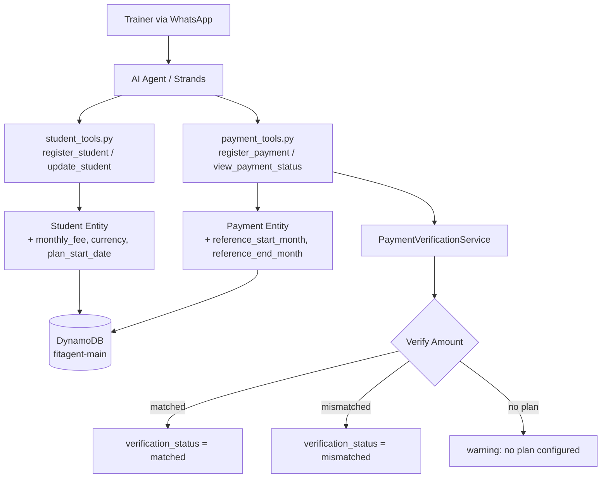

ZW2     # Design Document: Student Plan Payments

## Overview

This feature extends FitAgent's payment system to support plan-based payment management. Each student gets assigned a monthly fee (mensalidade) in R$ BRL, and the system verifies payments against the plan. It supports flexible payment schedules: advance payments (quarterly, semi-annual, annual) and late payments covering multiple past-due months in a single transaction.

The design builds on the existing `Student` and `Payment` Pydantic models, the single-table DynamoDB design, and the tool function pattern already established in the codebase. Key changes include adding plan fields to the `Student` entity, extending the `Payment` entity with reference period fields, creating a `PaymentVerificationService`, and adding a `view_payment_status` tool.

### Design Decisions

1. **Decimal for financial data**: The existing codebase uses `float` for `Payment.amount` and the DynamoDB client converts float↔Decimal. For financial precision, the new `monthly_fee` field on Student will use `Decimal` natively in the Pydantic model, stored as DynamoDB Number (Decimal). The existing `Payment.amount` field will also migrate to `Decimal` for consistency.

2. **Reference period on Payment**: Rather than creating a separate "payment period" entity, we extend the existing `Payment` model with `reference_start_month` and `reference_end_month` fields (ISO `YYYY-MM` format). This keeps the single-table design simple and avoids extra queries.

3. **Verification as a pure service**: The `PaymentVerificationService` is a stateless service class with pure functions. It takes a student's monthly fee and a payment's amount/period, and returns a verification result. This makes it trivially testable without DynamoDB mocking.

4. **Month status derived, not stored**: Payment status per month ("paid", "pending", "overdue") is computed at query time from confirmed payments, not stored as separate records. This avoids data consistency issues and keeps writes simple.

5. **Currency hardcoded to BRL**: Per requirements, all plan registrations use BRL. The existing `currency` field on Payment defaults to "USD" but will be set to "BRL" when a plan-based payment is registered.

## Architecture



### Component Interaction Flow

1. Trainer registers/updates a student with `monthly_fee` and `plan_start_date` via `register_student` or `update_student`
2. Trainer registers a payment with `reference_start_month` and `reference_end_month` via `register_payment`
3. `register_payment` calls `PaymentVerificationService.verify_payment()` to check amount against plan
4. Verification result is stored on the `Payment` record
5. Trainer queries `view_payment_status` to see month-by-month status for a student

## Components and Interfaces

### 1. Modified: `Student` Entity (`src/models/entities.py`)

New fields added to the existing `Student` Pydantic model:

```python
class Student(BaseModel):
    # ... existing fields ...
    monthly_fee: Optional[Decimal] = None        # Monthly fee in BRL (2 decimal places)
    currency: str = "BRL"                         # Always BRL for plan registrations
    plan_start_date: Optional[str] = None         # ISO format YYYY-MM (month plan starts)
```

- `monthly_fee`: Validated as positive, exactly 2 decimal places. `None` means no plan configured.
- `plan_start_date`: The month from which the plan is active, in `YYYY-MM` format.
- `currency`: Defaults to `"BRL"`. Stored alongside the fee for explicitness.

### 2. Modified: `Payment` Entity (`src/models/entities.py`)

New fields added to the existing `Payment` Pydantic model:

```python
class Payment(BaseModel):
    # ... existing fields ...
    reference_start_month: Optional[str] = None   # ISO YYYY-MM
    reference_end_month: Optional[str] = None      # ISO YYYY-MM
    verification_status: Optional[str] = None      # "matched", "mismatched", or None
    expected_amount: Optional[Decimal] = None      # Expected amount based on plan
```

- `reference_start_month` / `reference_end_month`: Define the period covered. Both must be present or both absent.
- `verification_status`: Set by the verification service at registration time.
- `expected_amount`: Stored for audit trail when verification is "mismatched".

### 3. New: `PaymentVerificationService` (`src/services/payment_verification.py`)

A stateless service with pure functions:

```python
class PaymentVerificationService:
    @staticmethod
    def verify_payment(
        monthly_fee: Decimal,
        amount: Decimal,
        reference_start_month: str,
        reference_end_month: str,
    ) -> Dict[str, Any]:
        """
        Verify payment amount against plan.
        
        Returns:
            {
                'status': 'matched' | 'mismatched',
                'expected_amount': Decimal,
                'actual_amount': Decimal,
                'months_covered': int
            }
        """

    @staticmethod
    def calculate_months_covered(start_month: str, end_month: str) -> int:
        """Calculate number of months in a reference period (inclusive)."""

    @staticmethod
    def get_payment_status_by_month(
        plan_start_date: str,
        confirmed_payments: List[Dict],
        current_month: str,
    ) -> List[Dict[str, str]]:
        """
        Derive month-by-month payment status.
        
        Returns list of:
            {'month': 'YYYY-MM', 'status': 'paid' | 'pending' | 'overdue'}
        """
```

### 4. Modified: `register_student` / `update_student` (`src/tools/student_tools.py`)

- `register_student`: Add optional `monthly_fee: float` and `plan_start_date: str` parameters. Convert `monthly_fee` to `Decimal` internally.
- `update_student`: Add optional `monthly_fee: float` and `plan_start_date: str` parameters. Validate fee > 0 and 2 decimal places.

### 5. Modified: `register_payment` (`src/tools/payment_tools.py`)

- Add optional `reference_start_month: str` and `reference_end_month: str` parameters.
- When reference period is provided and student has a plan, call `PaymentVerificationService.verify_payment()`.
- Store verification result on the Payment record.
- If student has no plan, set `verification_status = None` and include a warning in the response.

### 6. New: `view_payment_status` tool (`src/tools/payment_tools.py`)

```python
def view_payment_status(
    trainer_id: str,
    student_name: str = None,
    student_id: str = None,
) -> Dict[str, Any]:
    """
    View month-by-month payment status for a student.
    
    Returns months from plan_start_date to current month with status:
    - "paid": a confirmed payment covers this month
    - "pending": month hasn't passed yet, no payment
    - "overdue": month has passed, no payment
    """
```

### 7. Modified: `DynamoDBClient` (`src/models/dynamodb_client.py`)

- Update `_serialize_item` to handle `Decimal` values natively (pass through, since DynamoDB boto3 already handles Decimal).
- Update `_deserialize_item` to return `Decimal` for financial fields instead of converting to `float`. This requires a targeted approach: fields known to be financial (`monthly_fee`, `amount`, `expected_amount`) stay as `Decimal`.

**Decision**: Rather than changing the global deserializer (which would break existing code), the `Student.from_dynamodb` and `Payment.from_dynamodb` methods will explicitly convert financial fields to `Decimal` using `Decimal(str(value))`.

## Data Models

### DynamoDB Key Design

No new tables or GSIs needed. All data fits the existing single-table design.

#### Student Entity (updated)

| Attribute | Value | Notes |
|---|---|---|
| PK | `STUDENT#{student_id}` | Existing |
| SK | `METADATA` | Existing |
| monthly_fee | `150.00` (Number/Decimal) | New field |
| currency | `"BRL"` | New field |
| plan_start_date | `"2024-01"` | New field, YYYY-MM |

#### Payment Entity (updated)

| Attribute | Value | Notes |
|---|---|---|
| PK | `TRAINER#{trainer_id}` | Existing |
| SK | `PAYMENT#{payment_id}` | Existing |
| reference_start_month | `"2024-01"` | New, optional |
| reference_end_month | `"2024-03"` | New, optional |
| verification_status | `"matched"` | New, optional |
| expected_amount | `450.00` (Number/Decimal) | New, optional |

#### Querying Payment Status

To derive month-by-month status for a student:

1. Get student record → extract `plan_start_date` and `monthly_fee`
2. Query `get_student_payments(trainer_id, student_id)` → get all confirmed payments with reference periods
3. Build a set of "paid months" from all confirmed payments' reference periods
4. For each month from `plan_start_date` to current month:
   - If month in paid_months → "paid"
   - If month < current_month and not in paid_months → "overdue"  
   - If month >= current_month and not in paid_months → "pending"

This is a read-time computation, no extra DynamoDB items needed.

### Serialization Strategy for Financial Data

The critical concern is precision loss with float↔Decimal conversions.

**Approach**:
- `monthly_fee` on Student: Stored as `Decimal` in Pydantic model. The `to_dynamodb()` method writes it as a string representation that DynamoDB stores as Number. The `from_dynamodb()` method reads it back via `Decimal(str(value))`.
- `amount` on Payment: Currently `float`. Will be changed to `Decimal` with a validator that accepts both float and Decimal inputs (for backward compatibility with existing tool callers that pass float).
- `expected_amount` on Payment: New field, `Decimal` from the start.
- Reference months (`YYYY-MM` strings): No precision concern, stored as DynamoDB String.

**Round-trip guarantee**: `Decimal("150.00")` → DynamoDB Number `150.00` → `Decimal("150.00")`. No float intermediate step.

### Validation Rules

| Field | Rule |
|---|---|
| `monthly_fee` | Must be > 0, exactly 2 decimal places, stored as Decimal |
| `plan_start_date` | Must match `YYYY-MM` format, valid month (01-12) |
| `reference_start_month` | Must match `YYYY-MM`, valid month |
| `reference_end_month` | Must match `YYYY-MM`, valid month, >= start_month |
| `verification_status` | One of: `"matched"`, `"mismatched"`, or `None` |


## Correctness Properties

*A property is a characteristic or behavior that should hold true across all valid executions of a system — essentially, a formal statement about what the system should do. Properties serve as the bridge between human-readable specifications and machine-verifiable correctness guarantees.*

### Property 1: Verification expected amount equals fee times months

*For any* positive monthly fee (Decimal with 2 decimal places) and *for any* valid reference period (start_month ≤ end_month in YYYY-MM format), the expected amount calculated by `PaymentVerificationService.verify_payment()` shall equal `monthly_fee × number_of_months_covered`, where `number_of_months_covered` is the inclusive count of months from start to end.

**Validates: Requirements 2.1, 2.5, 3.2, 3.3, 3.4, 4.2**

### Property 2: Verification status is matched iff amount equals expected

*For any* positive monthly fee, *for any* valid reference period, and *for any* positive payment amount, the verification status shall be `"matched"` if and only if the payment amount equals `monthly_fee × months_covered`. Otherwise the status shall be `"mismatched"` and the response shall include both the expected and actual amounts.

**Validates: Requirements 2.2, 2.3**

### Property 3: Confirmed payments mark all covered months as paid

*For any* student with a plan and *for any* confirmed payment with a reference period covering months M₁ through M₂, every month in that range shall have status `"paid"` when querying the student's payment status.

**Validates: Requirements 3.5, 4.3**

### Property 4: Month status classification correctness

*For any* student with a plan (plan_start_date and monthly_fee set), *for any* set of confirmed payments with reference periods, and *for any* month M in the range [plan_start_date, current_month]:
- If M is covered by a confirmed payment → status is `"paid"`
- If M < current_month and M is not covered → status is `"overdue"`
- If M ≥ current_month and M is not covered → status is `"pending"`

These three cases are exhaustive and mutually exclusive.

**Validates: Requirements 5.1, 5.2, 5.3, 5.4**

### Property 5: Payment status range spans plan start to current month

*For any* student with a plan_start_date, the list of months returned by `get_payment_status_by_month()` shall start at `plan_start_date` and end at the current month (inclusive), with no gaps.

**Validates: Requirements 5.5**

### Property 6: Student plan data round-trip serialization

*For any* valid `Student` object (with or without plan fields: monthly_fee, currency, plan_start_date), calling `to_dynamodb()` then `from_dynamodb()` on the result shall produce an equivalent `Student` object with identical field values, including Decimal precision for `monthly_fee`.

**Validates: Requirements 6.1, 6.3**

### Property 7: Payment with reference period round-trip serialization

*For any* valid `Payment` object with reference period fields (reference_start_month, reference_end_month, verification_status, expected_amount), calling `to_dynamodb()` then `from_dynamodb()` on the result shall produce an equivalent `Payment` object with identical field values.

**Validates: Requirements 6.2, 6.4**

### Property 8: Monthly fee validation rejects invalid values

*For any* numeric value that is ≤ 0 or does not have exactly 2 decimal places, attempting to set it as a student's `monthly_fee` shall raise a validation error. *For any* positive Decimal with exactly 2 decimal places, it shall be accepted.

**Validates: Requirements 1.3, 1.5**

## Error Handling

### Validation Errors

| Scenario | Error Response |
|---|---|
| `monthly_fee` ≤ 0 | `{"success": False, "error": "Monthly fee must be greater than 0"}` |
| `monthly_fee` wrong precision | `{"success": False, "error": "Monthly fee must have exactly 2 decimal places"}` |
| `plan_start_date` invalid format | `{"success": False, "error": "Plan start date must be in YYYY-MM format"}` |
| `reference_start_month` > `reference_end_month` | `{"success": False, "error": "Reference start month must be <= end month"}` |
| `reference_start_month` invalid format | `{"success": False, "error": "Reference month must be in YYYY-MM format"}` |
| Only one of start/end month provided | `{"success": False, "error": "Both reference_start_month and reference_end_month must be provided"}` |
| Payment for student with no plan | `{"success": True, "data": {...}, "warning": "No plan configured for student. Verification skipped."}` |
| Student has no plan when viewing status | `{"success": False, "error": "Student has no plan configured. Cannot show payment status."}` |

### Error Propagation

- Validation errors are caught at the tool function level and returned as `{"success": False, "error": "..."}` — consistent with existing tool patterns.
- DynamoDB errors propagate as exceptions and are caught by the outer try/except in tool functions.
- The `PaymentVerificationService` is pure and raises `ValueError` for invalid inputs, which tool functions catch and convert to error responses.

## Testing Strategy

### Property-Based Testing (Hypothesis)

Each correctness property maps to a single Hypothesis test in `tests/property/test_plan_payment_properties.py`. Minimum 100 examples per test.

| Test | Property | Strategy |
|---|---|---|
| `test_verification_expected_amount` | Property 1 | Generate random `Decimal` fees (0.01–99999.99) and random YYYY-MM period pairs. Verify `expected == fee × months`. |
| `test_verification_status_matched_iff_correct` | Property 2 | Generate random fees, periods, and amounts. Check status is "matched" ↔ amount == expected. |
| `test_confirmed_payments_mark_months_paid` | Property 3 | Generate random plan + confirmed payments. Query status and verify all covered months are "paid". |
| `test_month_status_classification` | Property 4 | Generate random plan_start_date, set of confirmed payments, and a fixed "current month". Verify each month's status follows the classification rules. |
| `test_status_range_completeness` | Property 5 | Generate random plan_start_date and current_month. Verify returned months form a contiguous range from start to current. |
| `test_student_round_trip` | Property 6 | Generate random Student objects with plan fields. Verify `from_dynamodb(to_dynamodb(s))` equals `s`. |
| `test_payment_round_trip` | Property 7 | Generate random Payment objects with reference periods. Verify `from_dynamodb(to_dynamodb(p))` equals `p`. |
| `test_monthly_fee_validation` | Property 8 | Generate random invalid fees (negative, zero, wrong precision) and verify rejection. Generate valid fees and verify acceptance. |

**Hypothesis strategies** for custom types:
- `monthly_fee`: `st.decimals(min_value=Decimal("0.01"), max_value=Decimal("99999.99"), places=2)`
- `yyyy_mm`: Custom strategy generating valid year-month strings
- `reference_period`: Composite strategy ensuring start ≤ end

**Tag format**: Each test includes a comment:
```python
# Feature: student-plan-payments, Property {N}: {property_text}
```

### Unit Tests

Unit tests in `tests/unit/test_plan_payments.py` focus on specific examples and edge cases:

- `test_register_student_with_plan`: Register a student with monthly_fee=150.00 and plan_start_date="2024-01"
- `test_update_student_monthly_fee`: Update an existing student's fee
- `test_register_payment_with_verification_matched`: Payment of R$450 for 3 months at R$150/month → matched
- `test_register_payment_with_verification_mismatched`: Payment of R$400 for 3 months at R$150/month → mismatched
- `test_register_payment_no_plan_warning`: Payment for student without plan → warning
- `test_view_payment_status_mixed`: Student with some paid, some overdue, some pending months
- `test_view_payment_status_no_plan`: Student without plan → error
- `test_monthly_fee_zero_rejected`: Fee of 0 → validation error
- `test_monthly_fee_negative_rejected`: Fee of -100 → validation error
- `test_reference_period_start_after_end`: start > end → validation error
- `test_reference_period_spanning_past_and_future`: Period covering both past and current months → accepted (edge case from 4.4)
- `test_payment_amount_decimal_precision`: Verify no floating point drift with Decimal amounts

### Testing Library

- **Hypothesis** for property-based testing (already in project dependencies)
- **pytest** as test runner
- **moto** for DynamoDB mocking in unit/integration tests
- Each property test configured with `@settings(max_examples=100)`
